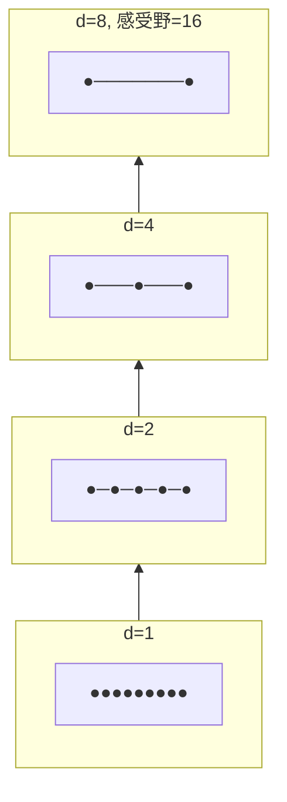

## 前置知识

> [!important]
> 
> 阅读本页前建议了解：条件概率链式法则、因果卷积概念

---

## 0. 定位

> WaveNet 与 WaveRNN 的原理、架构、代码实现与局限性分析

---

## 1. WaveNet 核心原理

### 1.1 自回归因式分解

WaveNet 将音频波形的联合概率分解为条件概率的乘积：

$$p(\mathbf{x}) = \prod_{t=1}^{T} p(x_t \mid x_1, \dots, x_{t-1})$$

每个采样点通过 **µ-law 量化**编码为 256 个离散值之一，使用 Softmax 分类器预测。

### 1.2 因果膨胀卷积



因果卷积确保 $x_t$ 只依赖 $x_1,\dots, x_{t-1}$，膨胀率指数增长 $d = [1, 2, 4, 8, \dots]$ 使感受野指数扩张。

```python
import torch
import torch.nn as nn

class CausalDilatedConv1d(nn.Module):
    """因果膨胀卷积：确保不泄露未来信息"""
    def __init__(self, in_ch, out_ch, kernel_size=2, dilation=1):
        super().__init__()
        # 左侧填充 = (kernel_size - 1) * dilation
        self.padding = (kernel_size - 1) * dilation
        self.conv = nn.Conv1d(in_ch, out_ch, kernel_size,
                              dilation=dilation)
    
    def forward(self, x):
        x = nn.functional.pad(x, (self.padding, 0))  # 仅左填充
        return self.conv(x)


class WaveNetResBlock(nn.Module):
    """WaveNet 残差块：门控激活 + 条件输入"""
    def __init__(self, residual_ch=64, gate_ch=64, skip_ch=256,
                 kernel_size=2, dilation=1):
        super().__init__()
        self.dilated = CausalDilatedConv1d(
            residual_ch, gate_ch * 2, kernel_size, dilation
        )
        self.cond_proj = nn.Conv1d(80, gate_ch * 2, 1)  # Mel 条件
        self.res_proj = nn.Conv1d(gate_ch, residual_ch, 1)
        self.skip_proj = nn.Conv1d(gate_ch, skip_ch, 1)
    
    def forward(self, x, cond):
        h = self.dilated(x) + self.cond_proj(cond)
        # 门控激活: tanh(前半) * sigmoid(后半)
        t, s = h.chunk(2, dim=1)
        h = torch.tanh(t) * torch.sigmoid(s)
        skip = self.skip_proj(h)
        res = self.res_proj(h) + x  # 残差连接
        return res, skip
```

> [!important]
> 
> **思辨：为什么 WaveNet 质量最高但不实用？**
> 
> 自回归分解保留了完整的序列依赖关系，理论上可以建模任意复杂的分布。但代价是推理时必须串行生成——22kHz 音频每秒需要 22,000 次完整的前向传播。即便在 V100 GPU 上也仅达 ×0.003 实时，生成 1 秒音频需要约 5 分钟。

---

## 2. WaveRNN

WaveRNN [Kalchbrenner et al., 2018] 通过以下优化加速自回归生成：

|**优化策略**|**WaveNet**|**WaveRNN**|
|---|---|---|
|输出表示|256 类 Softmax|Dual Softmax（高 8 位 + 低 8 位）|
|质量|MOS ~4.0|MOS ~3.9|

---

## 参考文献

- [1] van den Oord, A. et al. (2016). "WaveNet: A Generative Model for Raw Audio."

- [2] Kalchbrenner, N. et al. (2018). "Efficient Neural Audio Synthesis." ICML 2018.