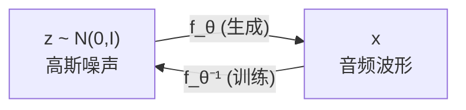

## 前置知识

> [!important]
> 
> 阅读本页前建议了解：概率密度函数变换公式、可逆函数概念

---

## 0. 定位

> 流模型声码器的原理、WaveGlow / WaveFlow 架构对比与局限性

---

## 1. 流模型核心思想

通过一系列**可逆变换**将简单先验分布（标准高斯）映射到复杂的波形分布：

$$\mathbf{x} = f_\theta(\mathbf{z}), \quad \mathbf{z} \sim \mathcal{N}(0, I)$$

训练通过**最大似然**，利用变量替换公式：

$$\log p(\mathbf{x}) = \log p(\mathbf{z}) + \log \left| \det \frac{\partial f_\theta^{-1}}{\partial \mathbf{x}} \right|$$



---

## 2. WaveGlow 架构

WaveGlow [Prenger et al., 2019] 基于 Glow 架构，包含 12 个 flow step × 8 个 squeeze 组 = 96 层仿射耦合层。

```python
import torch
import torch.nn as nn

class AffineCouplingLayer(nn.Module):
    """仿射耦合层：可逆变换的基本单元"""
    def __init__(self, in_channels, cond_channels):
        super().__init__()
        self.net = nn.Sequential(
            nn.Conv1d(in_channels // 2 + cond_channels, 256, 3, padding=1),
            nn.ReLU(),
            nn.Conv1d(256, 256, 1),
            nn.ReLU(),
            nn.Conv1d(256, in_channels, 3, padding=1)  # 输出 s 和 t
        )
    
    def forward(self, x, cond, reverse=False):
        x_a, x_b = x.chunk(2, dim=1)  # 分为两半
        h = self.net(torch.cat([x_a, cond], dim=1))
        log_s, t = h.chunk(2, dim=1)
        
        if not reverse:  # 正向（训练）
            x_b = x_b * torch.exp(log_s) + t
        else:  # 逆向（生成）
            x_b = (x_b - t) * torch.exp(-log_s)
        
        return torch.cat([x_a, x_b], dim=1), log_s
```

> [!important]
> 
> **思辨：双射约束的代价**
> 
> 流模型的每一层必须是可逆的，这严重限制了架构设计自由度。仿射耦合层的一半通道是恒等变换（$x_a$ 不变），相同参数量下有效容量仅为自由架构的约一半。WaveGlow 需要 87.73M 参数（96 层）才能达到 MOS 3.81，而 HiFi-GAN 仅用 13.92M 即达 MOS 4.36。

---

## 参考文献

- [1] Prenger, R. et al. (2019). "WaveGlow." ICASSP 2019.

- [2] Ping, W. et al. (2020). "WaveFlow." ICML 2020.