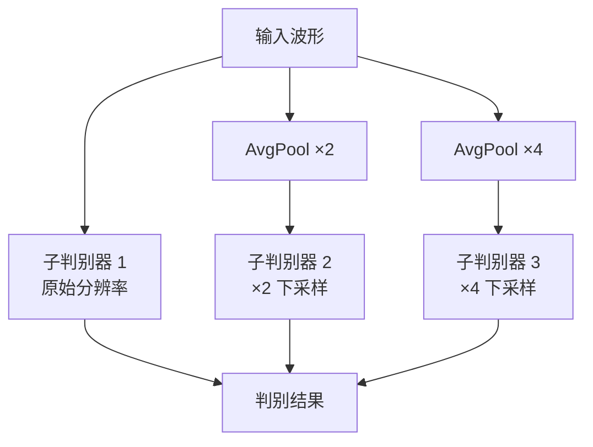

## 前置知识

> [!important]
> 
> 阅读本页前建议了解：GAN 基本概念、1D 卷积

---

## 0. 定位

> HiFi-GAN 之前的 GAN 声码器——MelGAN 和 Parallel WaveGAN 的核心设计与不足

---

## 1. MelGAN（2019）

MelGAN [Kumar et al., NeurIPS 2019] 是**第一个**基于 GAN 的快速声码器。

### 1.1 核心贡献

**多尺度判别器（Multi-Scale Discriminator, MSD）**：



```python
import torch.nn as nn

class MSDSubDiscriminator(nn.Module):
    """MSD 子判别器：分组1D卷积栈"""
    def __init__(self):
        super().__init__()
        self.convs = nn.ModuleList([
            nn.Conv1d(1, 16, 15, 1, 7),
            nn.Conv1d(16, 64, 41, 4, 20, groups=4),
            nn.Conv1d(64, 256, 41, 4, 20, groups=16),
            nn.Conv1d(256, 1024, 41, 4, 20, groups=64),
            nn.Conv1d(1024, 1024, 5, 1, 2),
            nn.Conv1d(1024, 1, 3, 1, 1),
        ])
    
    def forward(self, x):
        fmap = []
        for conv in self.convs[:-1]:
            x = conv(x)
            x = nn.functional.leaky_relu(x, 0.2)
            fmap.append(x)
        x = self.convs[-1](x)
        fmap.append(x)
        return x, fmap
```

### 1.2 特征匹配损失

$$\mathcal{L}_{FM} = \sum_{i=1}^{L} \frac{1}{N_i} \| D^{(i)}(x) - D^{(i)}(\hat{x}) \|_1$$

从判别器每一层提取中间特征，计算真实与生成样本的 L1 距离。这比纯对抗损失提供更稳定的训练信号。

---

## 2. Parallel WaveGAN（2020）

引入**多分辨率 STFT 损失**作为辅助监督：

$$\mathcal{L}_{\text{STFT}}(x, \hat{x}) = \frac{1}{M} \sum_{m=1}^{M} \left[ \mathcal{L}_{sc}^{(m)} + \mathcal{L}_{mag}^{(m)} \right]$$

其中 $\mathcal{L}_{sc}$ 是谱收敛损失，$mathcal{L}_{mag}$ 是 Log STFT 幅度损失。

---

## 3. 局限性总结

|**模型**|**MOS**|**主要不足**|MelGAN|3.79|质量差，高频细节丢失|
|---|---|---|---|---|---|
|Parallel WaveGAN|~3.85|参数少但质量有限|**HiFi-GAN V1**|**4.36**|MPD + MRF 突破性解决了质量问题|

> [!important]
> 
> **HiFi-GAN 解决了什么？** MelGAN 和 Parallel WaveGAN 证明了 GAN 声码器的速度优势，但质量不如 AR/Flow。HiFi-GAN 通过 MPD（多周期判别器）精确捕获周期结构 + MRF（多感受野融合）提升多尺度建模能力，首次让 GAN 声码器在 MOS 上超越所有其他范式。

## 参考文献

- [1] Kumar, K. et al. (2019). "MelGAN." NeurIPS 2019.

- [2] Yamamoto, R. et al. (2020). "Parallel WaveGAN." ICASSP 2020.