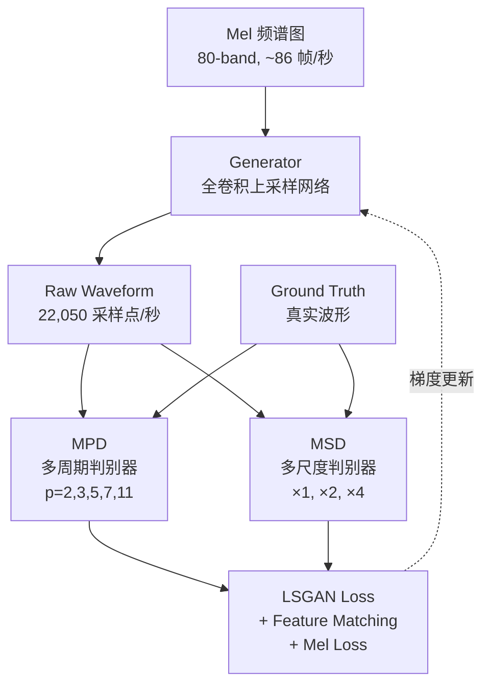
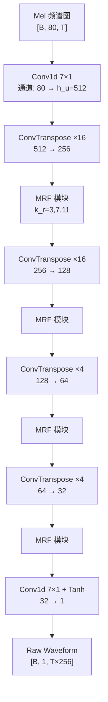

## 前置知识

> [!important]
> 
> 阅读本页前建议先读：1.1 神经声码器技术背景、GAN 基本概念（生成器-判别器对抗训练）

---

## 0. 定位

> Kong et al. (NeurIPS 2020) 的核心贡献：生成器-判别器协同设计、三种变体的质量-速度权衡

---

## 1. 整体架构总览

HiFi-GAN 由一个**生成器（Generator）**和两个**判别器（Discriminator）**组成，通过对抗训练 + 辅助损失联合优化。



---

## 2. 生成器（Generator）

生成器是一个**全卷积神经网络**，以 Mel 频谱图为输入，通过多级**转置卷积（Transposed Convolution）**逐步上采样，直到输出序列长度匹配原始波形的时域分辨率。每个转置卷积后跟随一个**多感受野融合模块（Multi-Receptive Field Fusion, MRF）**。

### 2.1 生成器数据流



上采样过程：总上采样倍率 = $16 times 16 times 4 times 4 = 256$，恰好等于 STFT 的 hop_size。

### 2.2 MRF 模块详解

**多感受野融合（Multi-Receptive Field Fusion, MRF）** 是生成器的核心创新。它并行放置多个残差块（ResBlock），每个使用不同的卷积核大小（kernel size）和膨胀率（dilation rate），然后将输出求和。这让生成器能同时观察不同长度的音频模式。

$$\text{MRF}(x) = \sum_{n=1}^{|k_r|} \text{ResBlock}_{k_r[n], D_r[n]}(x)$$

其中 $k_r = [3, 7, 11]$ 是三个 ResBlock 的卷积核大小，$D_r = [[1,1],[3,1],[5,1]] times 3$ 是对应的膨胀率。

以下是 MRF 模块的 PyTorch 实现：

```python
import torch
import torch.nn as nn
import torch.nn.functional as F
from torch.nn.utils import weight_norm

class ResBlock(nn.Module):
    """HiFi-GAN 残差块：多层膨胀卷积 + 残差连接"""
    def __init__(self, channels, kernel_size=3, dilations=(1, 3, 5)):
        super().__init__()
        self.convs1 = nn.ModuleList()  # 膨胀卷积层
        self.convs2 = nn.ModuleList()  # 1×1 卷积层
        for d in dilations:
            # 每个 dilation 对应一对卷积：膨胀卷积 + 普通卷积
            self.convs1.append(weight_norm(nn.Conv1d(
                channels, channels, kernel_size,
                dilation=d, padding=(kernel_size * d - d) // 2
            )))
            self.convs2.append(weight_norm(nn.Conv1d(
                channels, channels, kernel_size,
                dilation=1, padding=(kernel_size - 1) // 2
            )))

    def forward(self, x):
        for c1, c2 in zip(self.convs1, self.convs2):
            xt = F.leaky_relu(x, 0.1)  # Leaky ReLU 激活
            xt = c1(xt)                 # 膨胀卷积
            xt = F.leaky_relu(xt, 0.1)
            xt = c2(xt)                 # 普通卷积
            x = xt + x                  # 残差连接
        return x


class MRF(nn.Module):
    """多感受野融合模块：并行多个不同 kernel size 的 ResBlock，输出求和"""
    def __init__(self, channels, kernel_sizes=(3, 7, 11),
                 dilations=((1,3,5), (1,3,5), (1,3,5))):
        super().__init__()
        self.resblocks = nn.ModuleList([
            ResBlock(channels, k, d)
            for k, d in zip(kernel_sizes, dilations)
        ])

    def forward(self, x):
        # 将多个 ResBlock 的输出求和
        return sum(rb(x) for rb in self.resblocks)
```

> [!important]
> 
> **为什么要用多种 kernel size？** 音频信号包含从省音节级（>100ms，对应 >2200 个采样点）到微观波形级（几个采样点）的多尺度模式。kernel_size=3 捕获局部细节，kernel_size=11 捕获更长的上下文依赖，求和融合让生成器同时具备多尺度感知能力。

---

## 3. 多周期判别器（Multi-Period Discriminator, MPD）

MPD 是 HiFi-GAN 的**最核心创新**。语音音频由多种周期的正弦分量叠加而成，MPD 通过将 1D 波形 reshape 为 2D，让不同的子判别器分别检查不同周期的信号结构。

### 3.1 工作原理

对于周期 $p$，将长度为 $T$ 的 1D 波形 reshape 为 $\lfloor T/p \rfloor \times p$ 的 2D 表示，然后应用 2D 卷积（kernel 宽度方向固定为 1，独立处理每个周期采样）。

**周期选择：$p = [2, 3, 5, 7, 11]$**——全部是素数，以尽可能避免不同子判别器之间的重叠。

```python
class PeriodDiscriminator(nn.Module):
    """单个周期子判别器：将 1D 波形 reshape 为 2D 后进行 2D 卷积"""
    def __init__(self, period):
        super().__init__()
        self.period = period
        # 4 层步进 2D 卷积，kernel 宽度 = 1
        self.convs = nn.ModuleList([
            weight_norm(nn.Conv2d(1, 32, (5,1), (3,1), (2,0))),
            weight_norm(nn.Conv2d(32, 128, (5,1), (3,1), (2,0))),
            weight_norm(nn.Conv2d(128, 512, (5,1), (3,1), (2,0))),
            weight_norm(nn.Conv2d(512, 1024, (5,1), (3,1), (2,0))),
            weight_norm(nn.Conv2d(1024, 1024, (5,1), 1, (2,0))),
        ])
        self.output = weight_norm(nn.Conv2d(1024, 1, (3,1), 1, (1,0)))

    def forward(self, x):
        # x: [B, 1, T]
        B, C, T = x.shape
        # 填充到 period 的整数倍
        if T % self.period != 0:
            pad = self.period - (T % self.period)
            x = F.pad(x, (0, pad), "reflect")
            T = T + pad
        # reshape: [B, 1, T] -> [B, 1, T//p, p]
        x = x.view(B, C, T // self.period, self.period)

        fmap = []  # 保存中间特征用于 Feature Matching Loss
        for conv in self.convs:
            x = conv(x)
            x = F.leaky_relu(x, 0.1)
            fmap.append(x)
        x = self.output(x)
        fmap.append(x)
        return x.flatten(1, -1), fmap


class MPD(nn.Module):
    """多周期判别器：5 个素数周期的子判别器并联"""
    def __init__(self):
        super().__init__()
        self.discriminators = nn.ModuleList([
            PeriodDiscriminator(p) for p in [2, 3, 5, 7, 11]
        ])

    def forward(self, x):
        outputs, fmaps = [], []
        for d in self.discriminators:
            out, fmap = d(x)
            outputs.append(out)
            fmaps.append(fmap)
        return outputs, fmaps
```

> [!important]
> 
> **思辨：为什么用素数周期而非 2 的幂次？**
> 
> 消融实验显示，使用 $p = [2,4,8,16,32]$（2 的幂次）导致 MOS 下降 0.20（Table 2, [1]）。原因在于 2 的幂次之间存在大量**重叠采样**（如周期 4 的采样是周期 2 的子集），导致不同子判别器观察到的信息高度冗余。素数周期保证了最大程度的**不重叠性（Disjointness）**，让每个子判别器能观察到独特的周期结构。

---

## 4. 多尺度判别器（Multi-Scale Discriminator, MSD）

MSD 源自 MelGAN [Kumar et al., 2019]，用于捕获**连续模式和长程依赖**。它包含 3 个子判别器，分别在原始音频、×2 平均池化和 ×4 平均池化下采样后的波形上操作。

MPD 和 MSD 互补：

- **MPD** 操作在原始波形的**不相交采样（disjoint samples）**上，捕获周期结构

- **MSD** 操作在**平滑后的波形（smoothed waveforms）**上，捕获连续模式

---

## 5. 训练损失函数体系

HiFi-GAN 使用三重损失联合训练：

### 5.1 LSGAN 对抗损失

采用最小二乘 GAN（Least Squares GAN）[Mao et al., 2017]，替代二元交叉熵，提供更平滑的梯度：

$$\mathcal{L}_{\text{Adv}}(D; G) = \mathbb{E}_{(x,s)} \left[ (D(x) - 1)^2 + (D(G(s)))^2 \right]$$

$$\mathcal{L}_{\text{Adv}}(G; D) = \mathbb{E}_s \left[ (D(G(s)) - 1)^2 \right]$$

|符号|含义|
|---|---|
|$s$|输入条件（Mel 频谱图）|
|$D(\cdot)$|判别器输出（真实度分数）|

### 5.2 Mel 频谱重建损失

合成波形与真实波形的 Mel 频谱图之间的 L1 距离：

$$\mathcal{L}_{\text{Mel}}(G) = \mathbb{E}_{(x,s)} \left[ \| \phi(x) - \phi(G(s)) \|_1 \right]$$

其中 $\phi(\cdot)$ 是将波形转换为 Mel 频谱图的函数。这个损失能显著加速训练收敛并提升感知质量。

### 5.3 特征匹配损失（Feature Matching Loss）

从判别器每一层提取中间特征，计算真实与生成样本的 L1 距离：

$$\mathcal{L}_{\text{FM}}(G; D) = \mathbb{E}_{(x,s)} \left[ \sum_{i=1}^{T} \frac{1}{N_i} \| D^i(x) - D^i(G(s)) \|_1 \right]$$

### 5.4 最终损失

$$\mathcal{L}_G = \sum_{k=1}^{K} \left[ \mathcal{L}_{\text{Adv}}(G; D_k) + \lambda_{fm} \mathcal{L}_{\text{FM}}(G; D_k) \right] + \lambda_{mel} \mathcal{L}_{\text{Mel}}(G)$$

其中 $lambda_{fm} = 2$, $lambda_{mel} = 45$, $D_k$ 是 MPD 和 MSD 中的第 $k$ 个子判别器。

> [!important]
> 
> **思辨：为什么** $\lambda_{mel} = 45$ **这么大？**
> 
> Mel 损失的角色是**强条件约束**——确保生成波形的全局频谱结构与输入匹配。对抗损失和 Feature Matching 损失负责细节质量，但如果没有强 Mel 约束，生成器可能在早期训练中产生与输入不匹配的波形。消融实验显示移除 Mel 损失后 MOS 从 4.10 降至 3.25，下降 0.85（Table 2, [1]）。

---

## 6. 三种生成器变体对比

|**变体**|$h_u$|$k_u$ **(上采样)**|$k_r$ **(MRF)**|**参数量**|**MOS**|**GPU 速度**|**CPU 速度**|
|---|---|---|---|---|---|---|---|
|**V1**|512|[16,16,4,4]|[3,7,11]|13.92M|4.36|×167.9|×1.43|
|**V2**|128|[16,16,4,4]|[3,7,11]|0.92M|4.23|×764.8|×9.74|
|**V3**|256|[16,16,8]|[3,5,7]|1.46M|4.05|×1186.8|×13.44|

> [!important]
> 
> **工程判断**：V1 追求极致质量（MOS 4.36 ≈ 人声）；V2 追求极致轻量（0.92M，适合嵌入 VITS 等端到端模型）；V3 追求 CPU 实时推理（×13.44，适合端侧部署）。三者共享相同的判别器和训练机制，只需调整生成器超参数即可切换。

---

## 7. 消融实验核心结论

以下结果基于 V3 生成器，训练 500k 步 [1, Table 2]：

|**配置**|**MOS**|**影响**|
|---|---|---|
|Baseline (V3)|4.10|—|
|w/o MPD|2.28 (−1.82)|❗ **MPD 是质量的基石**|
|w/o MSD|3.74 (−0.36)|MSD 补充连续模式|
|w/o MRF|3.92 (−0.18)|多感受野有助但非决定性|
|w/o Mel Loss|3.25 (−0.85)|❗ Mel 损失至关重要|
|MPD p=[2,4,8,16,32]|3.90 (−0.20)|素数周期显著优于 2 的幂次|

---

## 延伸阅读

> [!important]
> 
> 子页面：
> 
> - 1.2.1 生成器架构详解（转置卷积、MRF）
> 
> - 1.2.2 多周期判别器（MPD）
> 
> - 1.2.3 多尺度判别器（MSD）
> 
> - 1.2.4 训练损失函数体系
> 
> - 1.2.5 三种生成器变体对比
> 
> - 1.2.6 实验结果与关键结论
> 
> 相关页面：1.3 BigVGAN 架构与原理、1.4 HiFi-GAN vs BigVGAN 对比

## 参考文献

- [1] Kong, J., Kim, J., & Bae, J. (2020). "HiFi-GAN: Generative Adversarial Networks for Efficient and High Fidelity Speech Synthesis." NeurIPS 2020. GitHub: [https://github.com/jik876/hifi-gan](https://github.com/jik876/hifi-gan)

- [2] Mao, X. et al. (2017). "Least Squares Generative Adversarial Networks." ICCV 2017.

- [3] Kumar, K. et al. (2019). "MelGAN: Generative Adversarial Networks for Conditional Waveform Synthesis." NeurIPS 2019.

- [4] Larsen, A. et al. (2016). "Autoencoding beyond pixels using a learned similarity metric." ICML 2016.

[[2.1 生成器架构详解（转置卷积与 MRF）]]

[[2.2 多周期判别器（MPD）详解]]

[[2.3 多尺度判别器（MSD）详解]]

[[2.4 训练损失函数体系详解]]

[[2.5 三种生成器变体（V1-V2-V3）对比]]

[[2.6 实验结果与关键结论]]