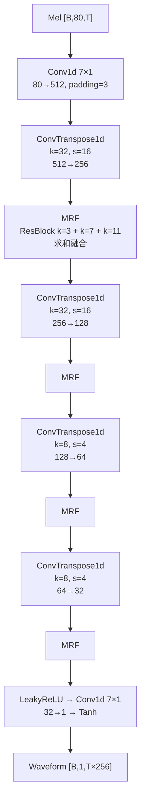

## 前置知识

> [!important]
> 
> 阅读本页前建议先读：1.2 HiFi-GAN 架构与原理（整体架构总览）

---

## 0. 定位

> 生成器的完整数据流：Conv1d → 多级转置卷积上采样 → MRF 残差块 → Tanh 输出

---

## 1. 生成器完整架构



### 1.1 转置卷积上采样

HiFi-GAN V1 的上采样策略 $k_u = [16, 16, 4, 4]$，kernel 大小 $= 2 times text{stride}$：

|**层**|**stride**|**kernel**|**输入通道**|**输出通道**|**累计上采样**|
|---|---|---|---|---|---|
|2|16|32|256|128|×256|
|4|4|8|64|32|×4096→×256*|

*实际输出对应 hop_size=256 的上采样倍率

```python
import torch
import torch.nn as nn
from torch.nn.utils import weight_norm

class HiFiGANGenerator(nn.Module):
    """HiFi-GAN V1 完整生成器"""
    def __init__(self, h_u=512, k_u=(16,16,4,4), k_r=(3,7,11)):
        super().__init__()
        self.conv_pre = weight_norm(
            nn.Conv1d(80, h_u, 7, 1, 3)  # Mel → 初始通道
        )
        
        # 转置卷积上采样层
        self.ups = nn.ModuleList()
        ch = h_u
        for s in k_u:
            self.ups.append(weight_norm(
                nn.ConvTranspose1d(
                    ch, ch // 2,
                    kernel_size=s * 2, stride=s,
                    padding=s // 2  # k=2s, padding=s//2 → 恰好 s× 上采样
                )
            ))
            ch = ch // 2
        
        # MRF 模块
        self.mrfs = nn.ModuleList([
            MRF(ch_i, k_r) for ch_i in 
            [h_u//2, h_u//4, h_u//8, h_u//16]
        ])
        
        self.conv_post = weight_norm(
            nn.Conv1d(ch, 1, 7, 1, 3)
        )
    
    def forward(self, mel):
        x = self.conv_pre(mel)
        for up, mrf in zip(self.ups, self.mrfs):
            x = nn.functional.leaky_relu(x, 0.1)
            x = up(x)      # 上采样
            x = mrf(x)     # 多感受野融合
        x = nn.functional.leaky_relu(x, 0.1)
        x = self.conv_post(x)
        x = torch.tanh(x)  # 输出范围 [-1, 1]
        return x
```

> [!important]
> 
> **为什么用 $k = 2s$？** 当转置卷积的 kernel size 是 stride 的整数倍时，可以避免**棋盘格伪影（Checkerboard Artifact）**——输出中周期性的幅度不均匀。$k=2s$ 是最小的无伪影配置。

---

## 参考文献

- [1] Kong et al. (2020). "HiFi-GAN." NeurIPS 2020.

[[2.1.1 转置卷积上采样深入解析]]

[[2.1.2 MRF 模块实现与可视化]]