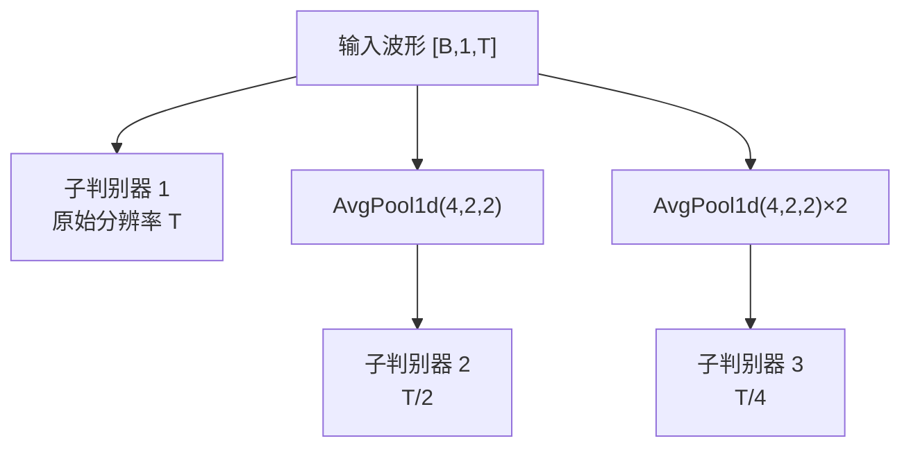

## 前置知识

> [!important]
> 
> 阅读本页前建议先读：1.2.2 多周期判别器（MPD）

---

## 0. 定位

> MSD 的工作原理、与 MPD 的互补关系、被 BigVGAN 替换为 MRD 的原因

---

## 1. MSD 结构

3 个子判别器，分别在原始/×2/×4 平均池化下采样后的波形上操作，每个子判别器是标准的 1D 分组卷积栈。

---

## 2. MPD 与 MSD 的互补性

|**维度**|**MPD**|**MSD**|输入处理|reshape 为 2D（等间隔采样）|时域平均池化（连续平滑）|
|---|---|---|---|---|---|
|捕获模式|周期/谐波结构|连续包络/长程依赖|消融影响|−1.82 MOS（致命）|−0.36 MOS（有益）|

---

## 3. MSD 的局限：为什么 BigVGAN 将其替换为 MRD？

> [!important]
> 
> MSD 的平均池化本质上是**低通滤波器**，会抑制高频分量。这意味着即使生成波形的高频部分严重失真，经过池化后的子判别器也可能无法区分。BigVGAN 的 MRD 直接在 STFT 频谱图上操作，能精确监督每个频率分量。

---

## 参考文献

- [1] Kong et al. (2020). "HiFi-GAN." NeurIPS 2020.

- [2] Kumar et al. (2019). "MelGAN." NeurIPS 2019.