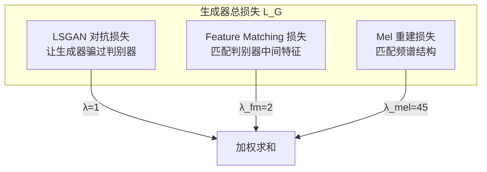

## 前置知识

> [!important]
> 
> 阅读本页前建议先读：1.2 HiFi-GAN 架构与原理（损失概览）

---

## 0. 定位

> 三重损失的数学推导、权重选择依据、消融实验解读

---

## 1. 损失体系总览



---

## 2. LSGAN 对抗损失

$$\mathcal{L}_{\text{Adv}}(D) = \mathbb{E}_x [(D(x)-1)^2] + \mathbb{E}_s [(D(G(s)))^2]$$

$$\mathcal{L}_{\text{Adv}}(G) = \mathbb{E}_s [(D(G(s))-1)^2]$$

```python
def adversarial_loss_d(disc_real, disc_gen):
    """判别器的 LSGAN 损失"""
    loss = 0
    for dr, dg in zip(disc_real, disc_gen):
        loss += torch.mean((dr - 1)**2) + torch.mean(dg**2)
    return loss

def adversarial_loss_g(disc_gen):
    """生成器的 LSGAN 损失"""
    loss = 0
    for dg in disc_gen:
        loss += torch.mean((dg - 1)**2)
    return loss
```

---

## 3. Feature Matching 损失

$$\mathcal{L}_{FM}(G;D) = \mathbb{E}_{(x,s)} \sum_{i=1}^{L} \frac{1}{N_i} \|D^{(i)}(x) - D^{(i)}(G(s))\|_1$$

```python
def feature_matching_loss(fmap_real, fmap_gen):
    """Feature Matching 损失：匹配判别器每层中间特征"""
    loss = 0
    for fr, fg in zip(fmap_real, fmap_gen):
        for r, g in zip(fr, fg):
            loss += torch.mean(torch.abs(r.detach() - g))
    return loss
```

---

## 4. Mel 频谱重建损失

$$\mathcal{L}_{Mel}(G) = \|\phi(x) - \phi(G(s))\|_1$$

```python
def mel_loss(mel_transform, y, y_hat):
    """Mel 频谱重建损失"""
    mel_real = mel_transform(y)
    mel_gen = mel_transform(y_hat)
    return nn.functional.l1_loss(mel_real, mel_gen) * 45  # λ_mel=45
```

---

## 5. 最终训练循环

$$\mathcal{L}_G = \sum_k [\mathcal{L}_{Adv}(G;D_k) + 2 \cdot \mathcal{L}_{FM}(G;D_k)] + 45 \cdot \mathcal{L}_{Mel}(G)$$

> [!important]
> 
> **思辨：权重比 1:2:45 的含义**
> 
> - $\lambda_{mel}=45$：Mel 损失是最强的约束，确保全局频谱结构正确。消融移除后 MOS 降 0.85
> 
> - $\lambda_{fm}=2$：Feature Matching 提供中等强度的感知级监督
> 
> - $\lambda_{adv}=1$：对抗损失最弱但不可或缺，提供细粒度的真实感优化

---

## 参考文献

- [1] Kong et al. (2020). "HiFi-GAN." NeurIPS 2020.

[[2.4.1 LSGAN 对抗损失深入]]

[[2.4.2 Feature Matching 损失深入]]

[[2.4.3 Mel 频谱重建损失深入]]