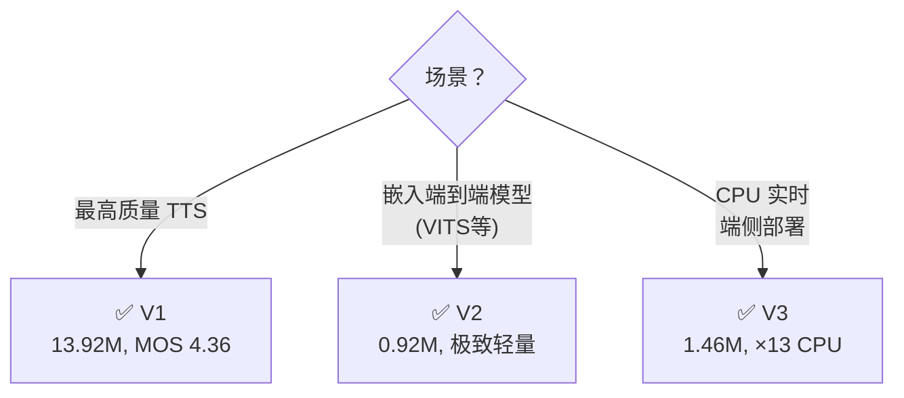

## 前置知识

> [!important]
> 
> 阅读本页前建议先读：1.2.1 生成器架构详解

---

## 0. 定位

> V1/V2/V3 的超参数差异、适用场景与工程选型

---

## 1. 三种变体参数对比

|**参数**|**V1**|**V2**|**V3**|初始通道 $h_u$|512|128|256|
|---|---|---|---|---|---|---|---|
|上采样 $k_u$|[16,16,4,4]|[16,16,4,4]|[16,16,8]|MRF kernel $k_r$|[3,7,11]|[3,7,11]|[3,5,7]|
|上采样层数|4|4|3|总上采样|×4096→×256|×4096→×256|×2048→×256|
|**参数量**|**13.92M**|**0.92M**|**1.46M**|**MOS**|**4.36**|**4.23**|**4.05**|
|GPU 速度|×167.9|×764.8|×1186.8|CPU 速度|×1.43|×9.74|×13.44|

---

## 2. 选型场景

> [!important]
> 
> **工程判断**：三种变体共享相同的判别器（MPD + MSD）和训练损失体系，仅生成器超参数不同。切换变体只需修改 config 文件，无需改动训练代码。

---

## 参考文献

- [1] Kong et al. (2020). "HiFi-GAN." NeurIPS 2020.