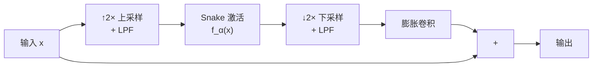

## 前置知识

> [!important]
> 
> 阅读本页前建议先读：1.3.1 Snake 激活函数、1.6.4 采样定理与反混叠设计

---

## 0. 定位

> AMP 模块的完整设计：为什么需要抗混叠、Kaiser 窗滤波器设计、与 MRF 的对比

---

## 1. 混叠问题

Snake 的 $\sin^2(\alpha x)$ 可以产生频率为 $2\alpha$ 的分量。如果 $2\alpha > f_s/2$（当前层的 Nyquist 频率），就会发生**混叠**——高频分量被折叠到低频，产生不可逆的伪影。

---

## 2. AMP 的解决方案



**核心思路**：在更高采样率下执行 Snake 非线性，然后低通滤波回到原始采样率。

### 2.1 低通滤波器设计

采用 **Kaiser 窗 sinc 滤波器**，灵感来自 StyleGAN3 [Karras et al., 2021]：

```python
import torch
import numpy as np
from scipy.signal import kaiser

def get_kaiser_lowpass(cutoff_freq, kernel_size=12, beta=14.0):
    """设计 Kaiser 窗低通滤波器"""
    n = torch.arange(kernel_size) - (kernel_size - 1) / 2
    # 理想低通 sinc 核
    h = 2 * cutoff_freq * torch.sinc(2 * cutoff_freq * n)
    # Kaiser 窗加权
    w = torch.tensor(kaiser(kernel_size, beta), dtype=torch.float32)
    h = h * w
    return h / h.sum()  # 归一化

# 截止频率 = Nyquist/2，保守滤波
filter_kernel = get_kaiser_lowpass(cutoff_freq=0.25, kernel_size=12)
```

### 2.2 完整 AMPBlock

```python
class AMPBlock(nn.Module):
    """抗混叠多周期组合模块中的残差块"""
    def __init__(self, channels, kernel_size=3, dilations=((1,1),(3,1),(5,1))):
        super().__init__()
        self.convs = nn.ModuleList()
        self.snakes = nn.ModuleList()
        
        for d_pair in dilations:
            self.snakes.append(Snake1d(channels))
            self.convs.append(nn.Conv1d(
                channels, channels, kernel_size,
                dilation=d_pair[0],
                padding=(kernel_size * d_pair[0] - d_pair[0]) // 2
            ))
        
        # 抗混叠上下采样
        self.upsample = nn.Upsample(scale_factor=2, mode='nearest')
        self.downsample = nn.AvgPool1d(kernel_size=2, stride=2)
    
    def forward(self, x):
        for snake, conv in zip(self.snakes, self.convs):
            xt = self.upsample(x)     # ↑2×
            xt = snake(xt)             # Snake 激活
            xt = self.downsample(xt)   # ↓2× + LPF
            xt = conv(xt)              # 膨胀卷积
            x = xt + x                 # 残差连接
        return x
```

> [!important]
> 
> **思辨：2× 过采样够不够？**
> 
> 理论上 Snake 可以产生任意高频分量，2× 过采样只能保护到 $f_s$ 以下的分量。但实践中，Snake 的 α 参数通常不会学到极大值（受梯度约束），2× 过采样在大多数情况下已足够。更高的过采样会显著增加计算开销。

---

## 参考文献

- [1] Lee et al. (2023). "BigVGAN." ICLR 2023.

- [2] Karras et al. (2021). "Alias-Free GAN." NeurIPS 2021.

[[3.2.1 Kaiser 窗 sinc 滤波器设计]]

[[3.2.2 抗混叠非线性实现细节]]
