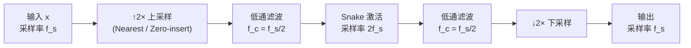

## 前置知识

> [!important]
> 
> 阅读本页前建议先读：1.3.2 AMP 模块、1.3.2.1 Kaiser 窗滤波器

---

## 0. 定位

> 上采样→Snake→下采样的完整流程、v1/v2 实现差异、计算开销分析

---

## 1. 抗混叠非线性流程



---

## 2. BigVGAN v1 vs v2 实现

|**维度**|**v1（纯 PyTorch）**|**v2（CUDA kernel）**|
|---|---|---|
|Snake + LPF|分步计算|单个 fused kernel|
|代码复杂度|低，纯 Python|高，需 CUDA 编译|

```python
# v1 纯 PyTorch 实现
class AntiAliasedSnake(nn.Module):
    def __init__(self, channels):
        super().__init__()
        self.snake = Snake1d(channels)
        self.up = nn.Upsample(scale_factor=2, mode='nearest')
        self.down = nn.AvgPool1d(kernel_size=2, stride=2)
    
    def forward(self, x):
        x = self.up(x)       # ↑2×
        x = self.snake(x)     # Snake
        x = self.down(x)      # ↓2× + LPF
        return x

# v2 Fused CUDA kernel——以上操作合并为一个算子
# from bigvgan_v2 import anti_aliased_snake_cuda
```

---

## 3. 计算开销分析

> [!important]
> 
> AMP 的抗混叠操作将每个 ResBlock 的计算量大约增加了 **2.4×**（由于 2× 上采样后 Snake 在双倍序列长度上计算）。这是 BigVGAN-base 比 HiFi-GAN V1 慢约 2.4× 的主要原因（×70 vs ×168）。BigVGAN v2 的 fused CUDA kernel 部分弥补了这个开销。

---

## 参考文献

- [1] Lee et al. (2023). "BigVGAN."

- [2] Karras et al. (2021). "Alias-Free GAN."