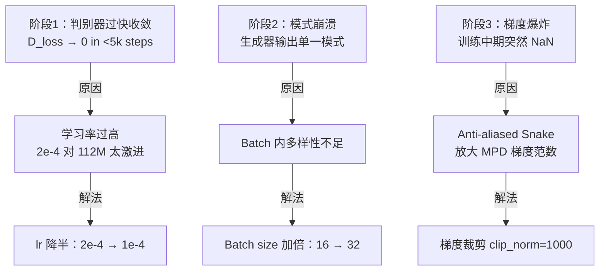

## 前置知识

> [!important]
> 
> 阅读本页前建议先读：1.3 BigVGAN 架构与原理（训练概览）

---

## 0. 定位

> 从 14M 到 112M 的扩展策略、训练不稳定性的诊断与解决、跨域（图像→音频）经验迁移的陷阱

---

## 1. 扩展策略

|**参数**|**BigVGAN-base**|**BigVGAN 112M**|
|---|---|---|
|上采样策略|4 层 [8,8,2,2]|6 层 [4,4,2,2,2,2]|
|训练数据|LibriTTS (~960h)|LibriTTS (~960h)|
|训练步数|5,000k|5,000k|

---

## 2. 训练崩溃三阶段诊断

---

## 3. 图像域经验迁移的陷阱

> [!important]
> 
> **谱归一化（Spectral Normalization）**：图像 GAN 的关键稳定化技术，在 BigVGAN 中导致严重的**相位失配伪影**。原因：谱归一化过度约束了 MPD 的梯度范数，削弱了其对周期结构的监督能力。
> 
> **数据增强**：SpecAugment / mixup 等在分类任务中有效的增强策略，在声码器训练中导致波形过度平滑或说话人特征混合。

---

## 参考文献

- [1] Lee et al. (2023). "BigVGAN." ICLR 2023.

[[3.4.1 训练崩溃诊断与解决]]

[[3.4.2 跨域经验迁移陷阱]]