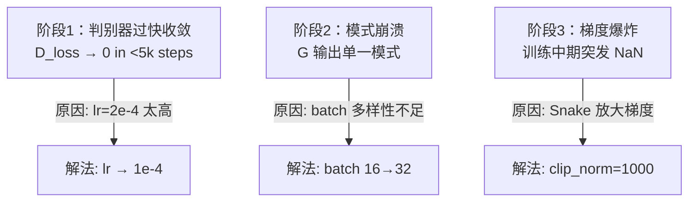

## 前置知识

> [!important]
> 
> 阅读本页前建议先读：1.3.4 大规模训练工程

---

## 0. 定位

> 112M BigVGAN 训练中的三个崩溃阶段及其解决方案的完整分析

---

## 1. 崩溃三阶段

---

## 2. 各解决方案的原理

### 2.1 学习率降半

大模型的参数空间更复杂，损失曲面更尖锐。学习率 2e-4 在 14M 模型上是安全的，但在 112M 模型上会导致判别器过快找到“快捷方式”区分真伪，生成器还来不及学习。

### 2.2 Batch Size 加倍

更大的 batch 让判别器在每步看到更多样本多样性，减少模式崩溃的风险。

### 2.3 梯度裁剪

Anti-aliased Snake 的上下采样会放大各层间的梯度范数，尤其是经过 MPD 的 reshape 后。clip_norm=$10^3$ 限制了梯度的最大范数，避免参数突变。

> [!important]
> 
> **思辨：为什么不用 Spectral Normalization？**
> 
> 图像 GAN 中 Spectral Normalization 是关键稳定化技术。但在 BigVGAN 中，它会过度正则化 MPD 的梯度，导致判别器无法精确监督周期结构，产生严重的**相位失配伪影**。音频域的判别器需要对周期结构的精确监督，这与图像域的需求不同。

---

## 参考文献

- [1] Lee et al. (2023). "BigVGAN."