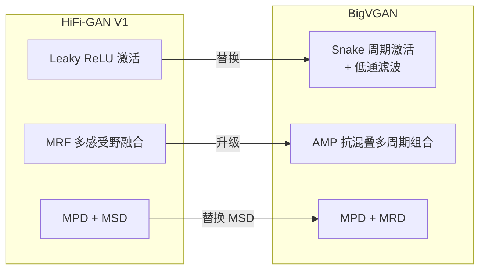

## 前置知识

> [!important]
> 
> 阅读本页前建议先读：1.2 HiFi-GAN 架构与原理（了解 Generator / MPD / MSD / Loss 基线设计）

---

## 0. 定位

> Lee et al. (ICLR 2023) 的核心贡献：面向通用声码器的生成器改进、大规模训练工程

---

## 1. BigVGAN 与 HiFi-GAN 的关系

BigVGAN 以 HiFi-GAN V1 为基线架构，做了**三个关键改进**：



|**组件**|**HiFi-GAN**|**BigVGAN**|**改进动机**|
|---|---|---|---|
|激活函数|Leaky ReLU|Snake|提供周期性归纳偏置，增强 OOD 外推能力|
|残差模块|MRF（Leaky ReLU）|AMP（Snake + 低通滤波）|抑制 Snake 产生的高频混叠伪影|
|判别器|MPD + MSD|MPD + MRD|MRD 在时频域操作，减少 pitch/周期性伪影|
|最大规模|13.92M|112M|利用大容量学习多样化训练数据|

---

## 2. Snake 周期激活函数（Periodic Inductive Bias）

### 2.1 问题：Leaky ReLU 缺乏周期性

音频波形天然具有高度周期性，可以表示为原始周期分量的叠加（傅里叶级数）。但 HiFi-GAN 生成器中的 **Leaky ReLU** 是分段线性函数，不提供任何周期性归纳偏置。这导致模型必须完全依赖膨胀卷积层来学习周期模式，在训练分布外（OOD）场景下外推能力很差。

### 2.2 Snake 函数定义

**Snake 激活函数** [Liu et al., NeurIPS 2020] 定义为：

$$f_\alpha(x) = x + \frac{1}{\alpha} \sin^2(\alpha x)$$

|符号|含义|范围|
|---|---|---|
|$\alpha$|可学习的频率控制参数，每个通道独立|$\alpha \in \mathbb{R}^h$，$h$ 为通道数|

**三个关键特性：**

1. **周期性**：$sin^2(alpha x)$ 提供周期性分量，$alpha$ 越大频率越高

1. **单调性**：$x$ 项保证函数单调递增，便于优化

1. **通道独立频率**：每个 1D 卷积通道有独立的 $alpha$，自然拟合不同频率的周期分量

```python
import torch
import torch.nn as nn

class Snake1d(nn.Module):
    """Snake 周期激活函数：f(x) = x + (1/alpha) * sin^2(alpha * x)"""
    def __init__(self, channels):
        super().__init__()
        # 每个通道独立的可学习频率参数
        self.alpha = nn.Parameter(torch.ones(1, channels, 1))

    def forward(self, x):
        # x: [B, C, T]
        # sin^2(alpha * x) 提供周期性分量
        return x + (1.0 / self.alpha) * torch.sin(self.alpha * x) ** 2
```

> [!important]
> 
> **思辨：为什么用** $\sin^2$ **而非 $sin$？**
> 
> $\sin^2(x)$ 始终非负（$geq 0$），加上恒等项 $x$ 后保证了单调性（$f'_alpha(x) = 1 + sin(2alpha x) geq 0$）。如果用裸的 $sin(x)$，函数会在局部区间非单调，导致梯度消失/振荡，训练不稳定。$sin^2$ 是「让神经网络学习周期函数」的关键技术洞察 [Liu et al., 2020]。

---

## 3. 抗混叠多周期组合模块（AMP）

### 3.1 问题：Snake 可能产生混叠伪影

Snake 激活可以产生任意高频细节，但离散时间网络的输出采样率有限，超过 Nyquist 频率的分量会引发**混叠伪影（Aliasing Artifact）**。

### 3.2 解决方案：滤波 Snake 非线性

AMP 模块在每个残差膨胀卷积层中应用**抗混叠非线性（Anti-Aliased Nonlinearity）**：


流程：先 2× 上采样 → 应用 Snake → 2× 下采样，每次采样变换都伴随 **Kaiser 窗口 sinc 低通滤波器**，灵感来自 Nyquist-Shannon 采样定理和 StyleGAN3 [Karras et al., 2021]。

```python
import torch
import torch.nn as nn
import torch.nn.functional as F
import numpy as np
from scipy.signal import kaiser

def design_lowpass_filter(cutoff, kernel_size, beta):
    """设计 Kaiser 窗口 sinc 低通滤波器"""
    # sinc 核
    n = torch.arange(kernel_size) - (kernel_size - 1) / 2
    h = torch.sinc(2 * cutoff * n)  # 理想低通滤波器
    # Kaiser 窗加权
    w = torch.tensor(kaiser(kernel_size, beta), dtype=torch.float32)
    h = h * w
    h = h / h.sum()  # 归一化
    return h

class AMPBlock(nn.Module):
    """抗混叠多周期组合模块（AMP）中的单个残差块"""
    def __init__(self, channels, kernel_size=3, dilation=(1, 1)):
        super().__init__()
        self.snake = Snake1d(channels)
        self.conv = nn.Conv1d(
            channels, channels, kernel_size,
            dilation=dilation[0],
            padding=(kernel_size * dilation[0] - dilation[0]) // 2
        )
        # 低通滤波器参数（类似 StyleGAN3）
        m = 2  # 上/下采样倍率
        self.up = nn.Upsample(scale_factor=m, mode='nearest')
        self.down = nn.AvgPool1d(kernel_size=m, stride=m)

    def forward(self, x):
        # 抗混叠 Snake：上采样 -> Snake -> 下采样
        xt = self.up(x)
        xt = self.snake(xt)
        xt = self.down(xt)
        # 膨胀卷积
        xt = self.conv(xt)
        return xt + x  # 残差连接
```

> [!important]
> 
> **AMP vs MRF 的本质区别**：MRF 中每个 ResBlock 使用 Leaky ReLU，不提供周期偏置；AMP 中每个 ResBlock 使用滤波 Snake，既提供周期偏置又抑制混叠。其他结构（多 kernel size 并行 + 求和）与 MRF 完全相同。

---

## 4. 判别器改进：MRD 替代 MSD

**多分辨率判别器（Multi-Resolution Discriminator, MRD）** 源自 UnivNet [Jang et al., 2021]，它将输入波形通过 STFT 转换为 **2D 线性频谱图**，然后用 2D 卷积判别。

|**判别器**|**输入域**|**操作方式**|**优势**|
|---|---|---|---|
|MSD|时域（平均池化下采样）|平均池化让高频信号衰减|捕获低频连续模式|
|**MRD**|**时频域（多分辨率 STFT）**|**直接在频谱图上操作**|**更精确的频谱结构监督**|

MRD 使用 3 组 STFT 参数：`n_fft=[1024, 2048, 512]`, `hop_length=[120, 240, 50]`, `win_length=[600, 1200, 240]`。

> [!important]
> 
> **思辨：为什么 MRD 优于 MSD？**
> 
> MSD 的平均池化是一种低通滤波，会**抑制高频分量**——意味着即使生成波形与真实波形在高频部分差异巨大，MSD 的某些子判别器也可能无法区分（见 HiFi-GAN Appendix B.2）。而 MRD 直接在频谱上操作，能精确监督每个频率分量的真实性，显著减少 pitch 和周期性伪影。

---

## 5. 大规模训练工程

### 5.1 从 14M 到 112M 的扩展策略

|**参数**|**BigVGAN-base (14M)**|**BigVGAN (112M)**|
|---|---|---|
|通道数 $h$|512|1536|
|上采样块数|4，比率 [8,8,2,2]|6，比率 [4,4,2,2,2,2]|
|总上采样倍率|×256|×256|

### 5.2 训练崩溃与解决方案

大规模 BigVGAN 训练遇到了严重的不稳定性问题：

|**问题**|**现象**|**解决方案**|
|---|---|---|
|早期崩溃|判别器损失在几千步内收敛到 0|学习率降半：$2 times 10^{-4} to 1 times 10^{-4}$|
|模式崩溃|生成器输出单一模式|Batch size 加倍：$16 to 32$|
|梯度爆炸|Anti-aliased Snake 放大 MPD 梯度范数|梯度范数裁剪至 $10^3$|

> [!important]
> 
> **重要发现：图像域的经验不完全适用于音频域**
> 
> - **谱归一化（Spectral Normalization）**：在图像 GAN 中是关键稳定化技术 [Miyato et al., 2018]，但在 BigVGAN 中导致严重的**相位失配伪影**，因为它过度正则化了 MPD 的梯度
> 
> - **梯度裁剪**：在图像 GAN 中被证明无效 [Brock et al., 2019, Appendix H]，但在 BigVGAN 中非常有效
> 
> - **数据增强（SpecAugment / mixup）**：导致波形过度平滑或说话人混合

---

## 6. 实验结果核心发现

### 6.1 分布内评测（LibriTTS）

|**模型**|**M-STFT ↓**|**PESQ ↑**|**MCD ↓**|**周期性误差 ↓**|**V/UV F1 ↑**|**MOS ↑**|**SMOS ↑**|
|---|---|---|---|---|---|---|---|
|HiFi-GAN V1|1.0017|2.947|0.6603|0.1565|0.9300|4.08|4.15|
|**BigVGAN-base**|**0.8788**|**3.519**|**0.4564**|**0.1287**|**0.9459**|**4.10**|**4.20**|
|**BigVGAN 112M**|**0.7997**|**4.027**|**0.3745**|**0.1018**|**0.9598**|**4.11**|**4.26**|

### 6.2 OOD 零样本评测（MUSDB18-HQ 音乐数据集）

|**模型**|**人声 SMOS**|**鼓点**|**贝斯**|**其他器乐**|**混合**|**平均**|
|---|---|---|---|---|---|---|
|HiFi-GAN V1|4.26|4.37|3.95|3.92|3.91|4.08|
|**BigVGAN-base**|**4.36**|**4.39**|**4.00**|**4.14**|**4.11**|**4.20**|
|**BigVGAN 112M**|**4.37**|**4.41**|**4.00**|**4.25**|**4.26**|**4.26**|

> [!important]
> 
> **核心发现**：BigVGAN-base（14M）在所有客观指标上已显著超越 HiFi-GAN V1，说明**架构改进（Snake + AMP + MRD）比单纯增加参数更重要**。112M BigVGAN 的主要优势体现在 OOD 场景，尤其是器乐（others: 3.92→4.25）和混合音频（mixture: 3.91→4.26）。

---

## 延伸阅读

> [!important]
> 
> 子页面：
> 
> - 1.3.1 周期归纳偏置（Snake 激活函数详解）
> 
> - 1.3.2 抗混叠多周期组合模块（AMP）
> 
> - 1.3.3 判别器改进：MRD 替代 MSD
> 
> - 1.3.4 大规模训练工程
> 
> - 1.3.5 实验结果与关键结论
> 
> 相关页面：1.2 HiFi-GAN 架构与原理、1.4 HiFi-GAN vs BigVGAN 对比

## 参考文献

- [1] Lee, S., Ping, W., Ginsburg, B., Catanzaro, B., & Yoon, S. (2023). "BigVGAN: A Universal Neural Vocoder with Large-Scale Training." ICLR 2023. GitHub: [https://github.com/NVIDIA/BigVGAN](https://github.com/NVIDIA/BigVGAN)

- [2] Liu, Z. et al. (2020). "Neural Networks Fail to Learn Periodic Functions and How to Fix It." NeurIPS 2020.

- [3] Karras, T. et al. (2021). "Alias-Free Generative Adversarial Networks." NeurIPS 2021.

- [4] Jang, W. et al. (2021). "UnivNet: A Neural Vocoder with Multi-Resolution Spectrogram Discriminators." Interspeech 2021.

- [5] Miyato, T. et al. (2018). "Spectral Normalization for Generative Adversarial Networks." ICML 2018.

- [6] Brock, A. et al. (2019). "Large Scale GAN Training for High Fidelity Natural Image Synthesis." ICLR 2019.

[[3.1 周期归纳偏置（Snake 激活函数详解）]]

[[3.2 抗混叠多周期组合模块（AMP）详解]]

[[3.3 判别器改进：MRD 替代 MSD]]

[[3.4 大规模训练工程]]

[[3.5 实验结果与关键结论]]