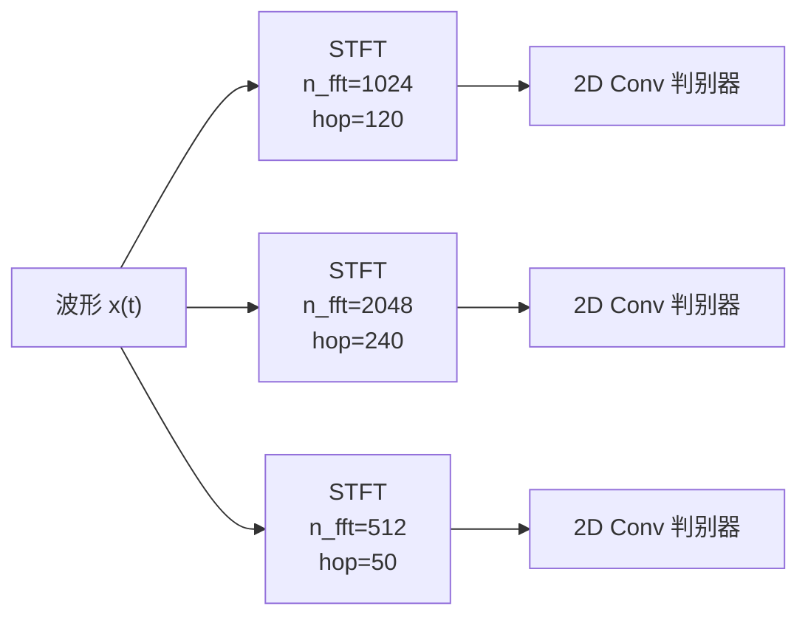

## 前置知识

> [!important]
> 
> 阅读本页前建议先读：1.2.3 多尺度判别器（MSD）

---

## 0. 定位

> MRD 的工作原理、STFT 参数选择、与 MSD 的实验对比

---

## 1. MRD 核心设计

MRD 源自 UnivNet [Jang et al., 2021]，将输入波形通过 STFT 转换为 **2D 线性频谱图**，然后用 2D 卷积判别。



### 1.1 STFT 参数

|**子判别器**|**n_fft**|**hop_length**|**win_length**|**频率分辨率**|1|1024|120|600|~23 Hz|
|---|---|---|---|---|---|---|---|---|---|
|2|2048|240|1200|~12 Hz|3|512|50|240|~47 Hz|

### 1.2 PyTorch 实现

```python
import torch
import torch.nn as nn

class ResolutionDiscriminator(nn.Module):
    """MRD 子判别器：在 STFT 频谱图上进行 2D 卷积"""
    def __init__(self, n_fft=1024, hop_length=120, win_length=600):
        super().__init__()
        self.n_fft = n_fft
        self.hop_length = hop_length
        self.win_length = win_length
        self.window = torch.hann_window(win_length)
        
        # 2D 卷积栈
        self.convs = nn.ModuleList([
            nn.Conv2d(2, 32, (3,9), padding=(1,4)),  # 实部+虚部=2通道
            nn.Conv2d(32, 32, (3,9), (1,2), (1,4)),
            nn.Conv2d(32, 32, (3,9), (1,2), (1,4)),
            nn.Conv2d(32, 32, (3,3), padding=(1,1)),
        ])
        self.output = nn.Conv2d(32, 1, (3,3), padding=(1,1))
    
    def forward(self, x):
        # x: [B, 1, T] -> STFT -> [B, 2, F, T']
        x = x.squeeze(1)
        X = torch.stft(x, self.n_fft, self.hop_length,
                       self.win_length, self.window.to(x.device),
                       return_complex=True)
        X = torch.stack([X.real, X.imag], dim=1)  # [B, 2, F, T']
        
        fmap = []
        for conv in self.convs:
            X = conv(X)
            X = torch.nn.functional.leaky_relu(X, 0.2)
            fmap.append(X)
        X = self.output(X)
        fmap.append(X)
        return X.flatten(1, -1), fmap
```

---

## 2. MRD vs MSD 对比

|**维度**|**MSD**|**MRD**|
|---|---|---|
|高频监督|❌ 池化抑制高频|✅ 直接监督全频谱|
|计算开销|较低|略高（需 STFT）|

> [!important]
> 
> **核心优势**：MRD 在频谱域直接操作，能精确监督每个频率 bin 的能量和相位一致性。MSD 的池化相当于低通滤波，会「放过」高频区域的伪影。

---

## 参考文献

- [1] Lee et al. (2023). "BigVGAN." ICLR 2023.

- [2] Jang et al. (2021). "UnivNet." Interspeech 2021.