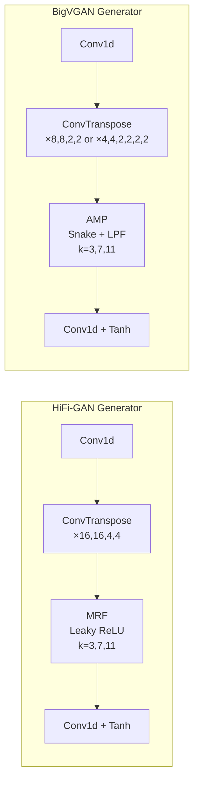
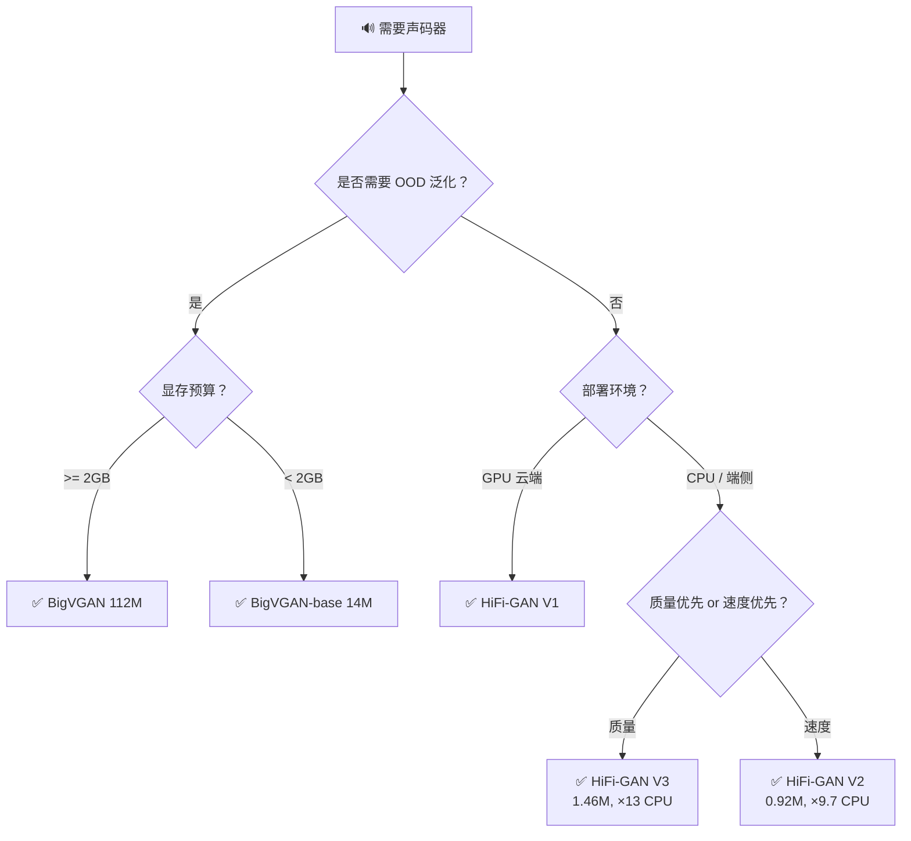

## 前置知识

> [!important]
> 
> 阅读本页前建议先读：1.2 HiFi-GAN 架构与原理、1.3 BigVGAN 架构与原理

---

## 0. 定位

> 从架构、训练、性能、部署四个维度系统对比，提供工程选型建议

---

## 1. 架构级对比

### 1.1 逐模块对比

|**模块**|**HiFi-GAN**|**BigVGAN**|**影响**|
|---|---|---|---|
|**激活函数**|Leaky ReLU ($\alpha=0.1$)|Snake ($f_\alpha(x)=x+\frac{1}{\alpha}\sin^2(\alpha x)$)|Snake 提供周期偏置，增强 OOD 泛化|
|**残差模块**|MRF: 3 个 ResBlock 并行求和|AMP: 3 个 ResBlock + 抗混叠滤波|AMP 抑制 Snake 高频伪影|
|**上采样**|4 层，$k_u=[16,16,4,4]$|base: [8,8,2,2]；112M: [4,4,2,2,2,2]|BigVGAN 112M 更细粒度步进|
|**判别器 1**|MPD ($p=[2,3,5,7,11]$)|MPD（相同）|MPD 已被证明核心有效|
|**判别器 2**|MSD（时域平均池化）|MRD（时频域多分辨率 STFT）|MRD 更精确监督频谱|

---

## 2. 训练配置对比

|**配置项**|**HiFi-GAN**|**BigVGAN**|
|---|---|---|
|数据集|LJSpeech（24h，单说话人）|LibriTTS train-full（~960h，多说话人）|
|采样率|22,050 Hz|24,000 Hz|
|Mel bands|80|100|
|学习率|$2 \times 10^{-4}$|$1 \times 10^{-4}$（降半以稳定大规模）|
|Batch Size|16|32（加倍防崩溃）|
|梯度裁剪|无|clip norm $10^3$|
|损失权重|$\lambda_{fm}=2, \lambda_{mel}=45$|相同|
|训练步数|2,500k steps|5,000k steps|
|GPU|1× V100|8× A100 80GB|

---

## 3. 性能对比

### 3.1 分布内质量

|**模型**|**参数量**|**M-STFT ↓**|**PESQ ↑**|**MCD ↓**|**MOS ↑**|**SMOS ↑**|
|---|---|---|---|---|---|---|
|HiFi-GAN V1|13.92M|1.0017|2.947|0.6603|4.08|4.15|
|HiFi-GAN V2|0.92M|—|—|—|4.23*|—|
|BigVGAN-base|14.01M|0.8788|3.519|0.4564|4.10|4.20|
|BigVGAN|112.4M|0.7997|4.027|0.3745|4.11|4.26|

_\_HiFi-GAN V1/V2 MOS 数据来自原论文 LJSpeech 实验，BigVGAN 数据来自 LibriTTS 实验，严格来说不可直接比较*

### 3.2 OOD 泛化能力

|**OOD 场景**|**HiFi-GAN V1**|**BigVGAN-base**|**BigVGAN 112M**|**差距**|
|---|---|---|---|---|
|未见说话人|✅ 可泛化|✅ 更好|✅ 最好|小|
|未见语言|⚠️ 明显下降|✅ 良好|✅ 最好|大|
|歌声|⚠️ 伪影明显|✅ 良好|✅ 最好|大|
|器乐|❌ 严重失真|✅ 可用|✅ 良好|极大|
|噪声环境|❌ 伪影严重|✅ 可用|✅ 良好|极大|

### 3.3 推理速度

|**模型**|**参数量**|**GPU 实时倍率**|**CPU 实时倍率**|**测试 GPU**|
|---|---|---|---|---|
|HiFi-GAN V1|13.92M|×167.9|×1.43|V100|
|HiFi-GAN V2|0.92M|×764.8|×9.74|V100|
|HiFi-GAN V3|1.46M|×1186.8|×13.44|V100|
|BigVGAN-base|14.01M|×70.18|—|RTX 8000|
|BigVGAN|112.4M|×44.72|—|RTX 8000|

> [!important]
> 
> **注意**：BigVGAN 的 AMP 模块包含额外的上/下采样 + 低通滤波操作，导致相同参数量下推理速度比 HiFi-GAN 慢约 2.4×（167.9/70.18）。BigVGAN v2 通过 fused CUDA kernel 部分解决了这个问题。

---

## 4. 工程选型决策树

> [!important]
> 
> **工程判断优先级**：
> 
> 1. **通用场景首选 BigVGAN-base**（14M）——质量、泛化、速度最佳平衡
> 
> 1. **单说话人 / 受控场景选 HiFi-GAN V1**——更快更轻
> 
> 1. **端侧部署选 HiFi-GAN V2/V3**——CPU 实时
> 
> 1. **极端 OOD（歌声/器乐/多语言）选 BigVGAN 112M**

---

## 延伸阅读

> [!important]
> 
> 子页面：
> 
> - 1.4.1 架构模块逐项对比
> 
> - 1.4.2 实验指标全面对比
> 
> - 1.4.3 工程选型指南

## 参考文献

- [1] Kong et al. (2020). "HiFi-GAN." NeurIPS 2020.

- [2] Lee et al. (2023). "BigVGAN." ICLR 2023.

[[4.1 架构模块逐项对比]]

[[4.2 实验指标全面对比]]

[[4.3 工程选型指南]]