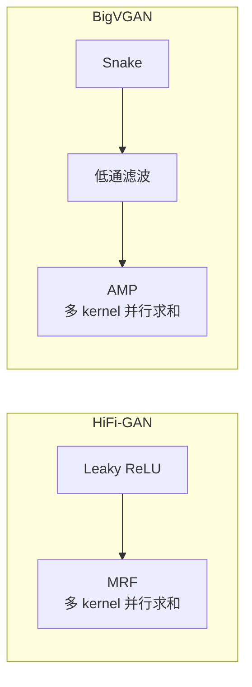

## 前置知识

> [!important]
> 
> 阅读本页前建议先读：1.2 HiFi-GAN 架构与原理、1.3 BigVGAN 架构与原理

---

## 0. 定位

> 生成器、判别器、激活函数、残差模块的逐项深度对比

---

## 1. 生成器架构对比

### 1.1 激活函数对比

|**维度**|**Leaky ReLU**|**Snake**|定义|$\max(0.1x, x)$|$x + \frac{1}{\alpha}\sin^2(\alpha x)$|
|---|---|---|---|---|---|
|周期性|❌ 无|✅ 可学习频率 α|单调性|✅ 严格单调|✅ 单调（$f' \geq 0$）|
|参数|0|每通道 1 个 α|OOD 外推|差（无周期偏置）|好（周期性归纳偏置）|

### 1.2 残差模块对比

|**维度**|**MRF**|**AMP**|核心操作|Leaky ReLU + 膨胀卷积|上采样 + Snake + 下采样 + 膨胀卷积|
|---|---|---|---|---|---|
|抗混叠|❌|✅ Kaiser 窗低通滤波|计算开销|基线|约 2.4×（额外上下采样）|

---

## 2. 判别器对比

|**维度**|**MPD**|**MSD**|**MRD**|输入域|时域（reshape）|时域（池化）|时频域（STFT）|
|---|---|---|---|---|---|---|---|
|捕获模式|周期结构|连续包络|频谱结构|高频监督|✅|❌（池化抑制）|✅|
|HiFi-GAN|✅|✅|❌|BigVGAN|✅|❌|✅|

---

## 参考文献

- [1] Kong et al. (2020). "HiFi-GAN." NeurIPS 2020.

- [2] Lee et al. (2023). "BigVGAN." ICLR 2023.
