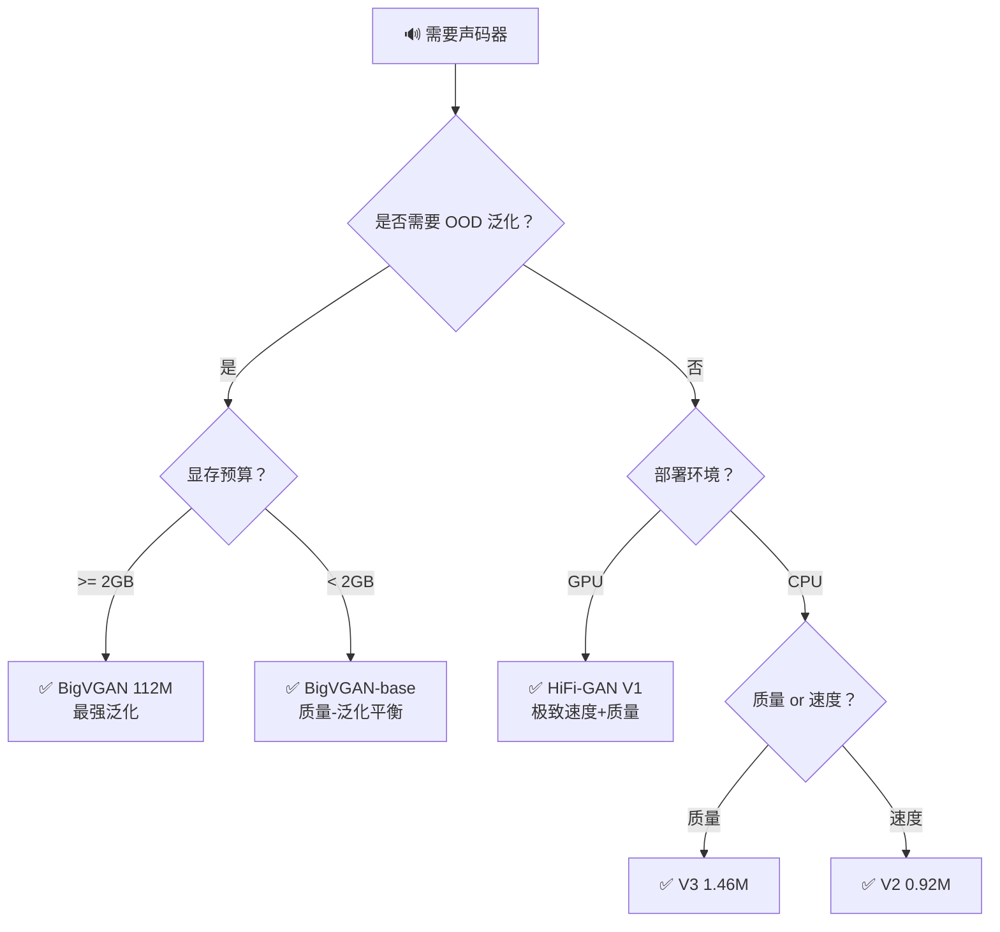

## 前置知识

> [!important]
> 
> 阅读本页前建议先读：1.4.1 架构对比、1.4.2 实验对比

---

## 0. 定位

> 基于场景需求的声码器选型决策树与实践建议

---

## 1. 决策树

---

## 2. 场景推荐汇总

|**场景**|**推荐模型**|**理由**|单说话人 TTS（云端）|HiFi-GAN V1|最快，质量已足够|
|---|---|---|---|---|---|
|多说话人 / 多语言 TTS|BigVGAN-base|泛化能力强，参数量适中|语音克隆 / VC|BigVGAN 112M|OOD 泛化最强|
|音乐生成 / 歌声合成|BigVGAN 112M|唯一能处理器乐|VITS 等端到端模型|HiFi-GAN V2|极致轻量，易嵌入|
|端侧 / CPU 实时|HiFi-GAN V3|CPU ×13 实时|语音大模型（SpeechGPT等）|unit-HiFi-GAN|离散单元输入|

> [!important]
> 
> **默认推荐**：如果不确定选哪个，首选 **BigVGAN-base**（14M）。它在质量、泛化、速度三个维度上都是最均衡的选择。

---

## 参考文献

- [1] Kong et al. (2020). "HiFi-GAN."

- [2] Lee et al. (2023). "BigVGAN."