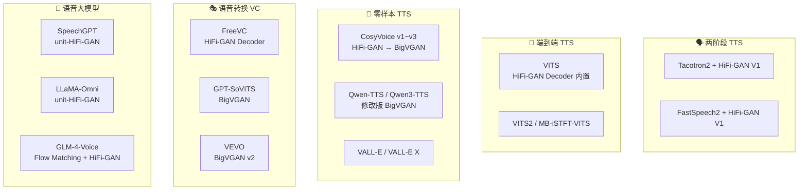

## 前置知识

> [!important]
> 
> 阅读本页前建议先读：1.2 HiFi-GAN 架构与原理、1.3 BigVGAN 架构与原理

---

## 0. 定位

> HiFi-GAN / BigVGAN 在现代 TTS、VC、语音大模型中的集成方式；开源生态与实践指南

---

## 1. 在现代语音系统中的集成地图



---

## 2. 主流集成模式详解

### 2.1 模式 A：独立声码器（两阶段管线）

最经典的使用方式，声学模型和声码器分别训练：

```python
import torch
from hifigan import Generator  # 官方 HiFi-GAN 库

# 1. 加载预训练声码器
vocoder = Generator(h)  # h = AttrDict(config)
vocoder.load_state_dict(torch.load('generator_v1'))
vocoder.eval().remove_weight_norm()

# 2. 从声学模型获取 Mel
mel = acoustic_model(text)  # [B, 80, T]

# 3. 生成波形
with torch.no_grad():
    audio = vocoder(mel)  # [B, 1, T*256]
    audio = audio.squeeze(1).cpu().numpy()
```

### 2.2 模式 B：内置解码器（端到端模型）

VITS / FreeVC 等端到端模型直接将 HiFi-GAN 的生成器作为解码器嵌入模型内部：

```python
# VITS 中的 HiFi-GAN Decoder——嵌入在 VAE 解码器中
class Generator(nn.Module):
    def __init__(self, initial_channel, resblock_kernel_sizes,
                 resblock_dilation_sizes, upsample_rates,
                 upsample_initial_channel, upsample_kernel_sizes):
        super().__init__()
        # 与独立 HiFi-GAN 完全相同的架构
        # 但输入不是 Mel，而是 VAE 潜变量 z
        self.conv_pre = nn.Conv1d(initial_channel, 
                                  upsample_initial_channel, 7, 1, 3)
        # ... 转置卷积 + MRF 层…
```

### 2.3 模式 C：零样本多语言声码器

CosyVoice v3 等系统需要处理未见说话人/语言，将声码器从 HiFi-GAN 升级为 BigVGAN，利用其更强的 OOD 泛化能力。

### 2.4 模式 D：离散语音单元声码器

SpeechGPT、LLaMA-Omni 等语音大模型使用离散语音单元（如 HuBERT codes）代替 Mel 频谱图作为中间表征，HiFi-GAN 被重新训练为 unit-HiFi-GAN：

```python
# unit-HiFi-GAN：输入从 Mel 变为离散 token embedding
class UnitHiFiGAN(Generator):
    def __init__(self, num_units, unit_dim, **hifigan_kwargs):
        super().__init__(**hifigan_kwargs)
        self.unit_embedding = nn.Embedding(num_units, unit_dim)
        # 用 embedding 替代 Mel 输入
        self.conv_pre = nn.Conv1d(unit_dim, 
                                  hifigan_kwargs['upsample_initial_channel'],
                                  7, 1, 3)
```

---

## 3. 代表性系统集成详表

|**系统**|**声码器**|**集成模式**|**特殊修改**|**开源**|
|---|---|---|---|---|
|Tacotron2 + HiFi-GAN|HiFi-GAN V1|A: 独立|无|✅|
|VITS|HiFi-GAN V1 Decoder|B: 内置|VAE latent 代替 Mel 输入|✅|
|CosyVoice v1~v3|HiFi-GAN → BigVGAN|A: 独立|v3 升级为 BigVGAN|✅|
|Qwen-TTS / Qwen3-TTS|修改版 BigVGAN|A: 独立|自定义修改|✅|
|GPT-SoVITS|BigVGAN|A: 独立|无|✅|
|VEVO|BigVGAN v2|A: 独立|v2 CUDA kernel 加速|✅|
|SpeechGPT|unit-HiFi-GAN|D: 单元|HuBERT codes 代替 Mel|✅|
|GLM-4-Voice|Flow Matching + HiFi-GAN|B: 内置|Flow Matching 采样后 HiFi-GAN 解码|✅|

---

## 4. 开源生态与实践指南

### 4.1 官方仓库

|**项目**|**地址**|**预训练模型**|**特点**|
|---|---|---|---|
|HiFi-GAN 官方|[github.com/jik876/hifi-gan](http://github.com/jik876/hifi-gan)|V1/V2/V3（LJSpeech）|参考实现，训练代码完整|
|BigVGAN 官方|[github.com/NVIDIA/BigVGAN](http://github.com/NVIDIA/BigVGAN)|base/112M（LibriTTS）|含 CUDA kernel 加速（v2）|
|BigVGAN v2|同上|22kHz / 44kHz|fused anti-aliased Snake kernel|

### 4.2 快速上手示例

```python
# BigVGAN v2 推理示例（官方仓库）
import torch
from bigvgan import BigVGAN
import librosa

# 1. 加载模型
model = BigVGAN.from_pretrained(
    'nvidia/bigvgan_v2_24khz_100band_256x',
    use_cuda_kernel=True  # 启用 fused CUDA kernel
)
model.eval().cuda()

# 2. 提取 Mel 频谱图
wav, sr = librosa.load('input.wav', sr=24000)
mel = model.get_mel_spectrogram(torch.from_numpy(wav).cuda())

# 3. 生成波形
with torch.inference_mode():
    audio = model(mel)  # [1, 1, T]
```

---

## 5. BigVGAN v2 更新要点

BigVGAN v2 (2024) 的主要改进：

|**维度**|**v1**|**v2**|
|---|---|---|
|CUDA kernel|无（纯 PyTorch）|✅ fused anti-aliased Snake|
|采样率|24kHz|22kHz / 24kHz / 44kHz|
|训练数据|LibriTTS|更大规模多域数据|
|推理速度|×44.72 实时|显著提升（kernel 加速）|

---

## 延伸阅读

> [!important]
> 
> 子页面：
> 
> - 1.5.1 TTS 系统中的集成
> 
> - 1.5.2 语音转换 / 语音克隆集成
> 
> - 1.5.3 语音大模型集成
> 
> - 1.5.4 开源生态与实践指南

[[5.1 TTS 系统中的集成]]

[[5.2 语音转换与语音克隆集成]]

[[5.3 语音大模型集成]]

[[5.4 开源生态与实践指南]]