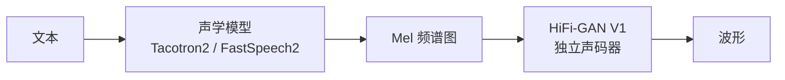

## 前置知识

> [!important]
> 
> 阅读本页前建议先读：1.5 实际应用与生态

---

## 0. 定位

> 声码器在两阶段 TTS、端到端 TTS、零样本 TTS 中的不同集成方式

---

## 1. 两阶段 TTS（模式 A：独立声码器）



声学模型和声码器**分别训练**，声码器接收 ground truth Mel 或声学模型预测的 Mel。

```python
import torch
from hifigan import Generator

# 加载预训练声码器
vocoder = Generator(config)
vocoder.load_state_dict(torch.load('generator_v1'))
vocoder.eval().remove_weight_norm()

# 推理
with torch.no_grad():
    mel = acoustic_model(text)  # [B, 80, T]
    audio = vocoder(mel)         # [B, 1, T*256]
```

---

## 2. 端到端 TTS（模式 B：内置解码器）

VITS 将 HiFi-GAN 生成器嵌入 VAE 解码器中，**端到端联合训练**：


关键差异：输入不再是 Mel 频谱图，而是 VAE 的潜变量 z。

---

## 3. 零样本 TTS（模式 C）

CosyVoice v3 等系统将声码器从 HiFi-GAN 升级为 BigVGAN，利用 Snake 激活函数提供的周期性归纳偏置来增强对未见说话人和语言的泛化能力。

> [!important]
> 
> **趋势**：随着 TTS 系统从单说话人向多说话人、多语言、零样本方向发展，声码器的选择也从 HiFi-GAN 向 BigVGAN 迁移。CosyVoice v1→v3 的演进就是典型案例。

---

## 参考文献

- [1] Kim, J. et al. (2021). "VITS." ICML 2021.

- [2] Du, Z. et al. (2024). "CosyVoice." arXiv 2024.