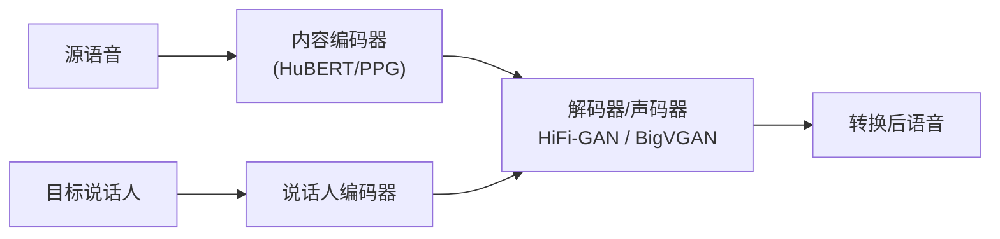

## 前置知识

> [!important]
> 
> 阅读本页前建议先读：1.5 实际应用与生态

---

## 0. 定位

> 声码器在 FreeVC、GPT-SoVITS、VEVO 等 VC 系统中的角色

---

## 1. VC 系统中的声码器

---

## 2. 代表系统

|**系统**|**声码器**|**特点**|FreeVC|HiFi-GAN V2 Decoder|轻量，内置于 VITS 架构|
|---|---|---|---|---|---|
|GPT-SoVITS|BigVGAN|独立声码器，OOD 泛化强|VEVO|BigVGAN v2|CUDA kernel 加速，零样本 VC|

> [!important]
> 
> **VC 场景为什么更倾向 BigVGAN？** VC 的核心挑战是处理未见说话人——目标说话人几乎总是训练集外的。BigVGAN 的 OOD 泛化能力使其成为 VC 场景的天然选择。

---

## 参考文献

- [1] Li, J. et al. (2023). "FreeVC." ICASSP 2023.

- [2] GPT-SoVITS. [github.com/RVC-Boss/GPT-SoVITS](http://github.com/RVC-Boss/GPT-SoVITS)