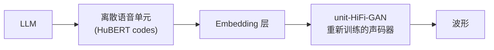

## 前置知识

> [!important]
> 
> 阅读本页前建议先读：1.5 实际应用与生态

---

## 0. 定位

> 声码器在 SpeechGPT、LLaMA-Omni、GLM-4-Voice 等语音大模型中的集成方式

---

## 1. 离散单元声码器（模式 D）



与标准声码器的关键差异：

- **输入**：离散 token embedding 代替连续 Mel 频谱图

- **训练**：在离散-连续配对数据上重新训练

- **架构**：生成器结构不变，仅修改输入投影层

```python
class UnitHiFiGAN(Generator):
    """离散单元声码器：输入从 Mel 变为 token embedding"""
    def __init__(self, num_units=500, unit_dim=256, **kwargs):
        super().__init__(**kwargs)
        self.unit_embedding = nn.Embedding(num_units, unit_dim)
        self.conv_pre = nn.Conv1d(unit_dim, kwargs['upsample_initial_channel'], 7, 1, 3)
    
    def forward(self, unit_ids):
        x = self.unit_embedding(unit_ids).transpose(1, 2)  # [B, D, T]
        return super().forward_from_hidden(x)
```

---

## 2. 代表系统

|**系统**|**声码器**|**中间表征**|SpeechGPT|unit-HiFi-GAN|HuBERT codes|
|---|---|---|---|---|---|
|LLaMA-Omni|unit-HiFi-GAN|HuBERT codes|GLM-4-Voice|Flow Matching + HiFi-GAN|连续潜变量|

---

## 参考文献

- [1] Zhang, D. et al. (2023). "SpeechGPT." arXiv 2023.

- [2] Fang, R. et al. (2024). "LLaMA-Omni." arXiv 2024.