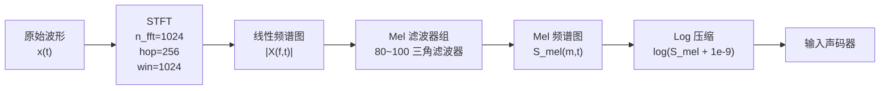

## 前置知识

> [!important]
> 
> 本页是基础概念汇总，可作为其他所有页面的参考工具书随时查阅

---

## 0. 定位

> 贯穿 HiFi-GAN 与 BigVGAN 的核心数学工具：GAN 理论、Mel 频谱图、膨胀卷积、采样定理、周期信号处理、损失函数数学

---

## 1. GAN 基本原理

### 1.1 极小极大博弈

生成对抗网络（Generative Adversarial Network, GAN）的训练目标是一个极小极大博弈：

$$\min_G \max_D V(D, G) = \mathbb{E}_{x \sim p_{\text{data}}} [\log D(x)] + \mathbb{E}_{z \sim p_z} [\log(1 - D(G(z)))]$$

|符号|含义|
|---|---|
|$D$|判别器，输出样本为真实的概率|
|$p_z$|先验分布（如高斯噪声）|

### 1.2 LSGAN（HiFi-GAN / BigVGAN 采用）

**最小二乘 GAN（Least Squares GAN）** 将交叉熵替换为均方误差：

$$\mathcal{L}_D = \mathbb{E}_x [(D(x) - 1)^2] + \mathbb{E}_s [(D(G(s)))^2]$$

$$\mathcal{L}_G = \mathbb{E}_s [(D(G(s)) - 1)^2]$$

> [!important]
> 
> **为什么用 LSGAN 而非原始 GAN？** 原始 GAN 的 $\log(1-D(G(z)))$ 在生成器较差时梯度极小（梯度消失），在生成器较好时梯度极大（梯度爆炸）。LSGAN 提供平滑的二次梯度，训练更稳定。

---

## 2. Mel 频谱图

### 2.1 计算流程



### 2.2 关键公式

**Mel 尺度转换**：

$$m = 2595 \log_{10}\left(1 + \frac{f}{700}\right)$$

其中 $f$ 是线性频率（Hz），$m$ 是 Mel 尺度值。Mel 尺度模拟了人耳对频率的非线性感知：低频区分辨率高，高频区分辨率低。

```python
import torch
import torchaudio

def get_mel_spectrogram(wav, sr=22050, n_fft=1024, 
                        hop_length=256, n_mels=80):
    """计算 Mel 频谱图（声码器标准输入）"""
    mel_transform = torchaudio.transforms.MelSpectrogram(
        sample_rate=sr, n_fft=n_fft, hop_length=hop_length,
        n_mels=n_mels, f_min=0, f_max=sr // 2
    )
    mel = mel_transform(wav)          # [B, n_mels, T]
    mel = torch.log(mel + 1e-9)       # Log 压缩
    return mel
```

---

## 3. 膨胀卷积（Dilated Convolution）

膨胀卷积是 HiFi-GAN ResBlock 和 BigVGAN AMPBlock 的核心组件，用于在不增加参数的情况下扩大感受野。

### 3.1 定义

对于 1D 信号，膨胀率为 $d$ 的卷积：

$$(x *_d w)[t] = \sum_{k=0}^{K-1} w[k] \cdot x[t - d \cdot k]$$

其中 $K$ 是卷积核大小，$d$ 是膨胀率。有效感受野 = $K + (K-1)(d-1)$。

|**膨胀率** $d$|**核大小** $K=3$|**有效感受野**|1|⬛⬛⬛|3|
|---|---|---|---|---|---|
|3|⬛⬜⬜⬛⬜⬜⬛|7|5|⬛⬜⬜⬜⬜⬛⬜⬜⬜⬜⬛|11|

---

## 4. 采样定理与混叠

### 4.1 Nyquist-Shannon 采样定理

$$f_s \geq 2 f_{\max}$$

采样率 $f_s$ 必须至少是信号最高频率 $f_{\max}$ 的两倍，否则发生**混叠（Aliasing）**——高频分量被错误地折叠到低频，产生不可去除的失真。

> [!important]
> 
> **与 BigVGAN 的关联**：Snake 激活函数的 $\sin^2(\alpha x)$ 可以产生任意高频分量，超过当前层的 Nyquist 频率时就会产生混叠。这正是 AMP 模块引入低通滤波的原因。

### 4.2 反混叠滤波器

BigVGAN 采用 **Kaiser 窗口 sinc 滤波器**：

$$h[n] = \text{sinc}(2f_c n) \cdot w_{\text{Kaiser}}[n]$$

其中 $f_c$ 是截止频率，$w_{\text{Kaiser}}$ 是 Kaiser 窗函数，$\beta$ 参数控制旁瓣衰减。

---

## 5. 转置卷积（Transposed Convolution）

转置卷积是 HiFi-GAN / BigVGAN 生成器上采样的核心操作。

### 5.1 上采样效果

对于步长为 $s$ 的转置卷积，输出长度 = $(L_{\text{in}} - 1) \times s - 2p + k$，其中 $L_{\text{in}}$ 是输入长度，$p$ 是填充，$k$ 是核大小。

```python
import torch.nn as nn

# HiFi-GAN V1 的 4 层转置卷积
upsample_rates = [16, 16, 4, 4]  # 总上采样 = 16*16*4*4 = 256
upsample_kernel_sizes = [32, 32, 8, 8]  # k = 2*s

for i, (s, k) in enumerate(zip(upsample_rates, upsample_kernel_sizes)):
    layer = nn.ConvTranspose1d(
        in_channels=512 // (2**i),
        out_channels=512 // (2**(i+1)),
        kernel_size=k, stride=s,
        padding=(k - s) // 2  # 确保恰好 s 倍上采样
    )
```

> [!important]
> 
> **棋盘格伪影（Checkerboard Artifact）**：当 $k$ 不是 $s$ 的整数倍时，转置卷积会在输出中产生周期性的幅度不均匀。HiFi-GAN 采用 $k = 2s$ 可以有效避免这个问题。

---

## 6. 周期信号与傅里叶分析

### 6.1 语音信号的周期性

语音波形可以表示为多个正弦分量的叠加（傅里叶级数）：

$$x(t) = \sum_{k=1}^{N} A_k \sin(2\pi f_k t + \phi_k)$$

其中 $f_k$ 是第 $k$ 个谐波的频率，$A_k$ 是幅度，$\phi_k$ 是相位。基频 $f_0$（基频频率，pitch）决定了语音的基本周期。

> [!important]
> 
> **与 MPD 的关联**：MPD 的素数周期 $p=[2,3,5,7,11]$ 恰好覆盖了语音信号中各种周期结构。将 1D 波形 reshape 为周期为 $p$ 的 2D 结构，本质上是在检查“每隔 $p$ 个采样点的信号是否一致”——这直接对应了傅里叶分量的周期结构。

---

## 延伸阅读

> [!important]
> 
> 子页面：
> 
> - 1.6.1 GAN 训练动态与稳定性
> 
> - 1.6.2 Mel 频谱图计算详解
> 
> - 1.6.3 膨胀卷积与感受野计算
> 
> - 1.6.4 采样定理与反混叠设计
> 
> - 1.6.5 转置卷积与棋盘格伪影
> 
> - 1.6.6 傅里叶分析与语音周期性

## 参考文献

- [1] Goodfellow, I. et al. (2014). "Generative Adversarial Nets." NeurIPS 2014.

- [2] Mao, X. et al. (2017). "Least Squares Generative Adversarial Networks." ICCV 2017.

- [3] Stevens, S. et al. (1937). "A Scale for the Measurement of the Psychological Magnitude Pitch." JASA 1937.

- [4] Yu, F. & Koltun, V. (2016). "Multi-Scale Context Aggregation by Dilated Convolutions." ICLR 2016.

- [5] Karras, T. et al. (2021). "Alias-Free Generative Adversarial Networks." NeurIPS 2021.

[[6.1 GAN 训练动态与稳定性]]

[[6.2 Mel 频谱图计算详解]]

[[6.3 膨胀卷积与感受野计算]]

[[6.4 采样定理与反混叠设计]]

[[6.5 转置卷积与棋盘格伪影]]

[[6.6 傅里叶分析与语音周期性]]
