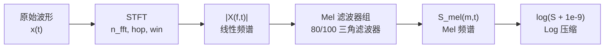

## 前置知识

> [!important]
> 
> 阅读本页前建议了解：短时傅里叶变换（STFT）基本概念

---

## 0. 定位

> STFT → 线性频谱 → Mel 滤波 → Log 压缩的完整计算流程与参数选择

---

## 1. 计算流程



---

## 2. 关键参数

|**参数**|**HiFi-GAN**|**BigVGAN**|**含义**|n_fft|1024|1024|FFT 窗口大小|
|---|---|---|---|---|---|---|---|
|hop_length|256|256|帧移（= 上采样倍率）|win_length|1024|1024|窗口长度|
|n_mels|80|100|Mel 频带数|f_min|0|0|最低频率|
|f_max|8000|12000|最高频率|采样率|22050 Hz|24000 Hz|—|

---

## 3. Mel 尺度转换

$$m = 2595 \log_{10}\left(1 + \frac{f}{700}\right)$$

Mel 尺度模拟人耳感知：低频区分辨率高，高频区分辨率低。

```python
import torch
import torchaudio

def get_mel_spectrogram(wav, sr=22050, n_fft=1024,
                        hop_length=256, n_mels=80):
    mel_fn = torchaudio.transforms.MelSpectrogram(
        sample_rate=sr, n_fft=n_fft,
        hop_length=hop_length, n_mels=n_mels,
        f_min=0, f_max=sr // 2
    )
    mel = mel_fn(wav)              # [B, n_mels, T]
    mel = torch.log(mel + 1e-9)    # Log 压缩
    return mel
```

> [!important]
> 
> **关键约束**：声码器的 Mel 参数必须与声学模型**完全一致**。参数不匹配会导致严重的音质下降，这是工程实践中最常见的错误。

---

## 参考文献

- [1] Stevens et al. (1937). "A Scale for the Measurement of Pitch."