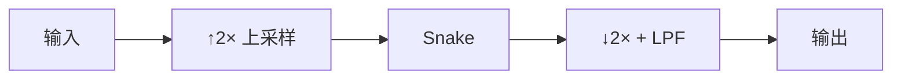

## 前置知识

> [!important]
> 
> 阅读本页前建议了解：基本的数字信号处理概念

---

## 0. 定位

> Nyquist-Shannon 采样定理、混叠现象、BigVGAN AMP 中的反混叠设计

---

## 1. Nyquist-Shannon 采样定理

$$f_s \geq 2 f_{\max}$$

采样率 $f_s$ 必须至少是信号最高频率 $f_{\max}$ 的两倍，否则高频分量被折叠到低频（**混叠**）。

---

## 2. 与 BigVGAN 的关联

Snake 激活函数 $\sin^2(\alpha x)$ 产生频率为 $2\alpha$ 的分量。当 $2\alpha > f_s/2$ 时发生混叠。

AMP 模块的解决方案：

**Kaiser 窗 sinc 滤波器**：

$$h[n] = \text{sinc}(2f_c n) \cdot w_{\text{Kaiser}}[n]$$

|**参数**|**值**|**含义**|$f_c$|0.25|截止频率（归一化）|
|---|---|---|---|---|---|
|kernel_size|12|滤波器长度|$\beta$|14.0|Kaiser 窗参数（控制旁瓣衰减）|

---

## 参考文献

- [1] Karras et al. (2021). "Alias-Free GAN."

- [2] Lee et al. (2023). "BigVGAN."