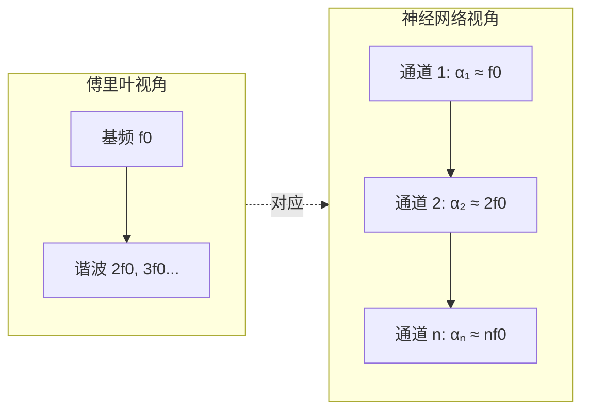

## 前置知识

> [!important]
> 
> 阅读本页前建议了解：基本的三角函数和波动概念

---

## 0. 定位

> 语音信号的周期性本质、傅里叶分析与 MPD/Snake 的关联

---

## 1. 语音信号的傅里叶表示

$$x(t) = \sum_{k=1}^{N} A_k \sin(2\pi f_k t + \phi_k)$$

|**符号**|**含义**|**典型范围**|
|---|---|---|
|$f_k = k \cdot f_0$|第 $k$ 次谐波|通常到 8-12 kHz|
|$\phi_k$|相位|影响感知质量|

---

## 2. 与 MPD 的关联

MPD 的素数周期 $p=[2,3,5,7,11]$ 将 1D 波形 reshape 为 2D，本质上是在检查「每隔 $p$ 个采样点的信号是否一致」。这直接对应傅里叶分量的周期结构。

---

## 3. 与 Snake 的关联

Snake 的 $\sin^2(\alpha x)$ 提供了可学习的周期分量。训练后，不同通道的 $\alpha$ 自然分化为不同频率，模拟了傅里叶分解的过程。

> [!important]
> 
> **统一视角**：MPD 在判别器端检查周期结构，Snake 在生成器端提供周期结构。两者都建立在傅里叶分析的思想基础上——语音是多种周期分量的叠加。

---

## 参考文献

- [1] Oppenheim, A. (2010). "Discrete-Time Signal Processing."

- [2] Liu et al. (2020). "Neural Networks Fail to Learn Periodic Functions."