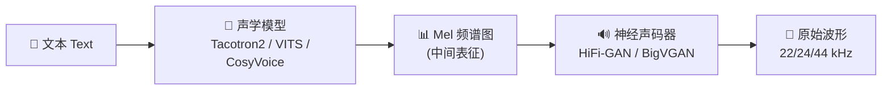
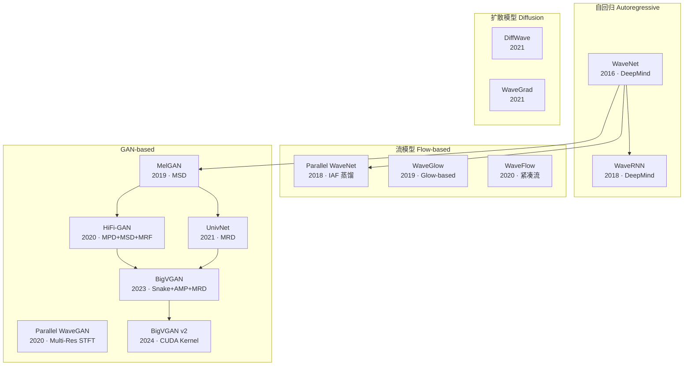
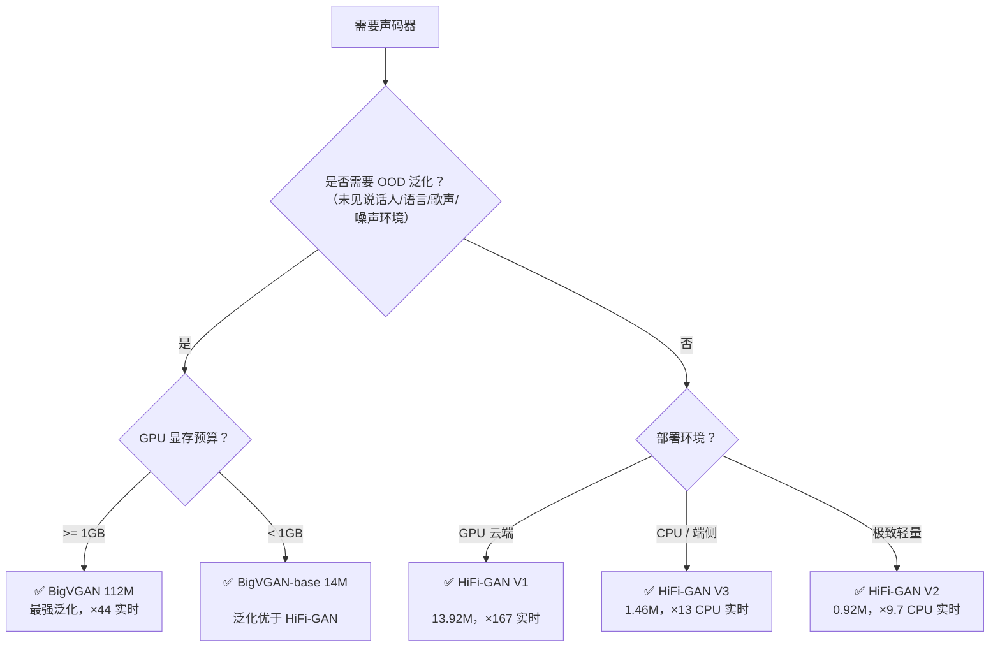

## 前置知识

> [!important]
> 
> 阅读本页前建议了解：生成对抗网络（GAN）基本概念、Mel 频谱图（Mel Spectrogram）基本概念、TTS 两阶段管线（Text→Mel→Waveform）

---

## 0. 定位

> 全局概览两篇核心论文——HiFi-GAN（Kong et al., NeurIPS 2020）与 BigVGAN（Lee et al., ICLR 2023）的技术贡献、架构差异与演进脉络；提供神经声码器分类框架、技术决策树、在现代 TTS/VC/语音大模型管线中的定位，以及子页面导航索引。

---

## 1. 神经声码器（Neural Vocoder）在语音合成中的位置

现代神经语音合成通常采用**两阶段管线（Two-Stage Pipeline）**：

**神经声码器（Neural Vocoder）** 是第二阶段模型，负责将低分辨率的声学特征（如 80/100-band Mel 频谱图）上采样为高分辨率的原始波形（Raw Waveform），采样率通常为 22.05~44.1 kHz，即每秒需生成数万个采样点。这一任务的核心挑战在于：

- **超高维输出**：1 秒 22 kHz 音频 = 22,000 个采样点，逐点生成极其缓慢

- **周期性建模**：语音信号由多种周期的正弦分量叠加而成（傅里叶级数），声码器必须精确捕获这些周期模式

- **感知质量**：人耳对相位失真、高频伪影极度敏感

---

## 2. 声码器技术演进脉络

### 四大范式横向对比

|**范式**|**代表模型**|**生成方式**|**质量**|**速度**|**参数量**|**局限**|
|---|---|---|---|---|---|---|
|自回归（AR）|WaveNet, WaveRNN|逐采样点串行|⭐⭐⭐⭐⭐|❌ 极慢（×0.003 实时）|24.7M|无法并行，不适合实时|
|流模型（Flow）|WaveGlow, WaveFlow|可逆变换并行|⭐⭐⭐⭐|⚠️ 中等（×22 实时）|87.7~99.4M|双射约束限制容量；参数量大|
|**GAN**|**HiFi-GAN, BigVGAN**|**全并行单次前向**|**⭐⭐⭐⭐⭐**|**✅ 极快（×167~×1186 实时）**|**0.92~112M**|**训练不稳定；需精心设计判别器**|
|扩散模型|DiffWave, WaveGrad|多步去噪|⭐⭐⭐⭐|⚠️ 需多步（6~50 步）|24~30M|推理步数多；实时性不足|

> [!important]
> 
> **核心结论**：GAN 声码器是目前**质量-速度帕累托最优**的范式。HiFi-GAN V1 仅 13.92M 参数即达到接近人声的 MOS 4.36，同时在 V100 GPU 上以 ×167 实时速度生成 22 kHz 音频。BigVGAN 进一步将 GAN 声码器推向通用声码器（Universal Vocoder）的目标。

---

## 3. 两篇核心论文贡献对比

|**维度**|**HiFi-GAN (NeurIPS 2020)**|**BigVGAN (ICLR 2023)**|
|---|---|---|
|**核心问题**|GAN 声码器质量不如 AR/Flow|GAN 声码器 OOD 泛化能力差|
|**关键创新**|MPD 多周期判别器 + MRF 多感受野融合|Snake 周期激活 + AMP 抗混叠模块 + 大规模训练|
|**生成器激活**|Leaky ReLU|Snake（周期性，可学习频率 α）|
|**判别器组合**|MPD + MSD|MPD + MRD（替换 MSD）|
|**训练数据**|LJSpeech（单说话人，24h）|LibriTTS-full（多说话人，~960h）|
|**最大参数量**|13.92M (V1)|112M|
|**MOS（分布内）**|4.36 ± 0.07|4.11 ± 0.09 / SMOS 4.26 ± 0.08|
|**OOD 泛化**|未见说话人可泛化|未见语言 / 录音环境 / 歌声 / 器乐均可泛化|
|**GPU 速度**|×167 实时 (V1, V100)|×44.7 实时 (112M, RTX 8000)|
|**开源**|[github.com/jik876/hifi-gan](http://github.com/jik876/hifi-gan)|[github.com/NVIDIA/BigVGAN](http://github.com/NVIDIA/BigVGAN)|

---

## 4. 技术决策树：选择哪个声码器？

> [!important]
> 
> **工程判断优先级**：
> 
> 1. **通用场景首选 BigVGAN-base**（14M）——质量、泛化、速度的最佳平衡点
> 
> 1. **单说话人 / 受控环境选 HiFi-GAN V1**——更快、更轻，质量已够用
> 
> 1. **端侧部署选 HiFi-GAN V2/V3**——CPU 实时推理
> 
> 1. **极端 OOD（歌声/器乐/多语言）选 BigVGAN 112M**——唯一能 zero-shot 处理的选项

---

## 5. 在现代语音系统中的实际使用

HiFi-GAN 和 BigVGAN 已成为现代 TTS、VC、语音大模型管线中的**标准声码器组件**：

|**系统**|**声码器选择**|**用途**|
|---|---|---|
|Tacotron2 + HiFi-GAN|HiFi-GAN V1|经典两阶段 TTS|
|VITS / FreeVC|HiFi-GAN Decoder（内置）|端到端 TTS / VC|
|CosyVoice v1~v3|HiFi-GAN → BigVGAN|零样本多语言 TTS|
|Qwen-TTS / Qwen3-TTS|修改版 BigVGAN|大语言模型驱动的 TTS|
|VEVO|BigVGAN v2|零样本语音模仿|
|SpeechGPT / LLaMA-Omni|unit-based HiFi-GAN|端到端语音大模型|
|GLM-4-Voice|Flow Matching + HiFi-GAN|实时语音对话|
|GPT-SoVITS|BigVGAN|开源语音克隆|

---

## 6. 本笔记架构总览

本笔记体系共 6 个 L2 主题、22 个 L3 技术节点、20 个 L4 细节节点，按以下结构组织：

|编号|主题|层级|核心内容|
|---|---|---|---|
|**1.1**|神经声码器技术背景|L2|AR → Flow → GAN 演进脉络|
|**1.2**|HiFi-GAN 架构与原理|L2|Generator(MRF) + MPD + MSD + Loss|
|**1.3**|BigVGAN 架构与原理|L2|Snake + AMP + MRD + 大规模训练|
|**1.4**|HiFi-GAN vs BigVGAN 对比|L2|逐模块对比 + 选型建议|
|**1.5**|实际应用与生态|L2|TTS / VC / 语音大模型集成|
|**1.6**|核心数学与基础概念|L2|GAN / Mel / 膨胀卷积 / 采样定理|

---

## 7. 常见误区

> [!important]
> 
> **误区 1：「BigVGAN 完全替代了 HiFi-GAN」**
> 
> 错。BigVGAN 的优势在 OOD 泛化场景（歌声、器乐、未见语言），但在单说话人受控场景下 HiFi-GAN V1 仍然是更优选择——更快（×167 vs ×44 实时）、更轻（14M vs 112M）、质量已接近人声。

> [!important]
> 
> **误区 2：「GAN 声码器训练不稳定，不如扩散模型」**
> 
> 错。HiFi-GAN 的训练已经非常成熟稳定（配合 LSGAN + Feature Matching + Mel Loss 三重损失）。BigVGAN 在 112M 规模训练时确实遇到了崩溃问题，但通过降低学习率（2e-4→1e-4）、梯度裁剪（clip norm 10³）即可解决。扩散模型的多步推理反而是更严重的实际瓶颈。

> [!important]
> 
> **误区 3：「参数量越大质量越好」**
> 
> 不完全对。BigVGAN-base（14M）在所有客观指标上已显著超越 HiFi-GAN V1（14M），说明**架构改进（Snake + AMP + MRD）比单纯增加参数更重要**。112M BigVGAN 的主要优势在 OOD 泛化而非分布内质量。

---

## 参考文献

- [1] Kong, J., Kim, J., & Bae, J. (2020). "HiFi-GAN: Generative Adversarial Networks for Efficient and High Fidelity Speech Synthesis." NeurIPS 2020.

- [2] Lee, S., Ping, W., Ginsburg, B., Catanzaro, B., & Yoon, S. (2023). "BigVGAN: A Universal Neural Vocoder with Large-Scale Training." ICLR 2023.

- [3] Kumar, K. et al. (2019). "MelGAN: Generative Adversarial Networks for Conditional Waveform Synthesis." NeurIPS 2019.

- [4] Yamamoto, R. et al. (2020). "Parallel WaveGAN: A Fast Waveform Generation Model Based on Generative Adversarial Networks with Multi-Resolution Spectrogram." ICASSP 2020.

- [5] Jang, W. et al. (2021). "UnivNet: A Neural Vocoder with Multi-Resolution Spectrogram Discriminators for High-Fidelity Waveform Generation." Interspeech 2021.

[[1. 神经声码器（Neural Vocoder）技术背景]]

[[2. HiFi-GAN 架构与原理]]

[[3. BigVGAN 架构与原理]]

[[4. HiFi-GAN vs BigVGAN 全方位对比]]

[[5. 实际应用与生态]]

[[DL/TTS/GAN 声码器深度解析：HiFi-GAN 与 BigVGAN 总纲/6 核心数学与基础概念/6. 核心数学与基础概念]]