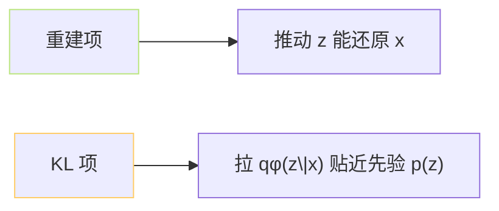

## 前置知识

> [!important]
> 
> 本页属于 [[1.1.1 条件变分自编码器（CVAE）框架|1.1.1 条件变分自编码器（CVAE）框架]] 的「精准定义」层。

---

## 0. 定义

> **ELBO（Evidence Lower BOund，证据下界）** 是「对数似然 $\log p_\theta(x)$ 的一个紧下界」，是 VAE / CVAE 训练的优化目标。

---

## 1. 推导三步

### 第一步：Jensen 不等式

$$\log p_\theta(x) = \log \int p_\theta(x,z)\,dz = \log \mathbb E_{q_\phi(z|x)}\!\left[\frac{p_\theta(x,z)}{q_\phi(z|x)}\right] \ge \mathbb E_{q_\phi(z|x)}\!\left[\log \frac{p_\theta(x,z)}{q_\phi(z|x)}\right]$$

### 第二步：拆解联合分布

$$\log p_\theta(x,z) = \log p_\theta(x|z) + \log p(z)$$

### 第三步：合并出 KL

$$\boxed{\mathcal L_{\text{ELBO}} = \underbrace{\mathbb E_{q_\phi(z|x)}[\log p_\theta(x|z)]}_{\text{重建项}} - \underbrace{D_{\text{KL}}(q_\phi(z|x) \| p(z))}_{\text{KL 项}}}$$

---

## 2. 两项的意义

- **重建项**：保证代理 $z$ 保留足够信息，以便解码。

- **KL 项**：防止 $q_\phi$ 跳脱先验（则逆粘性丢）。

---

## 3. 与证据的 gap

$$\log p_\theta(x) = \mathcal L_{\text{ELBO}} + D_{\text{KL}}(q_\phi(z|x) \| p_\theta(z|x))$$

仅当 $q_\phi(z|x) = p_\theta(z|x)$（后验完全拟合）时，ELBO = 真实对数似然。**ELBO 越高 ≈ 似然下界越高 + 后验越准**。

---

## 4. 在 VITS / SoVITS 中的体现

$x$ = mel-spectrogram；$z$ = posterior latent；condition $c$ = phonemes + bert。VITS 采用 ELBO + GAN + duration；见 [[1.1.1 条件变分自编码器（CVAE）框架|1.1.1 条件变分自编码器（CVAE）框架]]。

---

## 参考文献

1. Kingma, D. P. & Welling, M. (2014). _Auto-Encoding Variational Bayes_. ICLR.