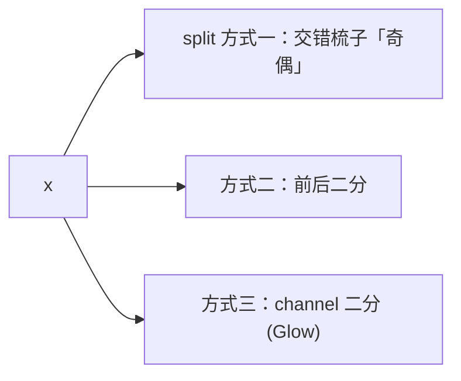

## 前置知识

> [!important]
> 
> 本页属于 [[1.1.2 Normalizing Flow 与 Affine Coupling Layer]]。

---

## 0. 定义

> **Affine Coupling Layer** = 「把输入一分为二 $(x_a, x_b)$，用 $x_a$ 预测 $x_b$ 的仿射变换参数 $(s, t)$，只变换 $x_b$」的可逆变换。是 Real NVP / Glow 的核心构件。

---

## 1. 计算式

### 前向（训练、编码）

$$\begin{aligned}  
x_a, x_b &= \text{split}(x) \\  
s, t &= \text{NN}(x_a) \\  
y_a &= x_a \\  
y_b &= x_b \odot \exp(s) + t \\  
y &= \text{concat}(y_a, y_b)  
\end{aligned}$$

### 反向（采样、解码）

$$\begin{aligned}  
y_a, y_b &= \text{split}(y) \\  
x_a &= y_a \\  
s, t &= \text{NN}(y_a) \quad\text{(同一 NN，可重用)}\\  
x_b &= (y_b - t) \odot \exp(-s) \\  
x &= \text{concat}(x_a, x_b)  
\end{aligned}$$

> [!important]
> 
> **巧点**：$text{NN}(x_a) = text{NN}(y_a)$，于是反向不需重跑 NN、仅简单计算。

---

## 2. 为什么可逆且 Jacobian 简单

输出对输入雅克比矩阵 = 上三角：

$$J = \begin{bmatrix} I & 0 \\ \partial y_b / \partial x_a & \text{diag}(\exp(s)) \end{bmatrix}$$

行列式 = 对角线乘积 = $prod_i exp(s_i) = exp(sum_i s_i)$。

$$\log |\det J| = \sum_i s_i$$

详见 [[1.1.2.2 Jacobian 与可逆性]]。

---

## 3. split 方式

VITS 选逍道 split（channel 维），多层交替旋转选择。

---

## 4. VITS 里的 Affine Coupling

- **层数**：4 层跟 8 层 另选。

- **NN**：WaveNet residual block stack。

- **输入**：$z$，条件 = phoneme/text encoder 输出。

- **Permutation**：两层之间插入 channel-reverse。

---

## 参考文献

1. Dinh, L. et al. (2017). _Density Estimation Using Real NVP_. ICLR.

1. Kingma, D. P. & Dhariwal, P. (2018). _Glow_. NeurIPS.