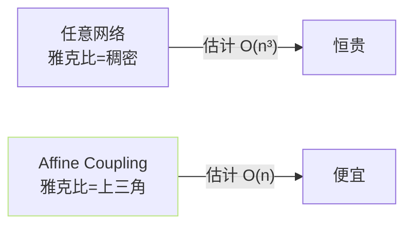

## 前置知识

> [!important]
> 
> 本页属于 [[1.1.2 Normalizing Flow 与 Affine Coupling Layer|1.1.2 Normalizing Flow 与 Affine Coupling Layer]]。建议先读 [[1.1.2.1 Affine Coupling Layer 计算式|1.1.2.1 Affine Coupling Layer 计算式]]。

---

## 0. 定义

> **Jacobian 雅克比行列式** 描述「输入变换后体积变化倍数」。在 NF 里，该量是「从 $p(z)$ 算 $p(x)$」的核心校正项。

---

## 1. 变量变换公式

设 $y = f(x)$，$f$ 可逆。则：

$$p_Y(y) = p_X(f^{-1}(y)) \cdot \left| \det \frac{\partial f^{-1}}{\partial y} \right| = p_X(x) \cdot |\det J_f|^{-1}$$

取对数：

$$\log p_Y(y) = \log p_X(x) - \log |\det J_f|$$

---

## 2. 为什么 Affine Coupling 雅克比简单

$$J_f = \frac{\partial y}{\partial x} = \begin{bmatrix} \frac{\partial y_a}{\partial x_a} & \frac{\partial y_a}{\partial x_b} \\ \frac{\partial y_b}{\partial x_a} & \frac{\partial y_b}{\partial x_b} \end{bmatrix} = \begin{bmatrix} I & 0 \\ \partial(x_b e^s + t)/\partial x_a & \text{diag}(e^s) \end{bmatrix}$$

**上三角 + 对角线**：

$$\det J_f = \prod_i e^{s_i} = e^{\sum_i s_i}, \quad \log|\det J_f| = \sum_i s_i$$

---

## 3. 可逆性保证

$y_b = x_b \odot e^s + t \implies x_b = (y_b - t) \odot e^{-s}$，但上面需 $e^s \ne 0$。由于 $s \in \mathbb{R}$，$e^s > 0$，**总是成立**。

- **数值稳定**：限制 $s$ 范围、加 LayerNorm/Tanh 防止爆炸。

- **梯度传递**：$\log|\det J| = \sum s_i$ 是可微函数与 $\theta$ 联动。

---

## 4. 在 VITS / SoVITS 中的作用

先验编码器输出 $z$ 与 $\log|\det J|$。训练 loss：

$$\log p_\psi(z|c) = \log \mathcal N(f^{-1}(z); 0, I) + \sum_i s_i^{(c)}$$

意义：Flow 把复杂后验「拉  到 高斯」，可计算似然。

---

## 参考文献

1. Dinh, L. et al. (2017). _Real NVP_. ICLR.

1. Rezende, D. J. & Mohamed, S. (2015). _Variational Inference with Normalizing Flows_. ICML.