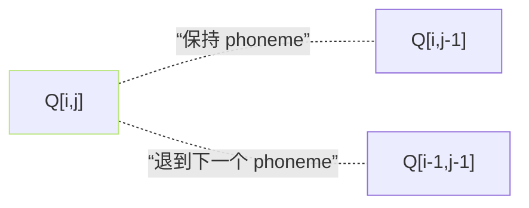

## 前置知识

> [!important]
> 
> 本页属于 [[1.1.3 Monotonic Alignment Search (MAS)]]。需读完 MAS 总体后看本页详细 DP。

---

## 0. 定义

> **单调对齐动态规划** = 「在 phoneme×frame 矩阵 $P$ 上找一条『必详』、**仅可向右或向下**的路径，使路径上的『对齐得分』总和最大」的 Viterbi-型 DP。

---

## 1. 问题设置

- 给定：phoneme 序列长度 $N$，mel 帧长度 $T$。

- 表格： $P_{i,j} = log mathcal N(z_j; mu_i, sigma_i)$（第 $i$ 个 phoneme 与第 $j$ 个帧的「匹配得分」）。

- 目标：路径 $\mathcal A = \{(i_1,j_1), ..., (i_T,j_T)\}$ 满足：
    
    1. **起于 $(1,1)$，终于** $(N,T)$。
    
    1. **必须逐帧前进**：$j_{k+1} = j_k + 1$。
    
    1. **phoneme 逐帧保持或+1**：$i_{k+1} in {i_k, i_k+1}$。
    

---

## 2. DP 递推

设 $Q_{i,j}$ = 从 $(1,1)$ 到 $(i,j)$ 的最佳累计得分。

$$Q_{i,j} = P_{i,j} + \max\big(Q_{i,j-1},\, Q_{i-1,j-1}\big)$$

边界：$Q_{1,1} = P_{1,1}$，$Q_{i,j} = -infty$ if $i > j$ 或不合法。



---

## 3. 回溯路径

```python
# 伪代码
for j in range(T, 0, -1):
    if i > 1 and Q[i-1, j-1] >= Q[i, j-1]:
        align[j] = (i-1, j)
        i -= 1
    else:
        align[j] = (i, j)
```

得到 $\mathcal A$ 后，计算每个 phoneme 的 duration：$d_i = |{j : i_j = i}|$。

---

## 4. 复杂度

- 时间：$O(N cdot T)$。 以 N=200, T=1000 计、某仅为 0.2 ms（CUDA）。

- 空间：$O(N cdot T)$。

- 只在训练时走；推理时由 duration predictor 提供 $d_i$。

---

## 5. CUDA 实现要点

- VITS 代码提供了 `monotonic_align/core.pyx` Cython 并行版。

- 在 batch 中为每个样本独立跟 DP，不能跨 batch 并行不同 $N, T$。

- 梯度不走 DP，仅使用 align 结果以作为“硬计」点位。

---

## 参考文献

1. Kim, J. et al. (2020). _Glow-TTS_. NeurIPS. §2.3.

1. Kim, J. et al. (2021). _VITS_. ICML. §3.1.