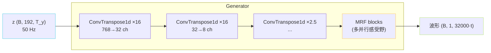

## 前置知识

> [!important]
> 
> 该 vocoder 是 VITS / GPT-SoVITS v1/v2 的波形生成头；v3/v4 换为 BigVGAN（见 [[1.6 BigVGAN]]）。

---

## 0. 定位

> **一句话**：HiFi-GAN 头 = **高倍数上采样卷积 + 多感受野 MRF 混合**，能以对抗训练从隐变量 $z$（50Hz）一步出 32kHz 波形。VITS 选它是因为「质量高 + 推理快 + 与 CVAE 可联合训」。

---

## 1. 架构总览

总上采样倍数 = 16 × 16 × 2.5 = **640×**（50 Hz → 32000 Hz）。SoVITS v1/v2 使用 4 级上采样，倍数 (10, 8, 2, 2)。

---

## 2. MRF（Multi-Receptive Field）模块

**思路**：多个不同 kernel size / dilation 的 ResBlock 并行，输出相加。

$$\text{MRF}(x) = \sum_{k=1}^{N} \text{ResBlock}_k(x), \quad \text{kernel}_k \in \{3, 7, 11\}, \text{dilation} \in \{1, 3, 5\}$$

意义：同时抓跨**小到大多个时间尺度**的波形细节，是 HiFi-GAN 能走赢 MelGAN/WaveGlow 的关键设计。

---

## 3. 判别器：MPD + MSD

|判别器|架构|作用|
|---|---|---|
|**MPD**（Multi-Period Discriminator）|5 个二维卷积子判器，period $\in\{2,3,5,7,11\}$|抓周期性饱和（元音、音高）|
|**MSD**（Multi-Scale Discriminator）|3 个不同采样率下的一维卷积子判器|抓谱结构、辅音详细|

联合损失：

$$\mathcal L_{\text{adv}} = \mathbb E_y\!\Big[\sum_k (D_k(y)-1)^2\Big] + \mathbb E_{\hat y}\!\Big[\sum_k D_k(\hat y)^2\Big]$$

**Feature Matching Loss**：逐层匹配判别器中间 feature。

$$\mathcal L_{\text{fm}} = \sum_k\sum_l \frac{1}{N_l}\|\,D_k^{(l)}(y) - D_k^{(l)}(\hat y)\,\|_1$$

> [!important]
> 
> FM 损失是「判别器中间特征对齐」，比单纯 adv 损失更能让生成器多样性不坍塌。是 HiFi-GAN 生产可用的重要原因。

---

## 4. VITS 千 SoVITS 的变化

|层|VITS 原版|GPT-SoVITS v1/v2|
|---|---|---|
|输入|z (192d, 50Hz)|z (192d, 50Hz)、semantic 原动|
|上采样|4 级 (8, 8, 2, 2)|4 级 (10, 8, 2, 2) 适 32k|
|输出|22.05k / 24k|**32k**|
|MRF|3 并行|保留|
|Snake 激活|无|部分处理|

---

## 5. 子页面导航

[[1.1.4.1 MRF（Multi-Receptive Field）块]]

[[1.1.4.2 MPD - MSD 判别器]]

---

## 参考文献

1. Kong, J., Kim, J., & Bae, J. (2020). _HiFi-GAN_. NeurIPS.

1. Kumar, K. et al. (2019). _MelGAN_. NeurIPS.

1. Lee, S. et al. (2023). _BigVGAN_. ICLR.