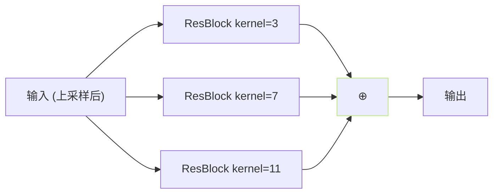

## 前置知识

> [!important]
> 
> 本页属于 [[1.1.4 HiFi-GAN 解码器（VITS 原版波形头）]]。

---

## 0. 定义

> **MRF（Multi-Receptive Field Fusion）** = 「一个上采样阶后面接三个不同 kernel×dilation 的残差块，并将他们输出相加」的模块。负责 HiFi-GAN 在不同时间尺度上同时建模。

---

## 1. 结构



每个 ResBlock 内部是「**1D 卷积 + dilation 堆叠**」，典型 kernel = [3,3,3], dilation = [[1,1],[3,1],[5,1]]。

---

## 2. 为什么要三个 kernel 合作

- **kernel=3**：捕获高频、短期细节。

- **kernel=7**：捕获中频、中期谐波。

- **kernel=11**：捕获低频、长期趋势。

三者相加 → **多感受野融合**。与 Inception 模块的思路一致。

---

## 3. 在 SoVITS 里的位置

SoVITS 解码器 = 上采样以及 MRF 堆叠：

```jsx
z → Conv → [上采样 8× → MRF] → [上采样 8× → MRF] → [上采样 2× → MRF] → [上采样 2× → MRF] → Conv → wav
```

- 总上采样倍率 = $8 times 8 times 2 times 2 = 256$。

- 输入 80×T frame → 输出 1×256T sample。

---

## 4. 计算成本

|层|卷积次数|FLOPs|
|---|---|---|
|4 个上采样阶|8 (transposed conv)|中|
|4 个 MRF × 3 kernel × 3 layer|36 次 1D conv|高|
|总计|50+|高|

**HiFi-GAN 是计算量的大头**。BigVGAN 在 MRF 上进一步加阶，质量更高，成本更贵。

---

## 参考文献

1. Kong, J. et al. (2020). _HiFi-GAN_. NeurIPS. §2.2.