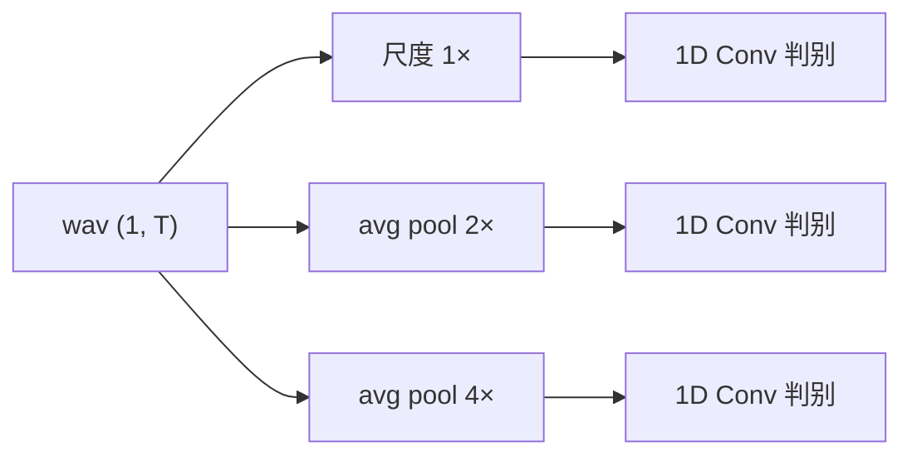
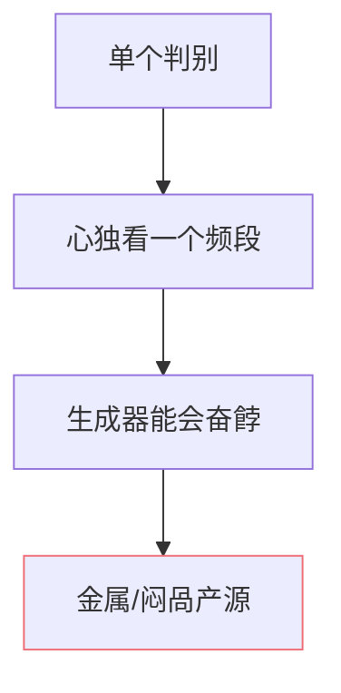

## 前置知识

> [!important]
> 
> 本页属于 [[1.1.4 HiFi-GAN 解码器（VITS 原版波形头）|1.1.4 HiFi-GAN 解码器（VITS 原版波形头）]]。

---

## 0. 定义

> **MPD（Multi-Period Discriminator）** 与 **MSD（Multi-Scale Discriminator）** 是 HiFi-GAN 的两个互补判别器组，分别检查「谐波周期性」与「不同采样率下的全局特征」。两者联手迫使生成器照顾不同频段。

---

## 1. MPD：Multi-Period Discriminator

思路：把 1D 波形 reshape 为 2D，高度 = period $p$，宽度 = $T/p$。然后 2D 卷积判别。

- **默认周期**：$p \in \{2, 3, 5, 7, 11\}$（互质数，避免重叠采样货）。

- **作用**：检查「同一周期点上的采样是否一致」——人耳对周期性货极敏感。

---

## 2. MSD：Multi-Scale Discriminator

思路：MelGAN 风格。原始、下采样 2×、下采样 4× 三个尺度上都跳一个 1D 卷积判别器。

- **作用**：从不同时间尺度上检查谐波、的全局趋势。

---

## 3. 联合损失

$$\mathcal L_D = \sum_{k} \mathbb E\!\big[(D_k(x) - 1)^2 + D_k(\hat x)^2\big]$$

$$\mathcal L_G = \sum_{k} \mathbb E\!\big[(D_k(\hat x) - 1)^2\big] + \lambda_{fm} \mathcal L_{fm} + \lambda_{mel} \mathcal L_{mel}$$

其中 $k$ 跨 5 个 MPD 子判别 + 3 个 MSD 子判别 = **8 个判别器**。

---

## 4. 为什么不能只留一个

判别器越多、越小众、越隔离，生成器越难「供馑」。HiFi-GAN 的 8 个子判别是「频段包裹」的最低限设计。

---

## 参考文献

1. Kong, J. et al. (2020). _HiFi-GAN_. NeurIPS. §2.3.

1. Kumar, K. et al. (2019). _MelGAN_. NeurIPS.