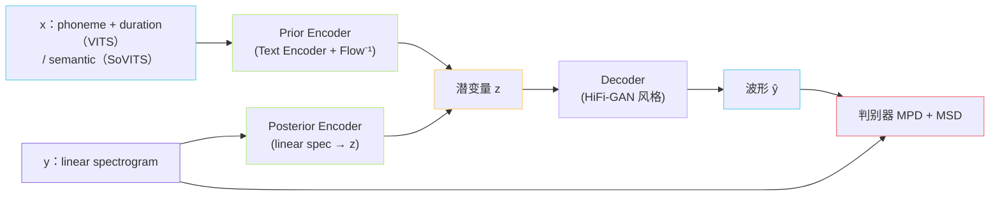

## 前置知识

> [!important]
> 
> 建议先读 [[1. 前置基础与理论根基]] 了解 GPT-SoVITS 五条线的全景。

---

## 0. 定位

> **一句话**：VITS = **变分推断 + Normalizing Flow + GAN** 的端到端 TTS，是 GPT-SoVITS **v1/v2/v2Pro 的声学解码器骨架**（v3/v4 已替换为 CFM）。理解 CVAE + Flow + HiFi-GAN 三件套，才能理解 SoVITS 解码端为什么长这样。

---

## 1.1.1 VITS 在 GPT-SoVITS 中的角色

GPT-SoVITS 的「**SoVITS 解码器**」**并不是**原版 VITS，而是 **VITS 骨架 + 去对齐 + 输入换 semantic** 的改造版：

|原版 VITS|GPT-SoVITS 改造|
|---|---|
|输入：phoneme + duration|输入：**semantic tokens**（来自 AR 头）+ 参考音色|
|单调对齐搜索（MAS）|**无对齐**——semantic 已是 25Hz 帧级语义|
|文本 → 先验分布|semantic token → 先验分布|
|训练含对齐损失|删除对齐相关损失|
|Decoder：HiFi-GAN V1|HiFi-GAN 风格 + 残差耦合，针对 32k|

> [!important]
> 
> VITS 是 GPT-SoVITS 解码器的**「毛坯房」**——去掉对齐模块后变成**条件波形生成器**，条件就是 AR 头吐出的 semantic 序列。

---

## 1.1.2 三大模块

三个原子页面深入各模块（见下方导航）。

---

## 1.1.3 关键公式（不展开推导）

### CVAE 的 ELBO

$$\mathcal{L}_{\text{VAE}} = \underbrace{-\mathbb{E}_{q_\phi(z|y)}[\log p_\theta(y|z)]}_{\text{重构}} + \underbrace{\mathrm{KL}\!\left(q_\phi(z|y) \,\|\, p_\theta(z|x)\right)}_{\text{先验-后验对齐}}$$

- $x$ 是条件（VITS：音素；SoVITS：semantic）；$y$ 是线性谱；$z$ 是潜变量。

- 后验 $q_\phi(z|y)$ 由 Posterior Encoder 给；先验 $p_\theta(z|x)$ 由 Text/Semantic Encoder + 反向 Flow 给。

- **Flow 的作用**：把简单高斯先验扭成复杂分布，缓解谱与音素之间的强非线性。

### VITS 总目标

$$\mathcal{L}_{\text{VITS}} = \mathcal{L}_{\text{VAE}} + \lambda_{\text{adv}} \mathcal{L}_{\text{adv}} + \lambda_{\text{fm}} \mathcal{L}_{\text{fm}} + \lambda_{\text{mel}} \mathcal{L}_{\text{mel}}$$

各项含义见 [[6.1.7 损失函数总览（mel - KL - adv - fm）]]。

---

## 1.1.4 方法对比：VITS vs Tacotron 2 vs FastSpeech 2

|维度|Tacotron 2|FastSpeech 2|VITS|
|---|---|---|---|
|对齐方式|Attention|外部强制对齐|**MAS 自学习**|
|是否需 vocoder|是（外置）|是（外置）|**否，端到端**|
|训练目标|L1 + stop|L1 + duration|**ELBO + GAN**|
|推理|慢（AR）|快|快（NAR）|
|报告 MOS|~4.0|~4.0|**~4.4**|

> [!important]
> 
> **为什么 GPT-SoVITS 仍然保留 VITS 而不全切到 CFM？**
> 
> - VITS **一步出波形**，推理延迟低，适合实时；CFM 需要 8+ 步 ODE，且还要走 BigVGAN，端到端延迟高 5~10×。
> 
> - VITS 的 GAN 损失对**音色细节**学习更直接（feature matching 损失逐层匹配），在小数据微调时音色相似度更高——这就是 V2Pro 在「音色克隆」赛道仍是首选的原因。

---

## 1.1.5 常见误区

> [!important]
> 
> **误区 1**：VITS 是「flow-based TTS」。
> 
> VITS 主干是 **CVAE**，Normalizing Flow 只是**增强先验灵活性**的组件，不是生成的核心。

> [!important]
> 
> **误区 2**：「GPT-SoVITS 的 SoVITS 就是 SoftVC-VITS」。
> 
> 不是。SoftVC-VITS 用于歌声转换（输入 SoftVC 特征），GPT-SoVITS 的 SoVITS 解码器输入是 **AR 头吐出的 semantic token**——二者命名相似，**核心条件信号完全不同**。

---

## 1.1.6 子页面导航

[[1.1.1 条件变分自编码器（CVAE）框架]]

---

## 1.1.7 延伸阅读

- [[6.1 V1 - V2 SoVITS（VITS-based）]]

- [[6.2 V3 - V4 SoVITS（CFM + BigVGAN）]]

- [[1.5 Flow Matching - CFM（v3-v4 的核心范式）]]

---

## 参考文献

1. Kim, J., Kong, J., & Son, J. (2021). _VITS_. ICML. arXiv:2106.06103.

1. Kong, J., Kim, J., & Bae, J. (2020). _HiFi-GAN_. NeurIPS.

1. Ren, Y. et al. (2021). _FastSpeech 2_. ICLR.

[[1.1.2 Normalizing Flow 与 Affine Coupling Layer]]

1. Shen, J. et al. (2018). _Tacotron 2_. ICASSP.

[[1.1.3 Monotonic Alignment Search (MAS)]]

[[1.1.4 HiFi-GAN 解码器（VITS 原版波形头）]]

[[1.1.5 ELBO 深入：证据下界的思想、逻辑与应用]]