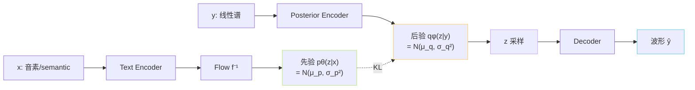

## 前置知识

> [!important]
> 
> 建议先读 [[1.1 VITS 原理（SoVITS 的“S”血统）|1.1 VITS 原理（SoVITS 的“S”血统）]]，然后可参考 [[1.1.5 ELBO 深入：证据下界的思想、逻辑与应用|1.1.5 ELBO 深入：证据下界的思想、逻辑与应用]] 作为数学补丁。

---

## 0. 定位

> **一句话**：VITS 的主干是条件变分自编码器（**Conditional VAE，CVAE**）——把「文本→语音」的生成问题改写为「在文本条件下，从语音隐变量 $z$ 采样再解码」。本页讲清 CVAE 在 VITS 里的**输入、输出、损失、推理路径**四在件。

---

## 1. 什么是 CVAE（与 VAE 的区别）

||VAE|CVAE|VITS 中的 CVAE|
|---|---|---|---|
|输入|$x$|$x, c$|$y$ (线性谱), $x$ (phoneme 或 semantic)|
|先验|$p(z)$|$p(z\|c)$|$p_\theta(z\|x)$，**由文本编码器+Flow 给出**|
|后验|$p(z\|x)$|$p(z\|x,c)$|$q_\phi(z\|y)$，由后验编码器给出|
|解码|$p(x\|z)$|$p(x\|z,c)$|$p(y\|z)$ → 波形|

> [!important]
> 
> **核心区别**：VITS 的「条件」 $x$ 不是拼接进 encoder 的辅助输入，而是**定义先验本身**——“这句音的隐变量应该长什么样”由文本决定。这是 VITS 能「一步出波形」的关键。

---

## 2. 四个模块拆解

### 2.1 Posterior Encoder $q_\phi(z|y)$

- 输入：线性谱 $y$（VITS 用 linear spec，not mel）。

- 结构：WaveNet-style 扩张卷积堆叠 + 1×1 输出 $\mu_q, \log \sigma_q$。

- 输出：高斯后验，采样 $z = \mu_q + \sigma_q \cdot \epsilon$。

### 2.2 Prior Encoder $p_\theta(z|x)$

- 输入：phoneme（VITS）或 semantic（SoVITS）。

- 结构：Text/Semantic Encoder 给出 **初先验** $\mathcal N(\mu_x,\sigma_x^2)$ → 再过 **反向 Flow** 扭成复杂分布。

- 护对齐：VITS 还需 MAS 对齐出帧级序列；SoVITS 不需对齐（semantic 本身是 25Hz 帧级）。

### 2.3 Decoder $p(y|z)→ˆy$

- HiFi-GAN 风格上采样堆叠。

- 注意：VITS 的 decoder 不是「$z \to$ 线性谱」，而是**跳过谱直接出波形**——这才是「端到端」的关键。

- 映射：z (192d, 50Hz) → 波形 (32kHz)，上采样倍数 = 32000/50 = **640×**。

### 2.4 反向 Flow $f^{-1}$ 的用途

- 训练：将后验采样 $z$ 用反向 Flow 扭回「简单高斯」空间与先验算 KL。

- 推理：从先验采样 → 正向 Flow 扭成复杂分布的 $z$。

---

## 3. 损失函数 —— 本页的中心

### CVAE 部分（ELBO）

$$\mathcal L_{\text{CVAE}} = \underbrace{-\mathbb E_{q_\phi(z|y)}[\log p(y|z)]}_{\text{重构}} + \underbrace{\mathrm{KL}\!\big(q_\phi(z|y)\,\|\,p_\theta(z|x)\big)}_{\text{先-后验对齐}}$$

### 拆解后的实际损失（VITS 论文式）

$$\mathcal L = \mathcal L_{\text{recon}} + \mathcal L_{\text{KL}} + \mathcal L_{\text{dur}} + \lambda_{\text{adv}}\mathcal L_{\text{adv}} + \lambda_{\text{fm}}\mathcal L_{\text{fm}}$$

- $\mathcal{L}_{\text{recon}}$：mel L1 损失（从 $z \to$ 波形取 mel 后与 GT mel 比）。

- $\mathcal{L}_{\text{KL}}$：上面公式的 KL 项。

- $\mathcal{L}_{\text{dur}}$：Stochastic Duration Predictor 的对齐损失（SoVITS 删除）。

- $\mathcal{L}_{\text{adv}}, \mathcal{L}_{\text{fm}}$：GAN 部分负责高频细节。

---

## 4. 为什么选 CVAE？

> [!important]
> 
> **三个原因**：
> 
> 1. **随机性** —— 同一句话能采出多种语调，隐变量 $z$ 天然是「不可控变量」的载体。
> 
> 1. **不需 NAR 多流** —— 与 VALL-E 的 8 流不同，$z$ 单一表示即可。
> 
> 1. **一步出波形** —— 同时集成谱建模与 vocoder，端到端优化能避免「预测 mel 住 → vocoder 补损」的累计误差。

---

## 5. 子页面导航

---

## 参考文献

1. Kingma, D. P., & Welling, M. (2014). _Auto-Encoding Variational Bayes_. ICLR.

1. Sohn, K. et al. (2015). _Conditional VAE_. NeurIPS.

[[1.1.1.1 ELBO 推导|1.1.1.1 ELBO 推导]]

1. Kim, J., Kong, J., & Son, J. (2021). _VITS_. ICML.

[[1.1.1.2 KL 项与 Posterior Collapse 风险|1.1.1.2 KL 项与 Posterior Collapse 风险]]