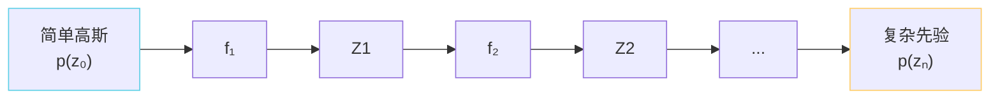

## 前置知识

> [!important]
> 
> 建议熟悉 [[1.1.1 条件变分自编码器（CVAE）框架|1.1.1 条件变分自编码器（CVAE）框架]]，本页揭开 VITS 中「反向 Flow」的身份：一个 Normalizing Flow。

---

## 0. 定位

> **一句话**：Normalizing Flow（标准化流）= **一串可逆、体积可算的变换**，能把「简单高斯」扭成「任意复杂分布」；同时能从复杂分布「算出密度 $\log p(z)$」。VITS 选用 **Affine Coupling Layer**作为原子变换，是 Flow 里「表达力/可逆性/计算量」三者平衡最好的一种。

---

## 1. NF 为什么重要

**问题**：Prior Encoder 输出的初先验 $\mathcal N(\mu_x,\sigma_x^2)$ 单验高斯太简单，与后验 $q_\phi(z|y)$ 距离太远，**KL 圈不住**。

**解决**：加一堆可逆变换把初先验揉变成任意复杂分布。

**变量变换公式**：

$$\log p(z_n) = \log p(z_0) - \sum_{i=1}^n \log \left|\det \frac{\partial f_i}{\partial z_{i-1}}\right|$$

只要 Jacobian 行列式**可计算**，复杂分布密度就能闭式写出。

---

## 2. Affine Coupling Layer 拆解

**思路**：把输入拆为两半 $z = (z^a, z^b)$，一半「不动」、另一半「被变」。这样 Jacobian 是上三角阵，行列式 = 对角线乘积。

### 正向变换

$$\begin{aligned}  
(s, t) &= \text{NN}(z^a) \\  
z'^a &= z^a \\  
z'^b &= z^b \odot \exp(s) + t  
\end{aligned}$$

### 逆变换（推理需要）

$$z^b = (z'^b - t)\odot \exp(-s)$$

### Jacobian

$$\log\left|\det J\right| = \sum_i s_i$$

只需加上 $s$ 的和就能计算体积变化。

> [!important]
> 
> **为什么这个设计哈？**
> 
> - $z^a$ 不动保证**可逆**。
> 
> - $z^b$ 变换由神经网络控制，保证**表达力**。
> 
> - $s$ 的和保证 Jacobian 低压力（O(d) 不是 O(d³)）。

---

## 3. VITS 中的 Flow 配置

|项|取值|
|---|---|
|原子层数|4 层|
|每层卷积|WaveNet 扩张卷积堆叠 (kernel=5, dilation=1)|
|z 维度|192|
|反转顺序|每层后 flip channels|
|SoVITS v1/v2|保留|
|SoVITS v3/v4|**移除**（改 CFM）|

> [!important]
> 
> **为什么 v3/v4 去了 Flow？**
> 
> CFM 本身就是 Continuous Normalizing Flow 的「直接回归速度场」状态，不再需要离散 coupling 叠叠乐。Flow 被「全量代替」了。

---

## 4. 与其他 Flow 变体对比

|变体|代表|优点|缺点|
|---|---|---|---|
|Affine Coupling|RealNVP, Glow, VITS|双向闭式|表达不如自回归|
|Autoregressive Flow|IAF, MAF|表达力强|类只能单向快|
|Continuous (Neural ODE)|FFJORD, **CFM**|表达最强|需 ODE 求解|

---

## 5. 子页面导航

---

## 参考文献

1. Dinh, L. et al. (2017). _Density Estimation using Real NVP_. ICLR.

1. Kingma, D. P., & Dhariwal, P. (2018). _Glow_. NeurIPS.

[[1.1.2.1 Affine Coupling Layer 计算式|1.1.2.1 Affine Coupling Layer 计算式]]

1. Papamakarios, G. et al. (2021). _Normalizing Flows for Probabilistic Modeling and Inference_. JMLR.

[[1.1.2.2 Jacobian 与可逆性|1.1.2.2 Jacobian 与可逆性]]