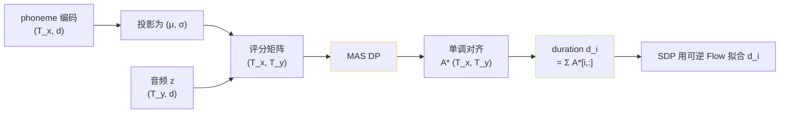

## 前置知识

> [!important]
> 
> 本页仅在 VITS 原版范围讨论。**GPT-SoVITS 已删除 MAS**，因为 semantic token 本身是 25Hz 帧级序列，同频于隐变量 $z$。

---

## 0. 定位

> **一句话**：MAS（**Monotonic Alignment Search**）是 VITS 原版的**自学习单调对齐算法**，用动态规划在训练中为每个音素决定推迟（duration）。本页讲清受什么职务驱动 + 为什么 GPT-SoVITS 不需要。

---

## 1. 问题背景

传统 TTS：phoneme 序列 $T_x$、音频帧序列 $T_y$。二者**长度不一致**，需要一个「对齐」告诉模型：“第 $t$ 帧上该说哪个音素”。

三种思路：

1. **外部对齐**（FastSpeech 2）——提前跑 MFA、Kaldi，贵且依赖语种。

1. **Attention 对齐**（Tacotron 2）——可能跳乱、不稳定。

1. **MAS**（VITS）——在训练中动态规划求最大似然单调路径，**无需外部标注**。

---

## 2. MAS 算法

**设**：隐变量 $z$ 上的帧位 $j=1..T_y$，音素位 $i=1..T_x$。定义对齐评分 $\alpha(i,j) = \log \mathcal{N}(z_j | \mu_i, \sigma_i^2)$（第 $j$ 帧归为第 $i$ 音素的不同以于结合 prior）。

类 Viterbi动态规划递推：

$$Q(i, j) = \alpha(i, j) + \max\!\Big(\,Q(i, j-1),\; Q(i-1, j-1)\,\Big)$$

约束：**单调**（只能往右、往右下）+ **不跳过音素**（不能从 $i$ 跳到 $i+2$）。

**复杂度**：$O(T_x \cdot T_y)$，序列 1k×1k 量级可接受。

---

## 3. 训练中怎么用

推理时不跑 MAS，而是用 SDP（Stochastic Duration Predictor）归出每个 $d_i$。

---

## 4. 为什么 SoVITS 删了 MAS

> [!important]
> 
> GPT-SoVITS 的「输入」已不是 phoneme，而是 **AR 头吐出的 semantic token 序列**。
> 
> - semantic 本身以 25Hz 帧率生成，与 $z$ 同频。
> 
> - AR 已经控制了 duration（要说多长是 AR 决定的）。
> 
> - 所以不需 MAS、不需 SDP，同时也丢掉了 $\mathcal{L}_{\text{dur}}$。
> 
> **这是「GPT 吃掉了对齐责任」的核心体现**——VITS 的 SoVITS 化后，对齐问题被上推到了 AR 阶段。

---

## 5. 子页面导航

[[1.1.3.1 单调对齐动态规划算法|1.1.3.1 单调对齐动态规划算法]]

---

## 参考文献

1. Kim, J., Kong, J., & Son, J. (2021). _VITS_. ICML. §2.3.

1. Kim, J. et al. (2020). _Glow-TTS_. NeurIPS. §2.2（MAS 首提出）.