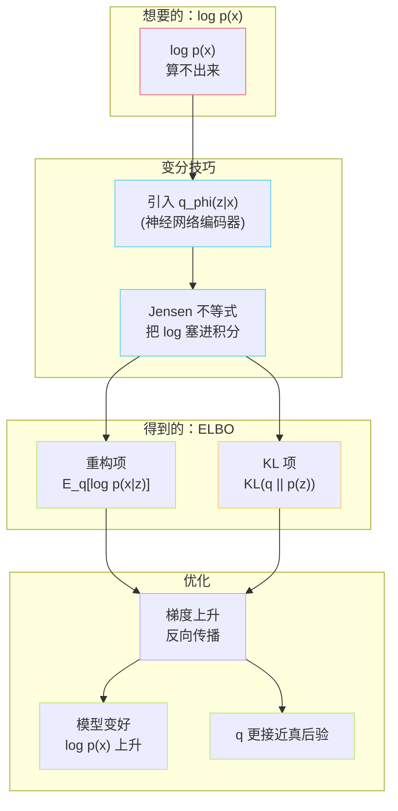
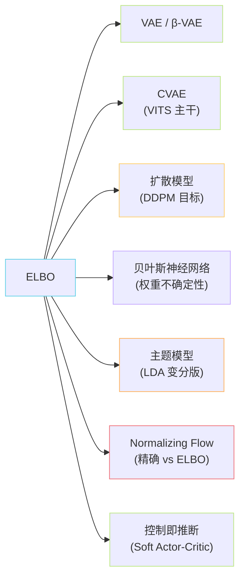

## 前置知识

> [!important]
> 
> 阅读本页前建议熟悉：
> 
> - **概率密度函数**与**期望** $\mathbb{E}_{q}[\cdot]$ 的含义（不必会推导，会读就行）。
> 
> - **贝叶斯公式** $p(z|x)=p(x|z)p(z)/p(x)$。
> 
> - 简单的 **KL 散度** 直觉：两个分布之间「差多远」的非对称距离。
> 
> - 推荐先读 [[1.1.1 条件变分自编码器（CVAE）框架|1.1.1 条件变分自编码器（CVAE）框架]]，本页是其数学心脏的展开。

---

## 0. 定位

> **一句话**：**证据下界（Evidence Lower BOund, ELBO）** 是「**算不动的** $\log p(x)$ **替身**」。它把一个**没法直接优化的目标**变成一个**可以反向传播的目标**，是 VAE / CVAE / 扩散模型 / 贝叶斯神经网络 / 变分推断 整个家族的**共同发动机**。本页用最直白的语言讲清「为什么有 ELBO、它在干什么、为什么 work、可以用在哪」。

---

## 1.1.5.1 一个故事：你为什么需要 ELBO

想象你是一位**侦探**，桌上有一段录音 $x$（你能听到的「证据」），你想知道：**「这段录音背后的真实场景** $z$ **是什么？」**

- $x$：观察到的数据（音频、图像、文本……）。

- $z$：背后隐藏的「原因」（说话人音色、说话内容、情绪……我们看不见，叫**潜变量 Latent Variable**）。

你的终极目标是计算两个东西：

1. **证据本身有多可能** $p(x)$：这段录音在所有可能世界中出现的概率（用来衡量模型好不好）。

1. **后验** $p(z|x)$：给定录音，背后真实场景的分布（用来「猜测」、生成、压缩）。

> [!important]
> 
> **坏消息**：这两个东西都几乎**算不出来**。
> 
> - $p(x) = \int p(x|z)p(z)\,dz$：要把所有可能的 $z$ 积分掉。$z$ 是高维连续向量（比如 256 维），积分**没有解析解**，蒙特卡洛采样**方差爆炸**。
> 
> - $p(z|x) = p(x|z)p(z)/p(x)$：分母还是上面那个算不出来的 $p(x)$。

**于是变分推断（Variational Inference）登场**：既然真后验 $p(z|x)$ 算不出来，那我就**找一个长得很像的、好算的分布** $q_\phi(z|x)$ **来代替它**——这个 $q_\phi$ 通常被参数化成神经网络（编码器）。

**ELBO 就是衡量「这场代替到底值不值」的量化指标**，同时它**也是** $\log p(x)$ **的下界**——所以最大化 ELBO 就是在「曲线救国」地最大化 $\log p(x)$。

> [!important]
> 
> **一句话直觉**：ELBO = 我们够得着的天花板。直接的天花板 $\log p(x)$ 在云里，ELBO 是云下面那块我们可以踮脚摸到的板。我们使劲把 ELBO 顶上去，真天花板也跟着被顶上去。

---

## 1.1.5.2 推导：从 $\log p(x)$ 一步步走到 ELBO

这是全文**唯一一段公式密集**的地方，每一步只用到「乘 1、加 0、log 拆分」三个小学操作。

### 变量定义表

|符号|含义|类比|
|---|---|---|
|$x$|观测数据|录音、图像|
|$z$|潜变量|「场景」「内容」|
|$p(x,z)$|联合分布（真实模型）|世界的真相|
|$p(z)$|先验|没听录音前你对场景的猜测|
|$p(x\mid z)$|似然 / 解码器|给定场景，会发出什么声音|
|$p(z\mid x)$|**真后验**（算不出）|听完录音后对场景的最优猜测|
|$q_\phi(z\mid x)$|**变分后验** / 编码器|你用神经网络做的「近似猜测」|

### 一步步推导

第一步：**写出我们想最大化的目标** $\log p(x)$，然后在里面**塞一个** $q_\phi(z|x)$（这就是「乘 1」的把戏）。

$$\log p(x) = \log \int p(x,z)\,dz = \log \int q_\phi(z|x) \cdot \frac{p(x,z)}{q_\phi(z|x)} \, dz$$

第二步：用 **Jensen 不等式**（凸函数的平均 ≥ 平均的凸函数，对凹函数 log 反向），把 log 挪到积分里面。

$$\log p(x) \geq \int q_\phi(z|x) \log \frac{p(x,z)}{q_\phi(z|x)}\,dz = \mathbb{E}_{q_\phi(z|x)}\!\left[\log \frac{p(x,z)}{q_\phi(z|x)}\right]$$

**右边这个期望就是 ELBO**，记作 $\mathcal{L}(\theta,\phi;x)$。它**永远 ≤** $\log p(x)$，故名「下界」。

第三步：把 $p(x,z)=p(x|z)p(z)$ 代进去，整理：

$$\boxed{\;\mathcal{L} = \underbrace{\mathbb{E}_{q_\phi(z|x)}[\log p_\theta(x|z)]}_{\text{重构项}} \; - \; \underbrace{\mathrm{KL}\!\left(q_\phi(z|x) \,\|\, p(z)\right)}_{\text{正则项}}\;}$$

> [!important]
> 
> **这就是 VAE 的目标函数！**
> 
> - **重构项**：从 $q_\phi$ 采样一个 $z$，用解码器还原 $x$，越像越好（让模型「编得回去」）。
> 
> - **KL 项**：让编码器输出的分布**不要太离谱**，要靠近先验 $p(z)$（通常是标准正态）——这是**防止过拟合的正则化**。

### 推导的另一面：ELBO 与真后验的距离

还有一种**完全等价**的写法，能更深刻地揭示 ELBO 的本质：

$$\log p(x) = \mathcal{L}(\theta,\phi;x) + \mathrm{KL}\!\left(q_\phi(z|x)\,\|\,p(z|x)\right)$$

移项：

$$\log p(x) - \mathcal{L} = \mathrm{KL}\!\left(q_\phi(z|x)\,\|\,p(z|x)\right) \;\geq\; 0$$

> [!important]
> 
> **重磅事实**：**ELBO 与** $\log p(x)$ **之间的差距 = 「近似后验」与「真后验」之间的 KL 散度**。
> 
> 所以最大化 ELBO 等价于**同时做两件事**：
> 
> 1. 把证据 $\log p(x)$ 推高（模型更好）。
> 
> 1. 让 $q_\phi$ 越来越像真后验 $p(z|x)$（推断更准）。
> 
> **一石二鸟**——这就是变分推断的全部魔法。

---

## 1.1.5.3 直观流程图



---

## 1.1.5.4 两种解读对照

|视角|公式形式|解读|使用场景|
|---|---|---|---|
|**重构 + 正则**|$\mathbb{E}_q[\log p(x\|z)] - \mathrm{KL}(q\\|p(z))$|「编得回 + 别离谱」|实现 VAE 的标准 loss|
|**证据下界**|$\log p(x) - \mathrm{KL}(q\\|p(z\|x))$|「证据减偏差」|分析推断质量 / 理论证明|
|**自由能**|$-\mathcal{L} = \mathbb{E}_q[-\log p(x,z)] - H[q]$|「能量 - 熵」，物理学借来的|贝叶斯网络、扩散模型推导|

三种写法**完全等价**，只是侧重点不同——遇到任何变分相关的论文，先确认它用的是哪一种皮，剥开后内核都一样。

---

## 1.1.5.5 应用场景全景



|领域|ELBO 在干什么|具体例子|
|---|---|---|
|**生成模型**|训练编码器 + 解码器联合最大化 ELBO|VAE 生成人脸 / VITS 生成语音 / Stable Diffusion 的 VQ-VAE 阶段|
|**语音合成（TTS）**|把文本/语义 token 当条件，求条件 ELBO|**VITS、GPT-SoVITS v1/v2/v2Pro**|
|**扩散模型**|DDPM 的 loss 是 ELBO 在 T 步上的展开|$L_t = \mathbb{E}\\|\epsilon - \epsilon_\theta(x_t,t)\\|^2$ 就是 ELBO 化简后的产物|
|**贝叶斯神经网络**|把权重 $W$ 当作潜变量，用 ELBO 学权重分布|Bayes by Backprop、不确定性估计|
|**主题模型**|文档-主题分配作为潜变量|LDA 的 SVI 训练|
|**强化学习**|「最大熵 RL」把动作序列当潜变量|Soft Actor-Critic 的目标函数本质是 ELBO|
|**压缩**|ELBO 直接对应 bit/dim 的香农极限|神经压缩（Ballé 等）|

> [!important]
> 
> **工程判断：什么时候用 ELBO？**
> 
> 1. **先看能否精确算** $p(x)$：能算（如 Normalizing Flow 全可逆架构）→ 直接最大化 $\log p(x)$，**不要**用 ELBO（更紧）。
> 
> 1. **再看** $z$ **是否离散且小**：是 → 用枚举 / EM 算法，**不需要** ELBO。
> 
> 1. **否则**：$z$ 高维连续 / 后验非高斯 / 模型嵌套深 → **ELBO 是默认选择**。

---

## 1.1.5.6 Python 最小实现：30 行讲清 ELBO

下面是一个**最朴素的 VAE 训练循环**，用 PyTorch 实现，每一行都对应推导中的一个符号。

```python
import torch
import torch.nn as nn
import torch.nn.functional as F

class TinyVAE(nn.Module):
    def __init__(self, x_dim=784, z_dim=16):
        super().__init__()
        # 编码器 q_phi(z|x)：输出 z 的高斯均值和 log 方差
        self.enc = nn.Sequential(nn.Linear(x_dim, 256), nn.ReLU())
        self.mu = nn.Linear(256, z_dim)        # 均值
        self.logvar = nn.Linear(256, z_dim)    # log 方差（保证方差 > 0）
        # 解码器 p_theta(x|z)
        self.dec = nn.Sequential(
            nn.Linear(z_dim, 256), nn.ReLU(),
            nn.Linear(256, x_dim), nn.Sigmoid(),
        )

    def forward(self, x):
        h = self.enc(x)
        mu, logvar = self.mu(h), self.logvar(h)
        # 重参数化技巧：z = mu + sigma * epsilon，让梯度能传回 mu/logvar
        std = (0.5 * logvar).exp()
        eps = torch.randn_like(std)
        z = mu + std * eps
        x_hat = self.dec(z)
        return x_hat, mu, logvar

def elbo_loss(x, x_hat, mu, logvar):
    # 1) 重构项：负对数似然，这里用 BCE 当作伯努利 log p(x|z)
    recon = F.binary_cross_entropy(x_hat, x, reduction="sum")
    # 2) KL 项：q=N(mu, sigma^2) 与 p(z)=N(0, I) 的 KL，有闭式解
    kl = -0.5 * torch.sum(1 + logvar - mu.pow(2) - logvar.exp())
    # 我们最大化 ELBO ≡ 最小化 (recon + kl)
    return recon + kl
```

> [!important]
> 
> **对照公式逐行读**：
> 
> - `mu, logvar` ↔ $q_\phi(z|x)=\mathcal{N}(\mu,\sigma^2)$ 的两组参数。
> 
> - `z = mu + std * eps` ↔ **重参数化技巧**：把不可导的「采样」变成可导的「均值 + 噪声 × 方差」。
> 
> - `recon` ↔ $-\mathbb{E}_{q_\phi}[\log p_\theta(x|z)]$。
> 
> - `kl` ↔ $\mathrm{KL}(q_\phi\|p(z))$，对高斯-高斯有解析解。

---

## 1.1.5.7 常见误区

> [!important]
> 
> **误区 1**：「最大化 ELBO 就等于最大化 $\log p(x)$。」
> 
> **错**。只有当 $q_\phi(z|x) = p(z|x)$ 时两者相等。一般情况下 ELBO **严格小于** $\log p(x)$，差距正好是 $\mathrm{KL}(q\|p(z|x))$。这意味着 VAE 评估 likelihood 时**只能给出下界**，比较模型 likelihood 要小心。

> [!important]
> 
> **误区 2**：「KL 项越小越好。」
> 
> **错**。KL 项太小（**posterior collapse**）会导致 $q_\phi(z|x) \approx p(z)$——编码器**不编码任何信息**，解码器**忽略** $z$，模型退化成无条件先验。所以 β-VAE 才要引入 $\beta$ 系数控制 KL 的权重。

> [!important]
> 
> **误区 3**：「ELBO 就是 VAE 专属。」
> 
> **错**。**DDPM 的** $\|\epsilon-\epsilon_\theta\|^2$ **loss 本质上是 ELBO 在马尔可夫链下的化简**（见 Ho et al. 2020 附录 A）。扩散、流匹配、贝叶斯 NN 都用它，ELBO 是变分推断的通用语言。

> [!important]
> 
> **误区 4**：「Jensen 不等式只是一个数学小技巧。」
> 
> **错**。Jensen 决定了**ELBO 的紧致性**。当 $q$ 是 delta 分布（确定性）时 ELBO 等号成立但失去随机性；当 $q$ 过宽时下界很松。变分族（mean-field / 正态 / Flow）的选择**直接决定 ELBO 离真值多远**——这是 Normalizing Flow 后验、IAF、Householder Flow 等工作的全部动机。

---

## 1.1.5.8 思辨：ELBO 的局限与替代

> [!important]
> 
> **A vs B：ELBO 还是 IWAE（Importance Weighted Autoencoder）？**
> 
> - **ELBO**：单样本估计，方差小，但**偏差大**（下界不紧）。
> 
> - **IWAE**：用 $K$ 个重要性采样样本，**偏差更小**（$K\to\infty$ 时趋近 $\log p(x)$），但方差和计算量更大。
> 
> - **场景 X（训练大模型）选 ELBO**：单样本足够稳定，$K\!=\!1$ 就够，工程上简单。
> 
> - **场景 Y（评估 likelihood）选 IWAE，**$K\!=\!5000$：要紧的下界，靠近真实 $\log p(x)$。

> [!important]
> 
> **为什么不直接最大化** $\log p(x)$**？**
> 
> - 因为它**没有显式表达式**——只能写成积分。
> 
> - 蒙特卡洛估计 $\log p(x) \approx \log \frac{1}{N}\sum p(x|z^{(i)})p(z^{(i)})$ 在高维 $z$ 下**方差爆炸**（被一两个高似然样本主导）。
> 
> - **追因到数学约束**：积分维度 = $z$ 的维度，蒙特卡洛方差按 $O(1/N)$ 衰减但常数随维度指数增长——这是「维度灾难」的硬限制。ELBO 用变分分布作为重要性分布，**大幅降低方差**。

> [!important]
> 
> **为什么扩散模型「赢」了 VAE？**
> 
> - **不是因为放弃了 ELBO**，而是因为**把 ELBO 拆成了** $T$ **个简单子问题**——每步只需学一个「去噪」分布，每步的近似后验都很简单，所以**累计紧度**远高于一步式 VAE。
> 
> - 这印证了一个深刻原理：**ELBO 的紧度由「变分族 vs 真后验」的距离决定，把任务拆细可以让变分族更容易贴近真后验**。

---

## 1.1.5.9 回到 GPT-SoVITS：ELBO 在 VITS 里的具体形态

在 VITS / GPT-SoVITS 的解码器里，ELBO 取 **条件版本**（CVAE）：

$$\mathcal{L}_{\text{CVAE}}(x,y) = \mathbb{E}_{q_\phi(z|y)}[\log p_\theta(y|z)] - \mathrm{KL}\!\left(q_\phi(z|y)\,\|\,p_\theta(z|x)\right)$$

- $y$：线性频谱（观测）。

- $x$：条件——VITS 里是音素 + 时长，**GPT-SoVITS 里是 AR 头吐出的 semantic token**。

- $q_\phi(z|y)$：Posterior Encoder（训练时用，从频谱编 $z$）。

- $p_\theta(z|x)$：Prior Encoder + 反向 Flow（推理时用，从条件编 $z$）。

> [!important]
> 
> **关键洞察**：训练时 Posterior 看得到「答案」 $y$，所以 $z$ 编码精准；推理时只能用 Prior 从条件 $x$ 猜 $z$。**KL 项就是把这两条路「拧到一起」的力**——训练完成后 Prior 才学到「不看答案也能编出靠谱 $z$」的能力，从而支持纯条件推理。

详细架构见 [[1.1.1 条件变分自编码器（CVAE）框架|1.1.1 条件变分自编码器（CVAE）框架]]。

---

## 参考文献

1. Kingma, D. P., & Welling, M. (2014). _Auto-Encoding Variational Bayes_. ICLR. arXiv:1312.6114.

1. Rezende, D. J., Mohamed, S., & Wierstra, D. (2014). _Stochastic Backpropagation and Approximate Inference in Deep Generative Models_. ICML.

1. Blei, D. M., Kucukelbir, A., & McAuliffe, J. D. (2017). _Variational Inference: A Review for Statisticians_. JASA.

1. Burda, Y., Grosse, R., & Salakhutdinov, R. (2016). _Importance Weighted Autoencoders_. ICLR.

1. Higgins, I., et al. (2017). _β-VAE: Learning Basic Visual Concepts with a Constrained Variational Framework_. ICLR.

1. Ho, J., Jain, A., & Abbeel, P. (2020). _Denoising Diffusion Probabilistic Models_. NeurIPS（附录 A：ELBO 与 DDPM loss 的等价推导）.

1. Kim, J., Kong, J., & Son, J. (2021). _Conditional Variational Autoencoder with Adversarial Learning for End-to-End Text-to-Speech (VITS)_. ICML. arXiv:2106.06103.

1. Doersch, C. (2016). _Tutorial on Variational Autoencoders_. arXiv:1606.05908.（最易读的入门）