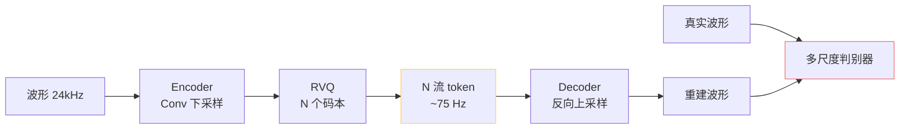
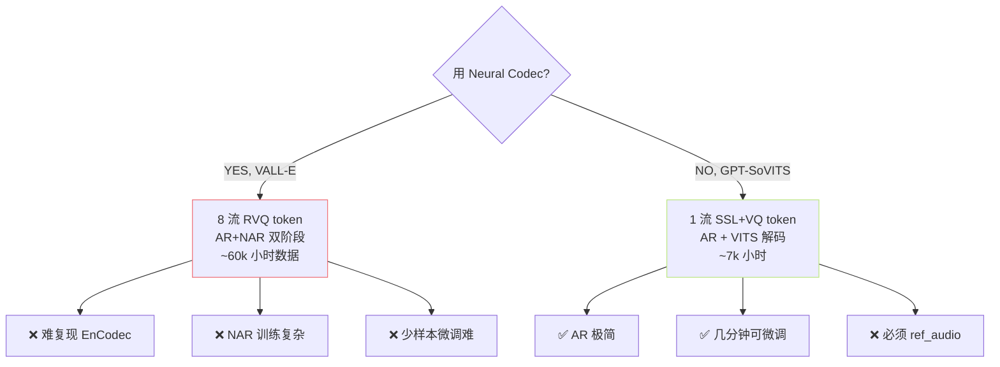

## 前置知识

> [!important]
> 
> 建议先读 [[1.2.1 离散语音 Token 化思想]]。Neural Audio Codec 是该思想的「波形级实现路线」。

---

## 0. 定位

> **一句话**：**神经音频编解码器（Neural Audio Codec）** = 「**端到端的可学习音频压缩器**」，输入波形 → 输出多流离散 token；解码端从 token 直接重建波形。代表作 **EnCodec / SoundStream / DAC**。VALL-E 用 EnCodec，**GPT-SoVITS 没采用**——它选择了「SSL + VQ」的另一条路。

---

## 1. 整体范式

---

## 2. RVQ：核心创新

**问题**：单 VQ 容量有限（K=1024 → 10 bit/帧），重建质量低。

**解决**：**Residual Vector Quantization**——多级 VQ 串联，每级量化前一级的**残差**。

$$\begin{aligned}  
z_q^{(1)} &= \text{VQ}_1(z) \\  
r^{(1)} &= z - z_q^{(1)} \\  
z_q^{(2)} &= \text{VQ}_2(r^{(1)}) \\  
& \vdots \\  
z_q = \sum_{i=1}^N z_q^{(i)}  
\end{aligned}$$

**比特数**：$N cdot log_2 K$；EnCodec 取 $N=8, K=1024$，每帧 80 bit。

详见 [[1.2.2.1 RVQ（Residual VQ）原理]]。

---

## 3. 三大代表对比

||**EnCodec** (Meta)|**SoundStream** (Google)|**DAC** (Descript)|
|---|---|---|---|
|时间|2022|2021|2023|
|输入采样率|24k / 48k|24k|44.1k|
|Encoder|Conv + LSTM|Conv|Conv + Snake|
|RVQ 级数|8|8|9|
|帧率|75Hz / 150Hz|75Hz|86Hz|
|比特率|1.5/3/6/12 kbps|3/6/12 kbps|8 kbps|
|判别器|MS-STFT + MPD|STFT-D|MS-STFT + Mel|
|用户|VALL-E, AudioLM|MusicLM|Vall-E X, 多语种|

详见 [[1.2.2.2 EnCodec - SoundStream - DAC 简表]]。

---

## 4. 为什么 GPT-SoVITS **不**用 Neural Codec？

> [!important]
> 
> **核心权衡**：Neural Codec 把「**全部音频信息**」压进 token；GPT-SoVITS 只把「**语义**」压进 token，音色 / 相位 / 噪声纹理交给 ref_audio + 解码器补。前者需要海量数据训码本依赖；后者用小数据就能跑。

---

## 5. 子页面导航

[[1.2.2.1 RVQ（Residual VQ）原理]]

[[1.2.2.2 EnCodec - SoundStream - DAC 简表]]

---

## 参考文献

1. Défossez, A. et al. (2022). _EnCodec_. arXiv:2210.13438.

1. Zeghidour, N. et al. (2021). _SoundStream_. IEEE/ACM TASLP.

1. Kumar, R. et al. (2023). _High-Fidelity Audio Compression with Improved RVQGAN (DAC)_. NeurIPS.