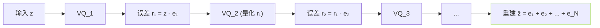

## 前置知识

> [!important]
> 
> 本页属于 [[1.2.2 Neural Audio Codec 概览|1.2.2 Neural Audio Codec 概览]]。需先了解 VQ 基本思路。

---

## 0. 定义

> **Residual Vector Quantization（RVQ）** = 「**将量化误差递归地交给下一本码本再量化**」的多本码本粉粒度量化器。起源于 SoundStream / EnCodec，是当代 Neural Audio Codec 的主流量化结构。

---

## 1. 为什么不能只单本 VQ

- 要「低比特率 + 高保真」：需量化误差足够小。

- 单本 VQ 为与其粉粒度受 codebook 大小 $K$ 限制。 例如 $K = 1024$ 仅能表达 10 bits。

- **加多本产生指数爆炸**：$K^N$ 在训练上不可行。

- **RVQ 用加法代乘法**：$N$ 个 $K$ 个 codebook、总表达 = $N \cdot \log_2 K$ bits。

---

## 2. 算法过程

**第** $n$ **本码本量化上本的误差**：

$$r_n = r_{n-1} - e_n, \quad e_n = \text{argmin}_{e \in C_n} \| r_{n-1} - e \|^2, \quad r_0 = z$$

重建：$\hat z = \sum_{n=1}^N e_n$。误差随 $N$ 增加指数递减。

---

## 3. 损失设计

$$\mathcal L_{RVQ} = \sum_{n=1}^N \Big( \| sg[r_{n-1}] - e_n \|^2 + \beta \| r_{n-1} - sg[e_n] \|^2 \Big)$$

- 每层都有 codebook loss + commitment loss（同 VQ-VAE）。

- 随机 Dropout codebook 的设计：训练时随机护使用前 $n_t$ 层（$n_t \sim U(1,N)$），以保证不同比特率下都能重建。

---

## 4. 作为比特率可调节器

|N 层|$K$|总 bit|例型采样率 50Hz的 bps|
|---|---|---|---|
|1|1024|10|0.5 kbps|
|4|1024|40|2.0 kbps|
|8|1024|80|4.0 kbps|
|16|1024|160|8.0 kbps|

EnCodec / SoundStream / DAC 提供了「一个模型多个比特率」的机制。

---

## 5. 与 GPT-SoVITS 的关系

GPT-SoVITS **本身不用 RVQ**，使用单本 VQ（1024 codebook）。但：

- VALL-E 、CosyVoice 、SparkTTS 都采用 RVQ。

- 未来可能的加阶路线：接入 RVQ codec 帮助生成高频。

详见 [[11.2 vs Fish-Speech|11.2 vs Fish-Speech]]。

---

## 参考文献

1. Zeghidour, N. et al. (2021). _SoundStream_. arXiv:2107.03312.

1. Défossez, A. et al. (2022). _EnCodec_. arXiv:2210.13438.

1. Kumar, R. et al. (2023). _DAC_. arXiv:2306.06546.