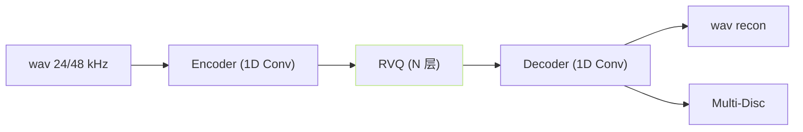

## 前置知识

> [!important]
> 
> 本页属于 [[1.2.2 Neural Audio Codec 概览|1.2.2 Neural Audio Codec 概览]]。本页提供三主流 codec 对比简表。

---

## 0. 定位

> **一句话**：**EnCodec（Meta）、SoundStream（Google）、DAC（Descript）** 是当代三大主流 Neural Audio Codec。三者架构相近：**卷积 encoder + RVQ + 卷积 decoder + GAN 损失**；区别在 codebook 大小、策略、训练数据、采样率上。

---

## 1. 架构三件套

---

## 2. 主流 codec 对比表

||SoundStream|EnCodec|DAC|
|---|---|---|---|
|发表年|2021|2022|2023|
|机构|Google|Meta|Descript|
|采样率|24 kHz|24/48 kHz|16/24/44 kHz|
|RVQ 层数|8|8–16|9–18|
|Codebook|$K=1024$|$K=1024$|$K=1024$|
|比特率|3–12 kbps|1.5–24 kbps|0.5–16 kbps|
|GAN|单 MSD|MPD/MSD|MPD/MSD + STFT|
|损失|L1+mel+adv|L1+mel+adv|L1+mel+adv+ms-STFT|
|默认 frame rate|75 Hz|75 Hz|86 Hz|
|是否开源|否（设计公开）|是|是|

---

## 3. 与 GPT-SoVITS 的老亏

GPT-SoVITS **未采用这三者任一**，采用「cnhubert + 单本 VQ」路径。原因：

1. **语义 与 声学 解耦**：SoVITS 让 cnhubert 代表语义，VITS posterior 代表声学 —— 不需 codec 一括子包含。

1. **高质量重建**：VITS posterior 联交以 GAN 输出质量高于低比特率 codec。

1. **训练快**：cnhubert 预训练现成、仅微调。

**不过**：VALL-E 、CosyVoice 2 、SparkTTS 都采用 codec 路线。详见 [[1.2.3 AR + NAR 双阶段（VALL-E 原版）|1.2.3 AR + NAR 双阶段（VALL-E 原版）]]。

---

## 4. 哪些 TTS 选了哪个 codec

|TTS|Codec|
|---|---|
|VALL-E (原版)|EnCodec 24kHz|
|CosyVoice 1/2|自训 cosyvoice-codec|
|NaturalSpeech 3|FACodec（自训，带解耦）|
|SparkTTS|BiCodec|
|Muyan-TTS|EnCodec|

---

## 参考文献

1. Zeghidour, N. et al. (2021). _SoundStream_. ICASSP.

1. Défossez, A. et al. (2022). _High Fidelity Neural Audio Compression (EnCodec)_.

1. Kumar, R. et al. (2023). _Descript Audio Codec (DAC)_.