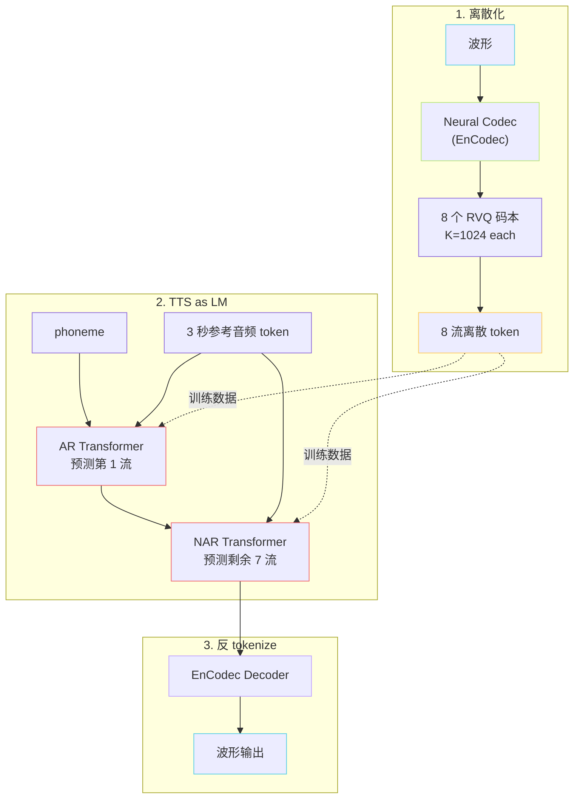

## 前置知识

> [!important]
> 
> 建议先了解 [[1.3 自监督语音表征（SSL Features）]] 与 [[1.4 向量量化（VQ）与离散语义 Token]]，因为 VALL-E 范式的前提是「语音能被 tokenize」。

---

## 0. 定位

> **一句话**：VALL-E 范式 = **「语音 = 离散 token 序列 → TTS = 语言模型」**。GPT-SoVITS 的 t2s_decoder（AR 头）继承了 VALL-E 的 AR 范式，但**砍掉 NAR 阶段、改用 VITS/CFM 解码**——是一个 **「VALL-E AR + 非 VALL-E 解码」** 的杂交。

---

## 1.2.1 VALL-E 的核心范式

**三大支柱**：

1. **Neural Audio Codec**：连续波形 → 离散 token（高音质重建所必需）。

1. **AR + NAR 双阶段**：AR 处理**时序依赖**、NAR 处理**码本间依赖**。

1. **In-Context Learning (ICL)**：参考音频拼在 prompt 前，做 zero-shot 克隆。

---

## 1.2.2 GPT-SoVITS 对 VALL-E 的改造

|维度|VALL-E|GPT-SoVITS|
|---|---|---|
|Tokenizer|EnCodec（外部）|**cnhubert + 单码本 VQ**（自训练）|
|码本数|8 RVQ|**1**|
|AR 输出|第 1 流|semantic token 单流|
|NAR 模块|7 层 NAR Transformer|**不存在；改用 VITS/CFM**|
|音色注入|ICL 参考 token|ICL ref_semantic + 解码器侧 ref mel|
|训练规模|60k 小时 LibriLight|v3 ~7k 小时；几分钟可微调|
|推理路径|AR → NAR → EnCodec.dec|AR → VITS.dec **或** AR → CFM → BigVGAN|

> [!important]
> 
> **核心取舍**：
> 
> VALL-E 把「语义 + 音色 + 相位」**全压进 8 流 token**；GPT-SoVITS **只把语义压进 1 流 token**，音色与相位**显式留给解码器**从 ref_audio 中读。
> 
> - ✅ **AR 头更小**：单 softmax，~330M（VALL-E 接近 1B）。
> 
> - ✅ **训练更稳**：单码本无 RVQ 间耦合，损失更纯净。
> 
> - ❌ **不能脱离 ref_audio**：必须始终提供参考音频。

---

## 1.2.3 关键损失：AR 的交叉熵

$$\mathcal{L}_{\text{AR}} = - \sum_{t=1}^{T} \log p_\theta\!\left(s_t \,\Big|\, s_{<t},\, \text{phone},\, \text{bert},\, s^{\text{ref}}_{1:T'}\right)$$

- $s_t$：第 $t$ 步 semantic token；$s^{\text{ref}}$：参考音频的 semantic 序列。

- 这就是一个**条件 LM 损失**，与 GPT-2/3 训练完全同构，因此可无缝复用 LLM 优化技术（KV cache、Flash-Attn、量化等）。

详见 [[5.1 Text2SemanticDecoder 总结构]]。

---

## 1.2.4 路线对比

|系统|Tokenizer|AR 阶段|NAR / 解码|克隆数据|
|---|---|---|---|---|
|VALL-E|EnCodec 8 RVQ|AR 1 流|NAR 7 流|3 秒|
|VALL-E 2|EnCodec|AR grouped|NAR|3 秒|
|**GPT-SoVITS**|**cnhubert + 单 VQ**|AR 1 流|**VITS / CFM**|**5~30 秒**|
|CosyVoice 1/2|FSQ Speech Tokenizer|LLM-AR|Chunk-aware CFM|3~10 秒|
|Muyan-TTS|类 EnCodec|**Llama-3**|NAR + 声码器|—|

详见 [[11. 与同期主流 TTS 的对比]]。

---

## 1.2.5 工程判断

> [!important]
> 
> **为什么 GPT-SoVITS 不直接用 VALL-E？**
> 
> 1. **EnCodec 训练流程未开源**：NAR 阶段的码本间依赖难复现。
> 
> 1. **8 流并行采样不友好**：要么 NAR 一次出（音质差），要么逐流 NAR（速度慢）；单流避开此权衡。
> 
> 1. **少样本微调**：8 流需要海量数据训码本依赖；单流 + 解码器从 ref 读音色，**几分钟数据即可微调**。

---

## 1.2.6 子页面导航

[[1.2.1 离散语音 Token 化思想]]

[[1.2.2 Neural Audio Codec 概览]]

[[1.2.3 AR + NAR 双阶段（VALL-E 原版）]]

[[1.2.4 In-Context Voice Cloning]]

---

## 1.2.7 延伸阅读

- [[5. AR - T2S 模型（GPT 语义建模阶段）]]

- [[11.4 vs Muyan-TTS（Llama-3.2-3B + SoVITS Decoder）]]

---

## 参考文献

1. Wang, C. et al. (2023). _VALL-E_. arXiv:2301.02111.

1. Défossez, A. et al. (2022). _EnCodec_. arXiv:2210.13438.

1. Chen, S. et al. (2024). _VALL-E 2_. arXiv:2406.05370.

1. Du, C. et al. (2024). _CosyVoice_. arXiv:2407.05407.