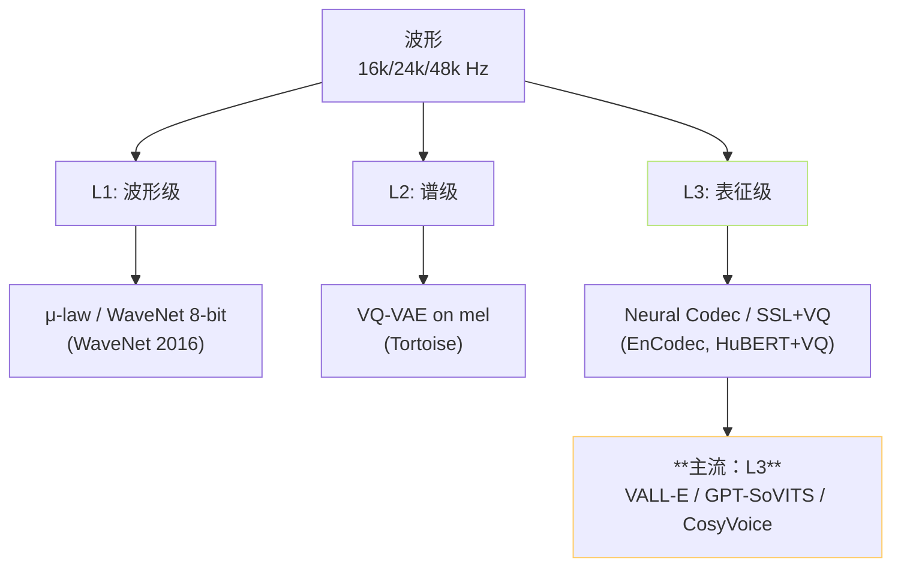

## 前置知识

> [!important]
> 
> 建议先读 [[1.2 VALL-E 类范式（GPT-SoVITS 的“GPT”血统）|1.2 VALL-E 类范式（GPT-SoVITS 的“GPT”血统）]]，本页是「为什么要 tokenize 语音」的哲学层。

---

## 0. 定位

> **一句话**：「**离散语音 token 化**」= 把连续波形 / mel / 隐表征**压成有限离散簇编号**，让语音可以被 GPT 风格的语言模型「下一 token 预测」。这是 VALL-E、CosyVoice、Muyan、GPT-SoVITS 等所有「LM-style TTS」共享的哲学底座。

---

## 1. 为什么要离散化

|角度|连续表征|离散 token|
|---|---|---|
|损失|MSE / L1|**交叉熵**|
|多模态|难（KL 与 MSE 量纲不同）|**统一 token 空间**，可与文本 LM 共享|
|采样|必须 GAN/Diffusion|**直接 softmax 采样**（top_k, top_p, temperature）|
|长程依赖|难|LM 自带|
|失真|0|量化误差|

> [!important]
> 
> **核心收益**：把语音从「连续信号」变成「序列符号」后，**整个 LLM 工程栈**（Transformer、KV cache、量化、Flash-Attn、long-context）都能复用，TTS 直接搭上 LLM 革命的便车。

---

## 2. 三层离散化

---

## 3. 三种离散化策略

### 3.1 神经声码器 + 量化（Neural Codec）

- 代表：**EnCodec**、SoundStream、DAC。

- 输入：原始波形。

- 输出：8 流 RVQ token，重建即可还原音频。

- 用户：VALL-E 系列、Voicebox。

- 特点：**端到端可还原**，无需外部 vocoder；但码本众多，AR 难直接预测全部。

### 3.2 SSL + 单 VQ（GPT-SoVITS 路线）

- 代表：**cnhubert + 单 VQ**。

- 输入：波形 → SSL 中间层 hidden。

- 输出：单流 25Hz token。

- 特点：**只压缩语义**，音色/相位让解码器从 ref_audio 中拿回，AR 极简。

### 3.3 Speech Tokenizer（FSQ-style）

- 代表：**CosyVoice Speech Tokenizer**（基于 finite scalar quantization）。

- 输入：波形。

- 输出：50Hz 单流 token。

- 特点：FSQ 替代 VQ-VAE，**无码本崩溃**问题。

---

## 4. 三大评价指标

|指标|含义|推荐范围|
|---|---|---|
|**比特率**|每秒所需 bit 数|200~1000 bps|
|**重建 PESQ / STOI**|重建后客观音质|PESQ ≥ 3.0|
|**AR 可预测性**|LM 预测准确度|top-1 acc ≥ 60%|

> [!important]
> 
> **三个指标互相牵制**：比特率高 → 重建好但 AR 难预测；比特率低 → AR 易但重建差。**GPT-SoVITS 取「极低比特率（~250 bps，单 VQ 1024 码 × 25Hz）」**，重建质量靠解码器从 ref 找回，是一个非常巧妙的设计折衷。

---

## 5. 在 GPT-SoVITS 中的体现

- **训练**：cnhubert 第 9 层 → 1×Conv 降维 → VQ → semantic id 流。

- **推理**：AR 头自回归生成 semantic id 流 → SoVITS 解码器还原音频。

- **可视化的「token 流」**：`prompt_semantic.pt`、`semantic_data.tsv` 文件里保存的就是这些离散 ID。

详见 [[4.3 SoVITS 内置 VQ Encoder|4.3 SoVITS 内置 VQ Encoder]]。

---

## 参考文献

1. van den Oord, A. et al. (2017). _VQ-VAE_. NeurIPS.

1. Défossez, A. et al. (2022). _EnCodec_. arXiv:2210.13438.

1. Zeghidour, N. et al. (2021). _SoundStream_. IEEE/ACM TASLP.

1. Wang, C. et al. (2023). _VALL-E_. arXiv:2301.02111.