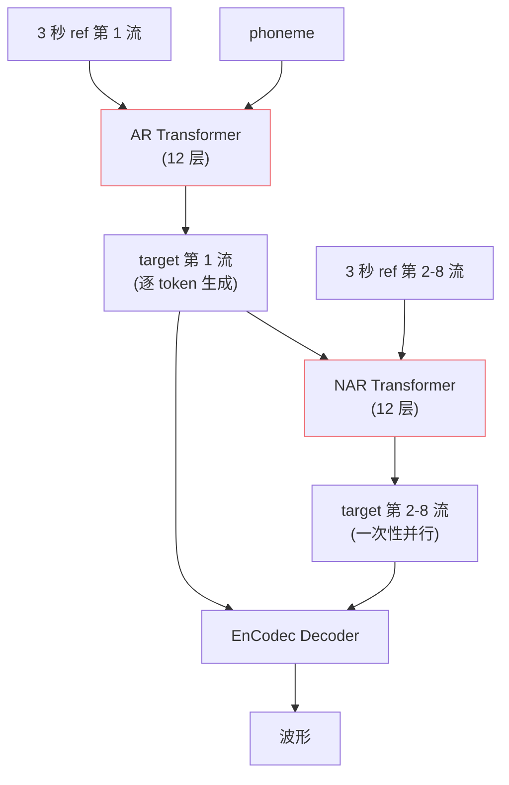

## 前置知识

> [!important]
> 
> 先读 [[1.2.2 Neural Audio Codec 概览|1.2.2 Neural Audio Codec 概览]]，了解 8 流 RVQ token。

---

## 0. 定位

> **一句话**：VALL-E 原版用**两个 Transformer**——AR 预测第 1 流、NAR 一次预测剩 7 流。设计动机是「**时序依赖**」与「**码本间依赖**」该分而治之。GPT-SoVITS 砍掉了 NAR——这是它与 VALL-E 最大的结构差。

---

## 1. 双阶段架构

---

## 2. 设计动机

### AR 处理时序依赖

第 1 流是**最粗粒度的语义流**，承担「这一帧大概是哪个音」的判断，依赖前面所有帧。AR 自回归是建模时序的标配。

### NAR 处理码本间依赖

第 2-8 流是「在第 1 流确定后，**同一帧上**还需哪些细节」。**帧内并行**而非帧间并行——所以 NAR 在 time 维一次性、在 RVQ 维上 8 步迭代（每步预测当前层的 token）。

---

## 3. 训练目标

### AR 部分

$$\mathcal L_{\text{AR}} = -\sum_{t} \log p\!\left(c^{(1)}_t \,\big|\, c^{(1)}_{<t}, \text{phone}, c^{(1),\text{ref}}\right)$$

### NAR 部分

$$\mathcal L_{\text{NAR}} = -\sum_{j=2}^{8}\sum_t \log p\!\left(c^{(j)}_t \,\big|\, c^{(<j)}_t, \text{phone}, c^{(<j),\text{ref}}\right)$$

注意 NAR 不在 time 上自回归，**只在 RVQ 层上**自回归。

---

## 4. 为什么 GPT-SoVITS **删掉 NAR**

> [!important]
> 
> **根本原因**：GPT-SoVITS 的 tokenizer 是 **单 VQ**，码本只有 1024 个簇、单流 token。AR 一步就够，不存在「码本间依赖」要 NAR 来补。
> 
> **真实路径**：cnhubert+VQ → AR 一流 → SoVITS 解码器还原音色（音色不在 token 里，从 ref mel 来）。
> 
> **好处**：
> 
> - ✅ 推理流程简单（无 8 步 NAR）
> 
> - ✅ 训练损失单一
> 
> - ✅ 可复用纯 LLM 工具链
> 
> **代价**：必须始终提供 ref_audio（无 ref 不能合成）。

---

## 5. 与 VALL-E 2 的演进

||VALL-E|VALL-E 2|
|---|---|---|
|AR|1 流|**Grouped AR**（组内并行）|
|NAR|7 步迭代|NAR + Repetition Penalty + Sampling 改进|
|ICL|3 秒 ref|3 秒 ref|
|报告自然度|~4.0|**~4.4**（人类水平）|

详见 [[11.5 vs Step-Audio - VALL-E 2 - NaturalSpeech 3|11.5 vs Step-Audio - VALL-E 2 - NaturalSpeech 3]]。

---

## 参考文献

1. Wang, C. et al. (2023). _VALL-E_. arXiv:2301.02111.

1. Chen, S. et al. (2024). _VALL-E 2_. arXiv:2406.05370.