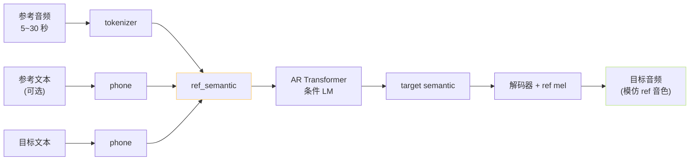
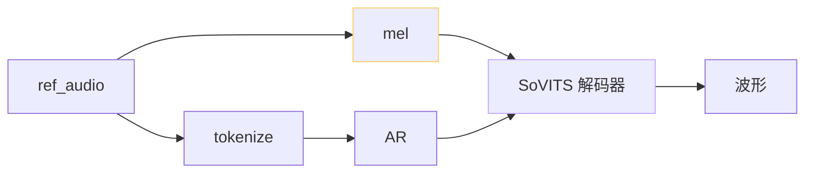

## 前置知识

> [!important]
> 
> 先读 [[1.2.3 AR + NAR 双阶段（VALL-E 原版）|1.2.3 AR + NAR 双阶段（VALL-E 原版）]]。

---

## 0. 定位

> **一句话**：**In-Context Voice Cloning（上下文音色克隆）** = 「**把参考音频拼在 prompt 前**，让 LM 在生成时自动模仿这段音频的音色」。这是 VALL-E 系列与 GPT-SoVITS 共享的 **zero-shot TTS 核心机制**——无需 fine-tune 即可换音色。

---

## 1. 范式总览



---

## 2. 三大支柱

### 2.1 prompt 拼接

构造 AR 输入序列：

```jsx
[BOS] [phone_ref] [SEP] [phone_tgt] [BOS_S] [sem_ref_1] [sem_ref_2] ... [sem_ref_T]
```

AR 从这里**继续生成** `[sem_tgt_1] ... [sem_tgt_T']` 直到 EOS。GPT-SoVITS 实际上把 ref 与 target 的 **phoneme 也拼接在一起**，让 AR 能用 ref 文本的「说话节奏」作为参考。

### 2.2 In-Context Learning 的本质

- 不更新模型权重。

- 把「示例」当作 prompt，让 LM 通过**注意力模式**从示例中提取风格。

- 与 GPT-3 的 few-shot prompting **完全同构**——只是把例子从文本换成 token 化语音。

### 2.3 解码器的并行通道

VALL-E 仅靠 token prompt 传递音色；GPT-SoVITS 多一条「**ref mel → SoVITS 解码器**」的并行通道，**显式注入音色**。



> [!important]
> 
> **这是 GPT-SoVITS 音色相似度高的关键**——双通道传递（token + mel）让 AR 拿语义、解码器拿音色，**职责清晰**，少样本时仍能稳定克隆。

---

## 3. 经验法则

|参考条件|推荐值|原因|
|---|---|---|
|ref_audio 时长|**5~10 秒**|太短抽取不到音色，太长 AR context 紧|
|ref_audio 噪声|越干净越好|噪声泄漏到合成|
|ref_audio 情感|与目标一致|情感由 ref 隐式传递|
|ref_audio 语种|与目标一致|跨语种会有口音泄漏|
|ref_text|与 ref 严格对应|影响 AR 节奏建模|

详见 [[8.1 参考音频处理（zero-shot - few-shot）|8.1 参考音频处理（zero-shot - few-shot）]]。

---

## 4. 失败模式

|失败|原因|缓解|
|---|---|---|
|音色像 ref 但说错字|AR 注意力被 ref 拉偏|调 top_k = 5~10|
|内容对但音色像默认|ref 太短/噪声大|重选 ref|
|半句换音色|AR KV cache 失效|检查 cut 策略|
|跨语种带口音|见 [[13.4 跨语种音色泄漏与口音\|13.4 跨语种音色泄漏与口音]]|用同语种 ref|

---

## 5. ICL 与 fine-tune 的取舍

> [!important]
> 
> - **ICL（zero-shot）**：5 秒 ref，2-3 秒推理，相似度 70~85%。
> 
> - **Fine-tune（SFT）**：1-30 分钟数据，半小时-数小时训练，相似度 85~95%。
> 
> - **生产经验**：若有 1 分钟以上目标说话人数据，**fine-tune 性价比远高于 ICL**。

---

## 参考文献

1. Wang, C. et al. (2023). _VALL-E_. arXiv:2301.02111. §3.2.

1. Brown, T. et al. (2020). _GPT-3_. NeurIPS.（ICL 概念出处）

1. Borsos, Z. et al. (2023). _AudioLM_. IEEE/ACM TASLP.