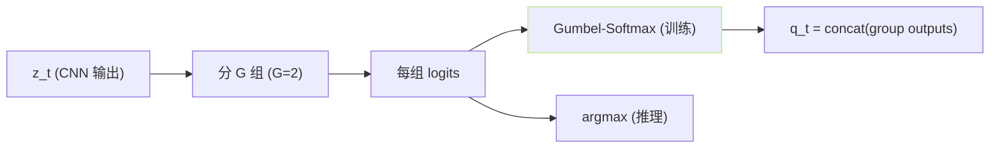
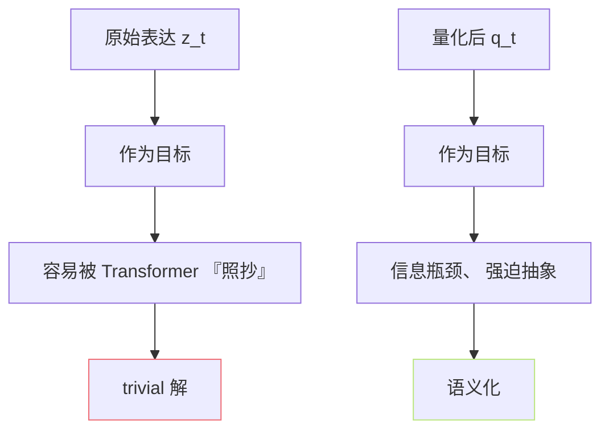

## 前置知识

> [!important]
> 
> 本页属于 [[1.3.1 wav2vec 2.0 原理|1.3.1 wav2vec 2.0 原理]]。

---

## 0. 定义

> **wav2vec 2.0 的对比学习** = 「在掩码位置，拉近上下文表达 $c_t$ 与『本位量化目标 $q_t$』、 拉远『同 batch 里其它位置的量化表达』」。Quantizer 是「提供负采集 + 同时助助语义集」的关键组件。

---

## 1. Quantizer：Gumbel-Softmax VQ

- $G = 2$ 组 codebook，每组 $V = 320$ 本码本 → 总本 $V^G = 102{,}400$。

- 使用 Gumbel-Softmax 训练可微。

- Diversity loss 鼓励均匀使用本码本：

$$\mathcal L_d = \frac{1}{GV} \sum_{g,v} p_{g,v} \log p_{g,v}$$

---

## 2. 对比损失

$$\mathcal L_m = -\sum_{t \in M} \log \frac{\exp(sim(c_t, q_t)/\kappa)}{\sum_{\tilde q \in Q_t} \exp(sim(c_t, \tilde q)/\kappa)}$$

- $c_t$：掩码位置 Transformer 表达。

- $q_t$：本位量化。

- $Q_t = \{q_t\} \cup K \text{ 个负采集自 batch}$，$K=100$。

- $\kappa$：温度 0.1。

- $\text{sim}$：余弦相似。

---

## 3. 为什么需要 Quantizer

量化 = **信息瓶颈**，丢掉说话人/设备/环境细节，保留语义。HuBERT 进一步推进以掩码 + k-means 实现 似似效果。

---

## 参考文献

1. Baevski, A. et al. (2020). _wav2vec 2.0_. NeurIPS.