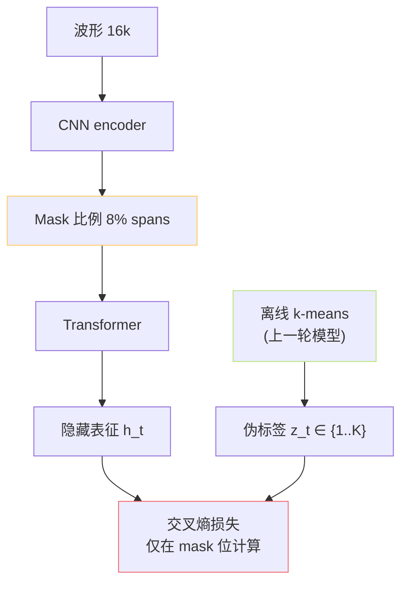
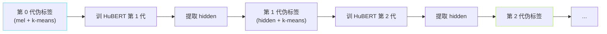
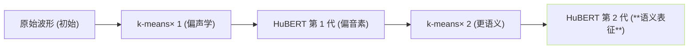

## 前置知识

> [!important]
> 
> 先读 [[1.3.1 wav2vec 2.0 原理]]。HuBERT 用「掩码预测 + 离线伪标签」取代 wav2vec 2.0 的「对比损失 + 在线 Quantizer」。

---

## 0. 定位

> **一句话**：HuBERT（**Hidden-Unit BERT**）的训练目标 = 「**在面罩位预测从上一轮模型进行 k-means 聚类得到的伪标签**」。两个关键设计：（1）**迭代伪标签**让表征逐代变语义化；（2）**交叉熵损失**比对比损失训练信号更多。

---

## 1. 整体架构

---

## 2. 训练损失

$$\mathcal L_{\text{HuBERT}} = -\sum_{t \in M} \log\frac{\exp\!\big(\mathrm{sim}(o_t, e_{z_t}) / \tau\big)}{\sum_{c=1}^K \exp\!\big(\mathrm{sim}(o_t, e_c) / \tau\big)}$$

- $M$：被掩的帧集合。

- $o_t = W h_t$：Transformer 输出的线性变换。

- $e_c$：embedding 表里第 $c$ 个伪标签中心。

- $z_t$：上一轮伪标签。

> [!important]
> 
> **本质**是「被掩位的多类分类任务」——与 BERT 的 MLM **完全同构**，只是把「被掩位能说哪个词」换成了「被掩位是哪个聚类簇」。

---

## 3. 两轮迭代训练

论文实测 2 轮后效果饱和。

---

## 4. 为什么 HuBERT 表征会「偏语义」

**迫使表征语义化的关键动机**：伪标签是「上一代 hidden + k-means」给出的。上一代 hidden 越语义化，聚类结果越语义化，本代训练出的表征也越语义化——**雪球效应**。

---

## 5. 与 GPT-SoVITS 的连接

- GPT-SoVITS 不重训 HuBERT，直接加载 **chinese-hubert-base** 预训权重。

- 取**第 9 层**输出作为 SSL 表征，不用最后一层。原因见 [[1.3.3 cnhubert（Chinese-HuBERT-base）]]。

- 冻结，仅作特征提取器。

---

## 6. 子页面导航

[[1.3.2.1 k-means 伪标签与迭代训练]]

---

## 参考文献

1. Hsu, W. et al. (2021). _HuBERT_. IEEE/ACM TASLP.

1. Devlin, J. et al. (2018). _BERT_. NAACL.