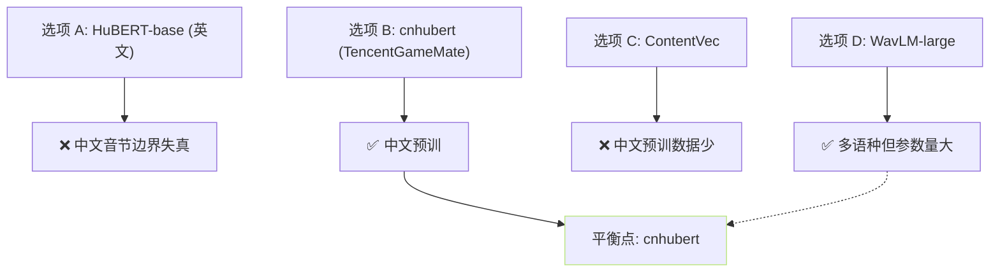
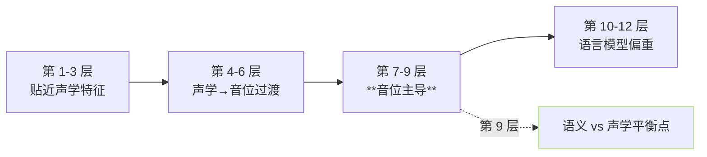

## 前置知识

> [!important]
> 
> 先读 [[1.3.2 HuBERT 训练目标]]。cnhubert 是 HuBERT 在中文语料上重训的版本。

---

## 0. 定位

> **一句话**：cnhubert = `TencentGameMate/chinese-hubert-base`，**12 层 Transformer、768d hidden、在 WenetSpeech 1万小时中文上预训练**，是 GPT-SoVITS 的「伪 phoneme 提取器」。该页讲清：为什么选它、为什么取第 9 层、采样率为什么必须 16k。

---

## 1. 架构参数

|项|取值|
|---|---|
|权重|TencentGameMate/chinese-hubert-base|
|预训数据|WenetSpeech（10000h 中文）|
|输入采样率|**16kHz**（必须）|
|CNN 缩放|320×（等效 20ms/帧 → 50Hz）|
|Transformer 层数|12|
|Hidden dim|768|
|Heads|12|
|K 伪标签|500（1代），后多轮增到 1000+|

---

## 2. 为什么选 cnhubert



**选择依据**：

1. 中文预训，音节/声调表征更准。

1. 参数量小（~94M），推理轻量。

1. WenetSpeech 语料质量高，含多场景 / 多口音。

> [!important]
> 
> **为什么不选中文 wav2vec 2.0？**训练不稳、中文预训权重质量参差不齐。cnhubert 是开源社区里中文 SSL 最成熟的质量权重。

---

## 3. 为什么取第 9 层



**经验依据**（SUPERB benchmark + GPT-SoVITS 内部实验）：

- 太浅（1-6 层）：表征多为频谱、能量状信号，语义不足。

- 太深（10-12 层）：表征偏向 ASR loss 调优，语义太强但丢了「饱和 / 音节」详细。

- **第 9 层**：二者平衡点，同时保留「音位语义」与「语音饱和」。

---

## 4. 采样率 16k 的必须性

HuBERT/cnhubert 的 CNN encoder 参数量化预训练于 **16 kHz**。输入2他采样率会造成：

- 特征跳起丢失，下游 VQ 量化随意。

- 50Hz 帧率变为其他值，与 AR 不同步。

所以 GPT-SoVITS 训练 / 推理代码里总是先 `librosa.resample(audio, 32000, 16000)` 才调 cnhubert，**与训练采样率 32k/24k/48k 完全解耦**。

---

## 5. 输出形状与下游接口

```python
# 伪代码
wav_16k = resample(wav, sr, 16000)        # (T_wav,)
feat = cnhubert(wav_16k).hidden_states[9] # (1, T_feat, 768), T_feat ≈ T_wav / 320
# 下游：VQ Encoder 接手
z_q, codes = vq_encoder(feat)              # codes: (1, T_feat//2,), 即 25Hz
```

---

## 6. 子页面导航

[[1.3.3.1 第 9 层特征选取的经验依据]]

---

## 参考文献

1. TencentGameMate/chinese-hubert-base. [https://huggingface.co/TencentGameMate/chinese-hubert-base](https://huggingface.co/TencentGameMate/chinese-hubert-base)

1. Zhang, B. et al. (2022). _WenetSpeech_. ICASSP.

1. Yang, S. et al. (2021). _SUPERB Benchmark_. Interspeech.