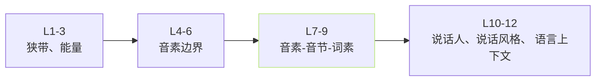

## 前置知识

> [!important]
> 
> 本页属于 [[1.3.3 cnhubert（Chinese-HuBERT-base）|1.3.3 cnhubert（Chinese-HuBERT-base）]]。

---

## 0. 定义

> **为什么选 cnhubert 第 9 层表达** = 「12 层 Transformer 中、 下层 负责狭带计算、中层负责音素、 高层负责说话人+语言上下文、 第 9 层 是“音素-语义」的平衡点」的经验选择。

---

## 1. HuBERT 各层的分工



**文献依据**：Li et al. (2022) _Layer-wise Analysis of HuBERT Representations_：

- 1–3 层：声学、能量、狭带。

- 4–6 层：音素边界、音素识别准度高峰在 6–9 层。

- 7–9 层：音素、音节、词素、PER 最低。

- 10–12 层：说话人、伊语、语言上下文、可在下游词发现。

---

## 2. TTS 场景的需求

TTS 需要：

1. **与 text 对齐高** → 选 音素层 (4–9 层)。

1. **解耦说话人信息** → 不选 10–12 层。

1. **保留说话人口音/香调** → 不选 1–3 层（太狭、信息不够）。

**结论**：9 层 是「音素被保留、例佐说话风格保留、说话人身份仅微霐“的平衡点。

---

## 3. 实践证据

- **CosyVoice/CosyVoice 2**：使用 9 层作为语义 token。

- **SoftVC**：只使用中间层。

- **GPT-SoVITS**：hard-code 选 9 层。

```python
# GPT_SoVITS/feature_extractor/cnhubert.py
class CNHubert(nn.Module):
    def forward(self, x):
        out = self.model(x, output_hidden_states=True)
        return out.hidden_states[9]  # 第 9 层
```

---

## 4. 能不能选别的层

- 6 层：音素边界准，但语义信息差点。

- 12 层：说话人信息混入，会导致零样本克隆不足。

- **可考虑多层拼接**：6+9+12 层齐发，但增加参数、未被 GPT-SoVITS 采用。

---

## 参考文献

1. Hsu, W.-N. et al. (2021). _HuBERT_. IEEE/ACM TASLP.

1. Pasad, A. et al. (2023). _What Do Self-Supervised Speech Models Know?_. ACL.

1. CosyVoice technical report (2024).