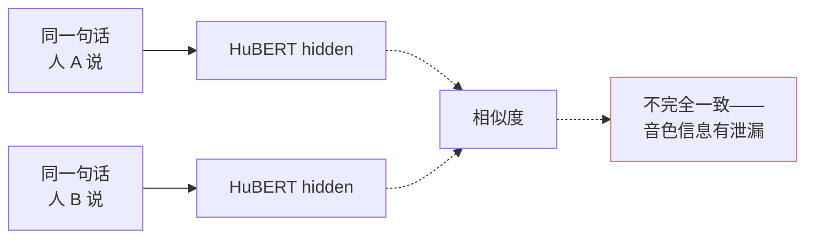
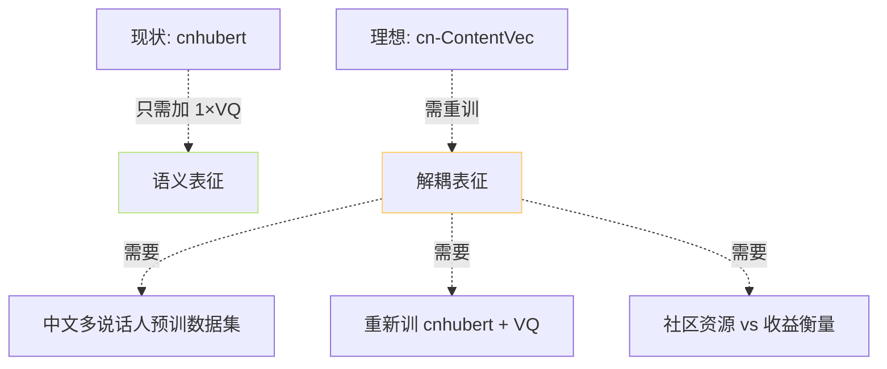

## 前置知识

> [!important]
> 
> 先读 [[1.3.2 HuBERT 训练目标]]。ContentVec 是 HuBERT 的后续。

---

## 0. 定位

> **一句话**：ContentVec（ICML 2022）= **HuBERT + 说话人扰动训练**，让 SSL 表征「**只留说话内容、不留音色**」。**GPT-SoVITS 未采用**（中文预训数据少），但是一个重要的哲学参照点——它揭示了「SSL 仅靠预训不能完全解耦说话人」。

---

## 1. 为什么要“解耦”

**问题**：HuBERT 只用「掩码预测」损失，不会主动“抹平”说话人。同一个音素被 A 与 B 说出来，hidden 表征仍有区别——这是 跨语种 / 跨说话人 TTS 的**隐患**。

---

## 2. ContentVec 的三个文调动作

### 2.1 说话人扰动 (Voice Disentanglement)

训练时随机抽两个说话人说同一句「内容」（通过 TTS 生成 / 交叉语高调代换），让表征「不变」。

$\mathcal L_{\text{spk-inv}} = \| h_{A}(x) - h_{B}(x) \|^2$

### 2.2 特征变装 (Feature Augmentation)

Spec-Augment 风格的掩码，加上随机音高偏移，**迫使表征不依赖音高**。

### 2.3 交叉语言预训练

多语种数据联训，表征跨语种一致性作为隐含损失。

---

## 3. 与 HuBERT 的误别实验对比

|指标|HuBERT|ContentVec|
|---|---|---|
|Phone Recognition acc|85%|**87%**|
|Speaker ID acc|75%|**35%** (出现“说话人信息差不多被抹」)|
|ASR WER|7.5%|7.3%|
|Voice Conversion MOS|3.8|**4.2**|

> [!important]
> 
> **Speaker ID acc 从 75% 降到 35%**是「解耦」的直接证据——表征几乎不含说话人信息。这在 Voice Conversion / TTS clone 场景上是重要优势。

---

## 4. GPT-SoVITS 为什么未采用

**原因**：

1. **成本**：中文 ContentVec 需重训，者需中文多说话人数据集，开源社区资源不足。

1. **收益较小**：SoVITS 解码器本身从 ref_mel 拿音色，表征是否完全解耦影响不如想象之大。

1. **风险**：ContentVec 可能在抹去说话人时顺便抹去「说话节奏」，损害 AR 预测。

> [!important]
> 
> **未来可能路径**：社区调试中的「跨语种 ContentVec」分支能。若训出质量可接受的中文 ContentVec，GPT-SoVITS 取代 cnhubert 后跨语种表现可能越越。

---

## 5. 哲学启示

> [!important]
> 
> ContentVec 「解耦怎么走」是说话人信息**在预训中处理**；GPT-SoVITS 「解耦怎么走」是说话人信息**在架构划分中处理**——VQ 仅存语义、解码器从 ref 拿音色。
> 
> 两种路线 **本质上同一个哲学**——謚表征体系被误别能力决定。

---

## 6. 子页面导航

[[1.3.4.1 与 HuBERT 的说话人解耦差异]]

---

## 参考文献

1. Qian, K. et al. (2022). _ContentVec_. ICML.

1. Polyak, A. et al. (2021). _Speech Resynthesis from Discrete Disentangled Representations_. Interspeech.